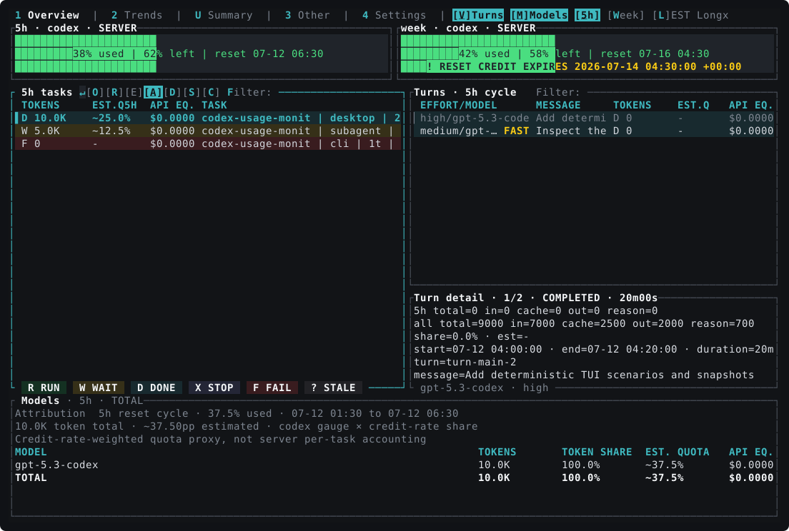

# codex-usage-monit

[English](README.md) · **简体中文**

[](https://github.com/ghostroller/codex-usage-monit/actions/workflows/ci.yml)
[](https://github.com/ghostroller/codex-usage-monit/releases/latest)
[](LICENSE)

**完全运行在终端里的 Codex 用量监控工具。**

`codex-usage-monit` 用于监控 Codex 额度窗口、重置时间、重置机会、任务、turn、模型、本地可观察 token 用量和历史走势。它既可以作为交互式 TUI 使用，也可以通过非交互式 CLI 输出纯文本或 JSON，供脚本、cron 和 CI 调用。

它以本地数据和终端为核心：不需要桌面程序、浏览器、数据库或监听端口。TUI 可以独立运行；也可以选择注册用户级后台记录服务，在 TUI 关闭后继续保存额度走势。预编译程序支持 Windows、macOS 和 Linux，也能通过 SSH 直接运行在没有桌面环境的开发服务器上。

## TUI 预览

[](docs/assets/tui/overview-dark-120x40.svg)

_此图由集成测试夹具确定性生成；CI 同步校验会防止预览图与当前 TUI 实现发生漂移。_

## 主要特点

- **账户用量一目了然** — 查看已用/剩余额度、所有可用额度桶和服务端返回的重置时间。
- **重置机会详情** — 查看权威的可用数量，以及服务端返回明细时每次机会的获得和过期时间。
- **过期提醒** — 如果最早且信息完整的可用重置机会会在普通 Codex 周自然重置前过期，Overview 的周用量进度条会显示提醒和准确的本地过期时间。
- **本地用量拆分** — 按当前 5 小时或周重置周期查看 task、turn、模型、token 总量和 token 占比。
- **用量走势** — 在本地记录服务端剩余额度、本地周 token、低置信度周估算，以及 15 分钟 token/估算桶。
- **可选后台记录** — TUI 关闭后可由 launchd、systemd 用户服务或 Windows 任务计划程序继续采集，无需管理员权限。
- **交互式终端 UI** — 不离开终端即可筛选、搜索、切换用量范围、展开任务树、查看 turn/模型和恢复任务。
- **可脚本化 CLI** — 导出便于阅读的文本或带 schema 版本的 camelCase JSON，选择指定 section，或按 thread 筛选 turn。
- **适合服务器** — 支持 SSH、tmux 和 Zellij；Linux Release 是静态 musl 构建，不依赖宿主机 glibc。
- **只读监控** — 读取本地 Codex 数据和账户用量指标，不读取 `auth.json`，也不会消耗重置机会。
- **低开销刷新** — 使用持久化增量缓存和事件驱动的 TUI 更新，避免反复解析没有变化的 rollout。

## 安装

### 安装 Release 程序

Shell 安装器支持 x86_64 和 ARM64 架构的 macOS 与 Linux。它会使用 `SHA256SUMS` 校验 Release 压缩包；默认安装无需 `sudo`，目标目录是 `~/.local/bin`。

```bash
curl --proto '=https' --tlsv1.2 -fsSLO \
  https://github.com/ghostroller/codex-usage-monit/releases/latest/download/install.sh
sh install.sh
```

运行前可以先检查 `install.sh` 的内容。安装器会在能够安全修改配置时，把安装目录加入常见 POSIX shell 的 PATH；否则会输出需要手动执行的准确 PATH 设置命令。

常用安装选项：

```bash
# 安装指定版本
sh install.sh --version vX.Y.Z

# 指定安装目录
sh install.sh --install-dir "$HOME/bin"

# 不修改 shell 配置
sh install.sh --no-modify-path
```

升级时，重新下载并运行最新版安装器，然后重启正在运行的 TUI。如果安装过后台记录服务，还要在替换可执行文件后再次运行 `codex-usage-monit service install`，让常驻进程切换到新版本。程序不提供自更新功能。

64 位 Windows 用户可以从[最新 Release](https://github.com/ghostroller/codex-usage-monit/releases/latest)下载 `codex-usage-monit-x86_64-pc-windows-msvc.exe` 和 `SHA256SUMS`。在 PowerShell 中校验后可按需改名，然后把 `codex-usage-monit.exe` 所在目录加入 `PATH`：

```powershell
$binary = "codex-usage-monit-x86_64-pc-windows-msvc.exe"
$actual = (Get-FileHash $binary -Algorithm SHA256).Hash.ToLowerInvariant()
$expected = ((Select-String -Path SHA256SUMS -Pattern " $([regex]::Escape($binary))$").Line -split "\s+")[0]
if ($actual -ne $expected) { throw "checksum mismatch" }
Move-Item $binary codex-usage-monit.exe
.\codex-usage-monit.exe --version
```

### 从源码安装

仓库固定使用 Rust 1.97.0。

```bash
git clone https://github.com/ghostroller/codex-usage-monit.git
cd codex-usage-monit
cargo install --locked --path .
codex-usage-monit
```

如果只希望在仓库内构建：

```bash
cargo build --locked --release
./target/release/codex-usage-monit
```

Windows 下的仓库内构建产物位于 `.\target\release\codex-usage-monit.exe`。

## 快速开始

启动交互式 TUI：

```bash
codex-usage-monit
```

输出账户额度和重置时间：

```bash
codex-usage-monit limits
```

导出紧凑 JSON 快照：

```bash
codex-usage-monit snapshot --format json --compact
```

通过伪终端在远程开发服务器上运行：

```bash
ssh -t dev-server codex-usage-monit
```

为了读取本地历史，请使用运行 Codex 的同一个 Unix 用户启动监控程序。如果数据位于其他目录，请传入 `--codex-home`：

```bash
codex-usage-monit --codex-home /path/to/.codex
```

实时账户 gauge 需要已经安装并登录的 Codex CLI，本程序会查询它的 App Server。监控本地 rollout 不需要 Codex Desktop。如果 App Server 不可用，或希望主动禁用网络访问，可以使用离线模式：

```bash
codex-usage-monit --offline snapshot --format json --compact
```

离线额度来自本地 rollout 中最新的可用快照，并会在适当情况下标记为 stale/partial。

## 用法

不带子命令运行 `codex-usage-monit` 会启动 TUI。一次性子命令适合 shell 脚本和自动化。

| 命令 | 用途 |
| --- | --- |
| `snapshot` | 输出完整快照或指定 section。 |
| `limits` | 输出账户额度窗口和重置机会。 |
| `tasks` | 输出近期任务。 |
| `turns` | 输出 turn，也可以限定到一个 thread。 |
| `models` | 输出当前首选重置周期内的模型用量。 |
| `attribution` | 输出额度归因和数据质量详情。 |
| `windows` | 输出每个当前重置周期内 task、turn 和模型的用量。 |
| `record` | 不启动 TUI，持续记录本地和账户历史。 |
| `service` | 安装、检查或删除可选的用户级后台记录服务。 |
| `debug-startup` | 分析正常 TUI 冷启动流程，但不进入交互模式。 |

一次性数据命令支持 `--format text|json` 和 `--compact`，后者会把 JSON 写成单行；`debug-startup` 则提供 `--width` 和 `--height` 来设置无界面渲染尺寸。

```bash
# 只输出指定的 snapshot section
codex-usage-monit snapshot \
  --section limits \
  --section tasks \
  --format json

# 输出一个 Codex thread 的 turns
codex-usage-monit turns \
  --thread 019abcde-0000-7000-8000-000000000000 \
  --format json

# 在 shell 管道中处理账户额度
codex-usage-monit limits --format json | jq '.limits'

# 在输出和新的缓存条目中替换标题并省略消息摘要
codex-usage-monit --redact-content tasks --format json
```

`jq` 是可选工具，只用于上面的管道示例。

有效的 `snapshot --section` 值包括 `limits`、`tasks`、`turns`、`models`、`attribution`、`windows` 和 `health`。TUI 的顶层 tab 是 **Overview**、**Trends** 和 **Other**；`health` 仍然是一次性 snapshot 的 section 名称。

### 持续记录历史

TUI 打开时会记录历史。本地 token 桶通常可以在重启后从 rollout 文件回算，但服务端额度 gauge 无法事后恢复。如果希望 TUI 关闭后剩余额度曲线仍然连续，可以显式安装用户级记录服务：

```bash
codex-usage-monit service install
codex-usage-monit service status
```

macOS 使用 LaunchAgent，Linux 使用 `systemd --user`，Windows 使用最低权限的当前用户任务计划。在线记录时，注册项会固化当前监控程序和 Codex 可执行文件的绝对路径，保留安装时的采集选项和 `PATH`，并运行 `record --foreground`。程序自身不会 daemonize。可以在 `service install` 前传入 `--codex-bin <FILE>` 覆盖自动发现的 Codex；离线 recorder 不要求安装 Codex。Windows 任务按用户 SID 隔离，不受默认 72 小时运行上限影响，允许电池供电，并会在失败后重启。删除服务不会删除历史：

```bash
codex-usage-monit service uninstall
```

移动或替换任一可执行文件、修改 `--codex-home`，或者改变采集选项后，请重新运行 `service install`。LaunchAgent 属于已登录的 macOS GUI 用户；systemd 用户服务通常只随用户登录会话运行，除非系统启用了 lingering；Windows 任务使用交互式用户令牌，因此只在该用户保持登录时运行。如果无界面主机不会保留用户会话，请启用对应平台支持的用户服务常驻方式，或使用已有 supervisor。

没有受支持服务管理器的环境，可以在 tmux、Zellij 或其他 supervisor 中运行：

```bash
codex-usage-monit record --foreground
```

### 常用选项

全局选项应放在子命令之前。

| 选项 | 含义 |
| --- | --- |
| `--codex-home <DIR>` | 读取自定义 Codex 数据目录，而不是 `$CODEX_HOME` 或 `~/.codex`。 |
| `--codex-bin <FILE>` | 使用指定的 Codex 可执行文件采集 App Server 数据；安装服务时会固化解析后的绝对路径。 |
| `--days <N>` | 扫描最近 N 天的 rollout；默认：`7`。 |
| `--max-files <N>` | 最多扫描 N 个 rollout 文件；默认：`500`。 |
| `--active-grace-minutes <N>` | 推断任务是否活跃时使用的时间阈值；默认：`5`。 |
| `--offline` | 不查询 App Server，使用本地降级数据。 |
| `--redact-content` | 把标题替换为 `[redacted]`、省略消息摘要，并使用独立的脱敏缓存。 |
| `--no-rollout-cache` | 禁用持久化的 rollout 解析缓存。 |
| `--theme dark|light` | 选择 TUI 主题。也可以用 `bright` 作为 `light` 的别名。 |
| `--startup-log <FILE>` | 把启动计时事件写成 JSONL。 |
| `--perf-log <FILE>` | 把运行时性能事件写成 JSONL。 |

运行 `codex-usage-monit --help` 或 `codex-usage-monit <command> --help` 可以查看完整选项。

## 交互式 TUI

**Overview** tab 把账户额度与 Tasks、Turns、Models 放在同一页面。如果信息完整的可用 Codex 重置机会会在当前服务端周自然重置前过期，提醒会直接显示在周用量进度条内。**Trends** 显示剩余额度、本地周 token/估算走势和 15 分钟柱状图。**Other** 显示数据源健康状态、采集统计、诊断信息、额度窗口、重置机会详情和后台 recorder 状态。

默认扫描最近 7 天、最多 500 个 rollout 文件。TUI 会增量刷新有变化的本地 rollout，并以较低频率刷新远程账户状态。

### 键盘操作

| 按键 | 操作 |
| --- | --- |
| `Tab` / `→`、`Shift+Tab` / `←` | 在视图之间移动。 |
| `1`、`2`、`3` | 打开 Overview、Trends 或 Other。 |
| 紧凑 Trends 中的 `r`、`w`、`h` | 显示 Remaining、Weekly 或 15-minute 图表。 |
| Trends 中的 `[`、`]`、`n` | 把 24 小时图表窗口向前/向后移动，或回到 Now。 |
| `5`、`w` | 选择 5 小时或周重置周期。 |
| `↑` / `k`、`↓` / `j`、`Home`、`End`、`PgUp`、`PgDn` | 在列表中导航。 |
| `Enter`、`Backspace` | 打开任务的 turns，或返回 Tasks。 |
| `/` 或 `f` | 筛选当前聚焦的 Tasks 或 Turns 列表。 |
| `r`、`E`、`-`、`+` | 切换平铺/树形模式，全部收起/展开，或收起/展开一个父任务。 |
| `a`、`d`、`s`、`c`、`[` / `]` | 筛选 All、Desktop、Subagent、CLI 来源，或循环切换来源。 |
| `v`、`m` | 显示/隐藏 Turns 或 Models。 |
| `o` | 在新 Zellij pane 中打开选中的已停止 root task，或为其他终端提供 resume 命令。 |
| `t` | 切换深色/浅色主题。 |
| `q` | 退出。在主视图按 `Esc` 会打开退出确认。 |

文本输入框聚焦时，可打印字符会先由输入框处理，再考虑全局快捷键。控件、Tasks/Turns 行、tab 和滚动条也支持鼠标操作。

## 字段含义

### 账户和重置字段

| 字段 | 含义 |
| --- | --- |
| `5h` / `Week` | 当前服务端定义的 5 小时或周重置周期。Week 不是滚动七天，也不一定是自然周。 |
| `USED` | App Server 用量指标返回的窗口内账户已用额度。 |
| `LEFT` | `100 - USED`，并限制在 0–100%。 |
| `ITEM` | 额度桶的 `limitId` 或重置机会标题；没有标题时，重置机会会回退显示 `resetType`。 |
| 额度窗口的 `RESET TIME` | 服务端返回的 `resetsAt` 时间。 |
| 重置机会可用数量 | 当前可用重置机会的权威数量。 |
| 重置机会的 `GRANTED` | 服务端返回时，表示该次重置机会的获得时间。 |
| 重置机会的 `RESET TIME` | 该机会的 `expiresAt`；`never` 表示服务端没有返回过期时间。 |
| `STATE` | 服务端返回的原始重置机会状态。 |
| JSON 中的 `resetType` | 服务端返回的原始重置机会类型。 |

服务端可能返回少于可用数量的明细行。这种情况下，`DETAILS n/N` 表示服务端只提供了 `N` 次可用机会中的 `n` 条详情；可用数量仍然是权威值。`SHOWING n/N` 表示当前终端高度不足，无法展示已经收到的所有机会详情；`WINDOWS n/N` 表示无法展示所有额度窗口行。

Overview 提醒采用保守规则：只使用完整且未过期的数据，其中机会状态必须为 `available`，`resetType` 必须为 `codexRateLimits`。程序会判断最早的未来过期时间是否严格早于普通 `codex` 周窗口的重置时间；明细被截断、标记为 partial 或 stale 时不显示提醒。

TUI 中的重置和 turn 时间使用本地时间；Collection/Snapshot 的 `asOf` 时间仍使用 UTC。一次性文本输出使用 UTC，JSON 使用 RFC 3339 时间戳。

### Task、turn 和模型字段

| 字段 | 含义 |
| --- | --- |
| `TOKENS` | 本地观察到的 token 总量。在带周期范围的 TUI 视图中，它表示所选普通 `codex` 重置周期内符合条件的非 Spark 用量；在一次性 `tasks`/`turns` 及其 JSON `tokenUsage` 中，它覆盖配置的扫描范围。 |
| `TOKEN5H%` / `TOKENWK%` / `TOKEN%` | 该实体在所选普通 `codex` 周期的本地可观察、符合条件的非 Spark token 中所占比例。它是 token 占比，不是账户额度百分比。 |
| `EST.Q5H` / `EST.QWK` / `EST.Q` | 归因到该实体的低置信度额度消耗估算，单位为百分点。`~` 表示近似值；`-` 表示无法计算。 |
| `EFFORT` | Codex 记录的 reasoning-effort 值。 |
| `FAST` | rollout 使用了 `serviceTier=priority`；归因会使用对应的 Fast 价格权重。 |
| `MESSAGE` | turn 消息的本地短摘要，最多 72 个字符。 |
| `SOURCE` | 记录的任务来源。TUI 筛选器包括 All（不限制来源）、Desktop（包含 `vscode`）、Subagent 和 CLI。 |

任务树默认全部收起；可见的父任务行会包含被隐藏后代的 token/占比。

### 状态标识

| 标识 | 含义 |
| --- | --- |
| `R RUN` | 运行中的任务或进行中的 turn。对于只来自 rollout 的任务，状态根据最近活动推断，并不能证明操作系统进程仍然存活。 |
| `W WAIT` | 当这些状态可用时，归并等待审批和等待输入状态。 |
| `D DONE` | 已完成的 turn/task，或空闲 task。 |
| `X STOP` | 已中断。 |
| `F FAIL` | 已失败。 |
| `? STALE` | 数据过期或状态未知。 |

Task 状态证据和置信度是两个独立的 JSON 字段。Task 的 `statusProvenance` 可以是 `live`、`server_snapshot`、`local_exact`、`inferred`、`estimated`、`stale` 或 `unknown`；`statusConfidence` 值包括 `high`、`medium`、`low` 和 `unknown`。Turn 记录目前只提供 `status`，没有这两个证据字段。

为了保持 schema 一致，额度归因 confidence 使用相同枚举，但当前估算器在能够计算时只输出 `low`，不能计算时输出 `unknown`。TUI 特意使用 `~` 或 `-` 传达这一点，而不是为每一行增加 confidence 列。

### 走势字段

| 图表 | 含义 |
| --- | --- |
| `Quota Remaining` | 持久化的服务端 `100 - usedPercent` 观察值。5 小时和周周期是独立序列；没有 recorder 运行时产生的缺口不会插值。 |
| `Weekly Local Tokens` | 当前服务端周周期内，符合条件的本地 token 增量累计值。 |
| `Weekly ~EST Usage` | 使用最新周 gauge，把额度按截至各时间点的本地价格权重分配。它是低置信度分配，不是独立的服务端测量。 |
| `15m Local Tokens` | 按调用完成观察时间放入 UTC 对齐 15 分钟桶的本地 token 增量。 |
| `15m ~EST Usage` | 把同一周低置信度分配拆到这些 15 分钟价格权重桶。 |

历史使用 UTC 保存、按本地时间显示。周累计样本使用原始调用时间，因此可以精确切在服务端给出的任意重置分钟。EST 历史会保留原始模型、服务层、token 分量和估算器版本，避免价格逻辑变化时静默混用不同定义。由于计算采用最新周 gauge 和完整周期分母，新增本地调用或服务端样本后，之前绘制的 `~EST` 柱可能被修订。跨越周重置边界的 `15m ~EST` 桶会被排除并标记为 partial，而不会混入相邻周期。

## 精度和限制

- **Token 是本地观察值。** Task/turn/模型计数来自单调累计计数器的增量。在相关日志完整、计数器没有发生歧义重置时，它们在已扫描的本地数据范围内是准确值。
- **账户用量指标是服务端数据。** 当前额度窗口百分比和重置时间来自 Codex App Server；离线或降级时则来自已过期（`stale`）的本地后备数据。
- **实体额度始终是估算。** Codex 不提供官方的每 task 或每 turn 额度账单。`EST.Q*` 将当前普通 `codex` 用量指标映射到本地模型/服务层价格权重上，因此来自其他机器或客户端的活动可能使结果失真。
- **`partial` 表示可用但不完整。** 较短的回溯范围、`--max-files`、无法读取/损坏的行、计数器重置、已过期的数据源或缺少周期边界，都可能把快照/窗口标为 `partial`。此时仍可能显示估算值。
- **归因只针对特定额度桶。** 所有额度桶都会显示，但 task/turn/模型归因目前使用普通 `codex` 桶。精确匹配的 `gpt-5.3-codex-spark` 用量不进入本地归因分母。
- **任务结束不等于账单精确。** 已结算任务可以拥有精确的本地可观察 token 总量，但其额度估算仍然是低可信值。
- **历史区分零值和缺失。** 程序停止会在服务端额度历史中留下缺口。本地 15 分钟桶只有在对应 rollout 仍处于配置的扫描天数和文件上限内时才能回填。升级时会丢弃旧的 30 分钟本地聚合桶，而不是近似拆分；额度历史和周累计历史会保留，近期本地桶会从仍在扫描范围内的 rollout 文件重建。

公式、价格回退规则、计数器处理和详细的不完整原因语义见[数据能力和限制](docs/codex-data-capabilities.md)。

## JSON 输出

JSON 输出使用 camelCase，目前报告 `"schemaVersion": 1`。

| 字段 | 含义 |
| --- | --- |
| `asOf` | 快照时间。 |
| `partial` | 结果可用，但一个或多个数据源/周期不完整或处于降级状态。 |
| `sources` | 数据源是否为最新、来源证据和采集详情。 |
| `limits` | 所有额度窗口。 |
| `rateLimitResetCredits` | 权威的重置机会数量，以及可选的逐条详情。 |
| `tasks`、`turns`、`models` | 本地实体记录和首选窗口的兼容字段。 |
| `attribution` | 首选窗口归因摘要和数据质量详情。 |
| `windowAnalyses` | 每个当前重置周期独立的 task/turn/模型归因。 |
| `accountUsage` | App Server 可用时返回的累计、每日、最长 turn 和活动连续天数摘要。 |
| `stats` | 扫描和解析器统计。 |
| `warnings`、`errors` | 采集过程中的警告和错误诊断。单个数据源出错不一定会使整个快照不可用。 |

Token 用量包含 `inputTokens`、`cachedInputTokens`、`outputTokens`、`reasoningOutputTokens` 和 `totalTokens`。不要把五项相加：cached input 是 input 的子集，reasoning output 是 output 的一部分，而 `totalTokens` 已经是总量。

对于重置机会，`availableCount` 是权威值。`credits: null` 表示只知道数量；`credits: []` 表示已经读取明细，并且返回的列表为空。如果服务端截断详情，非空列表仍可能短于 `availableCount`。

为了兼容，旧的逐实体归因字段会映射到首选的 5 小时窗口。需要同时使用 5 小时和周周期数据时，请读取 `windowAnalyses[]`。

### 退出码

| 代码 | 含义 |
| --- | --- |
| `0` | 结果完整。 |
| `1` | 无法生成有效结果。 |
| `2` | 结果可用但部分不完整。 |
| `64` | 命令行用法错误。 |

## 隐私和本地数据

监控程序读取 `sessions` 和 `archived_sessions` 下的 Codex rollout，读取 `session_index.jsonl`，并查询本地 App Server。它不会读取 `auth.json`，监控操作也绝不会消耗重置机会。

打开任务是显式操作：`o` 可以在 Zellij 中启动 `codex resume`；选择 Copy 时，只会把恢复命令写入终端剪贴板。详情见[终端任务恢复行为](docs/codex-terminal-resume.md)。

持久化缓存可能包含有限的任务标题和消息摘要。使用 `--redact-content` 可以把标题替换为 `[redacted]`、省略消息摘要，并把新数据写入独立的脱敏缓存；使用 `--no-rollout-cache` 可以禁用解析缓存。脱敏模式不会删除之前由非脱敏运行创建的缓存。

默认缓存位置：

- macOS：`~/Library/Caches/codex-usage-monit`
- Linux：`$XDG_CACHE_HOME/codex-usage-monit`；未设置 `XDG_CACHE_HOME` 时为 `~/.cache/codex-usage-monit`
- Windows：`%LOCALAPPDATA%\codex-usage-monit\cache`

设置 `CODEX_USAGE_MONIT_CACHE_DIR` 可以覆盖缓存目录。

历史和 recorder 状态属于用户数据，而不是可重建的解析缓存。默认位置为：

- macOS：`~/Library/Application Support/codex-usage-monit`
- Linux：`$XDG_STATE_HOME/codex-usage-monit`；未设置时为 `~/.local/state/codex-usage-monit`
- Windows：`%LOCALAPPDATA%\codex-usage-monit`

设置 `CODEX_USAGE_MONIT_STATE_DIR` 可以覆盖状态目录。历史按 Codex home 隔离，以 UTC 日 JSON 分片保存 90 天。`--no-rollout-cache` 不会禁用历史，删除后台服务也不会删除历史。

## 故障排查和诊断

### `codex-usage-monit: command not found`

打开一个新 shell，或执行安装器输出的 PATH 命令。使用默认安装目录时：

```bash
export PATH="$HOME/.local/bin:$PATH"
```

### 账户额度缺失或过期

确认同一用户已经安装并登录 `codex`。只有本地 rollout 数据可用时，请使用 `--offline`。离线/stale 额度会按设计生成 partial 结果。

### 周总量不完整

扩大扫描范围和文件上限，确保覆盖完整的服务端重置周期：

```bash
codex-usage-monit --days 14 --max-files 2000
```

### 启动或运行时性能

```bash
codex-usage-monit debug-startup
codex-usage-monit --startup-log /tmp/codex-usage-startup.jsonl
codex-usage-monit --perf-log /tmp/codex-usage-perf.jsonl
```

首次运行、解析器版本变化或禁用缓存时，因为需要从头解析 rollout，耗时可能更长。
运行时日志会记录采集刷新、历史写入/读取耗时和分片数量、绘制聚合，以及周期性的 CPU、内存和 I/O 样本，不包含 session 内容。

## 文档

- [数据能力和限制](docs/codex-data-capabilities.md)
- [终端任务恢复行为](docs/codex-terminal-resume.md)
- [更新日志](CHANGELOG.md)

## 许可证

[MIT](LICENSE)
