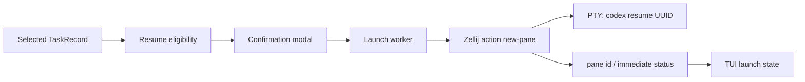

# 从任务列表恢复 Codex 终端会话

更新日期：2026-07-14

状态：Phase 1 首版实现；当前仅支持从 TUI 恢复到当前 Zellij session 的新 Codex CLI pane

验证基线：`codex-cli 0.144.3`、`zellij 0.44.1`

## 1. 结论

这个能力可以实现，但首版应准确命名为 **resume 到新的 Codex CLI 前端**，不能称为附着到原来的 Desktop/CLI 进程。

当前首版行为是：在 codex-usage-monit 的 Tasks 面板选择一个非活跃 root task，通过 `[O]Open` 在当前 Zellij session 内创建一个默认接近全屏的 floating pane，并在真实 PTY 中执行：

```text
codex resume --cd <task.cwd> <thread_uuid>
```

显式 UUID 会直接选择对应 thread，不经过 picker；命令不携带 `PROMPT`，因此打开终端本身不会替用户提交新 turn。Desktop 创建的本地 task 也可以在 CLI 中恢复；官方文档明确描述了 Desktop task 在 CLI resume 后仍保留历史附件。

首版不承诺以下能力：

- 附着到一个正在执行的独立 Desktop/CLI runtime；
- 在两个独立 Codex runtime 中安全地并发操作同一 active thread；
- 把 subagent thread 直接提升为独立交互式 root TUI；
- 恢复已被 Desktop 清理掉的 managed worktree；
- 从 selected turn 的历史位置继续。`resume` 的目标是 thread，打开的是该 thread 的最新状态。

live rejoin 的可行研究路径是让多个前端连接同一个 Codex App Server。`codex resume --remote` 已具备入口，但当前工具不知道既有 Desktop/CLI 所属 App Server 的 endpoint 和认证信息，也没有稳定的多前端 active-turn 交互契约，因此不能把它作为首版的自动降级路径。

## 2. 用户体验目标

典型流程：

1. 用户在 Tasks 面板选择一个 task；
2. 按 `O` 或点击 `[O]Open`；
3. 弹窗展示 title、thread id、cwd、来源、状态证据和 Zellij 目标；
4. 用户按 `Enter` 或点击 `[↵] Open` 确认；
5. 当前 Zellij session 创建并聚焦一个 Codex floating pane；
6. Codex CLI 加载该 thread 的历史，停在可输入状态；
7. 用户退出 Codex pane 后，原 monitor pane 的筛选、选择和滚动位置保持不变。

“Open” 是 TUI 动作名；弹窗和文档中必须使用“Resume in new terminal”一类措辞，避免让用户误以为工具接管了原终端进程。

## 3. 当前数据是否足够

`TaskRecord` 已经包含启动所需的大部分字段：

`codex://threads/<uuid>` 中的 technical thread id、rollout 的 `thread_id` 和 CLI `resume` 参数中的 session ID，在本地持久化 task 上使用同一个 UUID 身份。界面和内部代码继续统一称为 `thread_id`，只在解释 CLI help 时使用 session ID。

| 字段 | 用途 | 当前边界 |
| --- | --- | --- |
| `thread_id` | 精确传给 `codex resume` | 只接受工具从 rollout 读取并验证过的 UUID，不使用 session name |
| `title` | 弹窗和 pane 的展示名 | 必须清理终端控制符、双向文本控制符并按显示宽度截断 |
| `cwd` | Zellij pane cwd 与 Codex `--cd` | 缺失、已删除或不是目录时禁止启动，不静默换到 monitor cwd |
| `source` | 区分 root Desktop/CLI 与 subagent | 首版禁用 `subagent` |
| `parent_thread_id` | 辅助判断 subagent 层级 | Tree 折叠后的汇总行仍应使用被选中父 task 自己的 UUID |
| `status` | active 风险门控 | 独立 runtime 的状态多为推断，不能证明没有其他前端正在运行 |
| provenance/confidence | 在确认弹窗解释状态证据 | 低可信或 unknown 必须显示警告 |

`Snapshot` 已经包含本次扫描使用的 `codex_home`。launcher 必须从 `app.snapshot.codex_home` 读取它，而不是重新读取环境或给 TUI 增加一条 `CollectConfig` 数据通路。工具允许 `--codex-home`，新 Codex 进程必须使用与扫描数据相同的 `CODEX_HOME`，否则 UUID 可能在另一套 session 库中找不到。

`TaskRecord` 现在会保留 rollout 是否只来自 `archived_sessions`；同一 thread 同时存在 active 与 archived 副本时，以 active 副本为准。首版会在确认前阻止 archived task，且不会自动执行 `codex unarchive`。

## 4. 支持矩阵

| 目标 | 首版策略 | 原因 |
| --- | --- | --- |
| 已完成/失败/中断的 root CLI task | 支持，确认后启动 | 属于 `codex resume` 的稳定契约 |
| 已完成/失败/中断的 root Desktop task | 支持，启动新的 CLI 前端 | 官方明确存在 Desktop 到 CLI 的 resume 路径 |
| Idle root task | 支持，但提示状态并非跨 runtime 的 live lock | rollout 状态不能证明原进程已经退出 |
| Stale/Unknown root task | 支持，显示高可见警告 | 本地证据不足，仍可能有其他前端 |
| Running/WaitingApproval/WaitingInput | 默认禁用 | 独立 CLI 不是原 runtime 的 live attach，并发语义没有公开保证 |
| subagent | 禁用，提示从父 task 使用 `/agent` | `codex resume` 没有承诺把 subagent 作为独立 root TUI 恢复 |
| archived task | 禁用并提示先 unarchive | rollout 来源已识别，但工具不应静默修改 Codex 状态 |
| cwd 缺失或已删除 | 禁用 | Codex 读取当前 working tree，换目录会改变项目、指令和 Git 语义 |
| monitor 不在 Zellij 内 | 首版禁用 | 后台 session 不会凭空提供用户可见的交互终端 |
| selected turn | 恢复其所属 thread 的最新状态 | CLI 没有按 turn 定位或回退的 resume 参数 |

即使 task 显示 Completed，也不能把它解释成跨进程排他锁。确认弹窗始终说明“将创建新的 CLI 前端”；active 状态的强制覆盖是否开放，留到真实并发测试后再决定。

## 5. Codex 能力边界

### 5.1 Resume 保留什么

Codex 保存 thread transcript 和记录的工作目录。恢复后继续写入同一个 thread id，历史消息仍然可见。

Codex 读取的是 **当前 working tree**，不是该 task 创建时的文件快照。因此弹窗必须显示实际 cwd，并提醒用户当前文件和 Git 状态可能已经变化。工具不应为 resume 自动 checkout、stash、创建 worktree 或修改分支。

Desktop managed worktree 可能已经被清理。若记录的 cwd 不存在，CLI 没有公开契约会恢复 Desktop snapshot；首版应停止并提示用户先在 Desktop 完成 restore/handoff。

### 5.2 Resume 不是什么

`codex resume <uuid>` 会创建一个新的交互式 Codex TUI 进程。它不是：

- 连接原进程 PTY；
- 镜像原 Desktop 界面；
- 把原 runtime 中正在等待的 approval/input 自动迁移到新 pane；
- 从某个历史 turn 回放或分叉。

Codex TUI 需要真实 PTY，不能把它的 stdin/stdout 接到 monitor 的普通 pipe 中。Zellij pane 正好提供独立 PTY，同时让 monitor 自己的 alternate screen 保持运行。

### 5.3 共享 runtime 研究路径

本机 Codex 0.144.3 生成的 experimental App Server schema 将 running thread 的 `thread/resume` 描述为 rejoin，Codex CLI 也支持 `resume --remote <endpoint>`。但稳定公开文档没有进一步保证多个交互前端如何共同处理 active turn、approval 或 input，因此这仍是待验证路径，不能作为首版能力承诺。

后续可以实验由工具管理一个共享 Unix-socket App Server，再让它启动的 Codex TUI 都连接该 runtime。这要求工具拥有 server 生命周期、endpoint、认证、订阅和故障恢复，也无法自动发现当前 Desktop 私有 runtime。首版继续使用稳定 CLI，不引入 App Server 控制面。

## 6. TUI 交互设计

### 6.1 入口

- 在 Tasks 面板标题栏增加 `[O]Open`，紧凑布局显示 `[O]`；
- 严格遵循 `AGENTS.md`：单独以 accent/bold 渲染真实快捷键 `O`，整个标签共享稳定鼠标 hitbox；
- 只有 `Focus::Tasks` 且搜索输入未聚焦时绑定 `O`；输入框必须先消费可打印字符；
- Turns 焦点不绑定 `O`，因为 selected turn 不能改变 resume 位置；用户先通过 `←` 返回 Tasks；
- 不可启动时控件保持可见但降色，点击或按键在 Tasks footer 给出具体原因。

`R` 已用于 Tree，`Enter` 已用于进入 Turns，使用 `O` 可以避免现有快捷键冲突。

### 6.2 确认弹窗

弹窗至少展示：

```text
Resume in new Codex terminal?
Task:    主要功能实现
Thread:  019f52ac-7a9f-7fd1-8dda-e775ef950785
Source:  desktop
Status:  DONE · inferred/medium
Cwd:     /Users/user/Workspace/codex-usage-monit
Target:  zellij floating pane · current session

[↵] Open   [Esc] Cancel
```

Stale/Unknown 使用 warning 文案；active、subagent、archived 或无效 cwd 不进入可确认状态。弹窗优先处理键鼠事件，不能把 `O`、筛选键或导航键泄漏给底层面板；`Ctrl-C` 延续现有直接退出规则。终端空间不足以完整显示关键信息时只显示 Resize 提示并保留 `[Esc] Cancel`（空间允许时），不渲染可点击的 Open，也不让 `Enter` 启动，避免 cwd 被截掉后误确认。

### 6.3 启动与重复操作

首版状态机为：

```text
Idle -> Confirming -> Launching -> RunningPane
                    -> Failed
RunningPane -> FocusExisting
            -> MissingPane -> Idle
```

- 同一个 thread 在 `Launching` 时合并重复按键/双击，避免创建两个 pane；
- 当前 monitor 进程内维护 `thread_id -> pane_id`，重复 Open 时异步校验 pane，再聚焦已有 pane；
- 已登记 pane 仍存在时使用 `focus-pane-id` 聚焦；Zellij 拒绝聚焦时向用户显示错误；
- pane 已退出并处于 held 状态时优先聚焦它，让用户看到退出码并决定重跑或关闭；
- pane 已被删除时只清理映射并提示再次按 `O`；第二次操作重新读取当前 task 状态，只有仍符合条件时才进入新 pane 确认，避免异步结果覆盖用户随后切换的选择或弹窗；
- 已登记 pane 的重复 Open 只执行聚焦，因此即使 task 后来显示 Running/Waiting，也不会创建第二个 Codex 前端；pane 不存在后则恢复普通 active 门控；
- pane id 只在一个 Zellij session 生命周期内有效，不能不经校验持久化到用户菜单状态。

首次启动成功后 monitor 记录 Zellij 返回的 `terminal_N`。重复 Open 会先用 `list-panes --all --json` 校验该 pane：仍存在时直接聚焦，被删除时清理映射并要求用户再次触发 Open。这里的“成功”只代表 Zellij 接受并创建了 pane，不代表 pane 内的 Codex 已经成功恢复 thread；首版不探测 pane 内 Codex 的后续退出状态，默认保留 pane 供用户查看原始错误。

## 7. Zellij 适配

### 7.1 首版运行条件

最可靠的交互范围是 **monitor 本身运行在一个 Zellij pane 内**。Zellij 在 pane 中设置 `ZELLIJ=0`、`ZELLIJ_SESSION_NAME` 和 `ZELLIJ_PANE_ID`；这些值只用于 capability hint，最终仍以轻量 `list-panes`/action 是否成功为准。

`ZELLIJ_SESSION_NAME` 在 session rename 后不会更新既有 pane。首版默认操作当前 session，不持久化该名称；若 rename 导致 action 失败，提示用户在重启 monitor pane 后重试，不承诺透明恢复。

### 7.2 推荐 pane 形态

首版默认创建当前 tab 内的 floating pane：

- width `90%`；
- height `90%`；
- `--near-current-pane`；
- 保留边框；
- 不使用 blocking 参数；
- 不使用 `--close-on-exit`。

接近全屏能给 Codex TUI 足够空间，同时仍让用户意识到 monitor 留在下层。退出命令后保留 held pane，可以看到 Codex/PATH/cwd 错误，并使用 Zellij 的 Enter 重跑、Ctrl-C 关闭。用户可在配置中改为 tiled pane 或启用 `closeOnExit`；独立 tab 仍属于后续范围。

### 7.3 用户级配置

TUI 启动时加载 `open.json`；文件不存在时以私有权限原子写入默认内容。`debug-startup` 复用同一初始化路径，一次性输出命令不读取或写入该文件。

路径解析顺序是：

1. 设置 `CODEX_USAGE_MONIT_CONFIG_DIR` 时使用 `<该目录>/open.json`；
2. 设置 `XDG_CONFIG_HOME` 时使用 `$XDG_CONFIG_HOME/codex-usage-monit/open.json`；
3. macOS 使用 `~/Library/Application Support/codex-usage-monit/open.json`；
4. Windows 使用 `%LOCALAPPDATA%\codex-usage-monit\open.json`；
5. 其他 Unix 使用 `~/.config/codex-usage-monit/open.json`。

默认文件为：

```json
{
  "version": 1,
  "enabled": true,
  "backend": "zellij",
  "codexBin": null,
  "zellij": {
    "floating": true,
    "widthPercent": 90,
    "heightPercent": 90,
    "closeOnExit": false
  }
}
```

字段语义：

- `enabled` 是 Open 总开关；
- `backend` 当前只接受 `zellij`；
- `codexBin: null` 从 monitor 的 `PATH` 解析 Codex，非空时使用该路径，固定版本时建议填写绝对路径；
- `floating: false` 创建当前 tab 的 tiled pane；`widthPercent` / `heightPercent` 必须在 `1..=100`，只在 floating 模式使用；
- `closeOnExit: false` 保留退出后的 pane，`true` 则向 Zellij 传 `--close-on-exit`。

配置不热重载，修改后需要重启 monitor。若 JSON 损坏、缺少 `version`、包含未知或拼错的字段、使用未来或其他不支持的版本、尺寸非法或读取失败，工具会保留原文件、禁用 Open，并在用户触发 Open 时显示错误；不会用默认值覆盖问题文件。Unix 上自动创建的目录和文件分别使用 `0700` 与 `0600`。

### 7.4 命令契约

下面只用于说明参数顺序，实际实现必须使用 `std::process::Command` 的独立 argv，禁止 `sh -c`、shell 拼接或 paste：

```text
zellij action new-pane
  --floating
  --width 90%
  --height 90%
  --near-current-pane
  --name <sanitized-pane-name>
  --cwd <recorded-cwd>
  --
  /usr/bin/env
  PATH=<monitor-process-PATH>
  CODEX_HOME=<snapshot-codex-home>
  <absolute-codex-bin>
  resume
  --cd
  <recorded-cwd>
  <thread-uuid>
```

设计说明：

- Zellij `--cwd` 设置 pane 目录，Codex `--cd` 明确设置 agent 工作根，两者保持一致；
- 显式 UUID 时不传 `--all`，它只影响 picker/`--last` 的 cwd 过滤；
- 不传 `PROMPT`、model、sandbox、approval、profile 或危险开关；
- 使用绝对 `codex_bin`，避免 Zellij server 的旧 PATH 找到另一版本；
- 本机 Codex 由 nvm 安装，shebang 仍需要 `node`，所以通过非 shell 的 `/usr/bin/env` 显式带入当前 PATH；
- 只显式传非敏感的 PATH 和 CODEX_HOME，不把 API key、token 或其他 secret 放进 argv；
- pane name 为 `codex <uuid前8位> - <title>`，仅用于展示，去除 C0/C1、ESC、BEL、换行和 bidi 控制符，并限制为 48 列；
- stdout 中的 `terminal_N` 是 pane id，stderr 和非零退出用于呈现 Zellij action 失败。

进程调用放入独立 worker，使用 null stdin 并分别捕获 stdout/stderr，结果通过 channel 回到 TUI event loop。虽然 Zellij action 通常立即返回，也不能让外部命令阻塞 100ms 的绘制/输入循环。Codex/Zellij executable、cwd 和当前 Zellij 环境的 preflight 都在用户触发 Open 后执行，不进入 rollout 扫描和首帧渲染的冷启动路径。

### 7.5 不在 Zellij 内

首版显示明确错误：

```text
Open requires codex-usage-monit to run inside Zellij.
```

不自动启动 GUI Terminal，也不自动选择 `zellij list-sessions` 的第一项：列表可能包含 exited/resurrectable session，后台 session 也没有附着 client，创建 pane 后用户仍看不到交互界面。

后续可选路径：

1. 允许用户显式指定 active session，使用 `zellij --session <name> action new-pane ...`；
2. 创建短 ASCII 名的 background session，再明确输出 `zellij attach <name>`；
3. 暂停 monitor 的 raw/alternate screen，在当前终端前台运行 `codex resume`，退出后恢复 monitor。

macOS 的 Zellij socket 路径有长度限制。若未来由工具创建 session，名称应使用类似 `cum-<8hex>` 的短 ASCII 值，不使用项目名或 task title。

## 8. 实现映射

首版把配置、launcher 和 TUI 状态分开，不把 subprocess 细节塞进 `App`：

```text
src/open_config.rs
  OpenConfig        version/enabled/backend/codexBin/Zellij options
  OpenConfigStore   用户级路径发现、默认创建与严格加载

src/session_launch.rs
  ResumeTarget       thread_id/title/cwd/source/status evidence
  LaunchContext      codex_home/codex_bin/PATH/monitor cwd/Zellij environment
  ZellijLaunchPlan   纯 argv、pane name 与预检结果
  LaunchResult       新 pane id；既有 pane 另以 FocusResult 表示
```

职责边界：

- `domain.rs` / rollout：继续提供 task identity 和 `Snapshot.codex_home`；补足 archive launch metadata；
- `open_config.rs`：发现并加载用户配置、缺失时安全创建默认文件、拒绝损坏或未来版本；
- `tui.rs::App`：选择、弹窗、launching 状态、pane registry、状态文案和 hitbox；
- `tui.rs::run_loop`：启动 worker、接收 `LaunchResult`、保持 UI 响应；
- `session_launch.rs`：验证 UUID/cwd/source，解析 executable，构造 argv，调用并解析 Zellij；
- `ui_state.rs`：首版不持久化 pane id、确认弹窗或 launching 状态；
- `cli.rs`：首版无新子命令，后续可复用同一 launcher 增加 `open --thread <uuid>`。

配置保持具体的 `OpenBackend::Zellij` enum，没有预先设计通用插件系统。等 tmux、当前终端 handoff 或外部 Zellij session 真正进入范围后再抽象共同接口。



## 9. 错误与反馈

| 错误 | 用户反馈 | 是否创建 pane |
| --- | --- | --- |
| 无选择或筛选后选择不可见 | `No task selected` | 否 |
| UUID 非法 | `Task has no resumable thread id` | 否 |
| subagent | `Resume the parent task, then use /agent` | 否 |
| active task | `Live attach is unavailable for independent runtimes` | 否 |
| cwd 缺失/删除 | 显示原路径和 Desktop restore 建议 | 否 |
| archived | 提示先 unarchive | 否 |
| 不在 Zellij | 提示从 Zellij 内启动 monitor | 否 |
| `zellij`/`codex` 不可执行 | 显示 executable 与修复方向 | 否 |
| Zellij action 非零 | 显示简短 stderr | 未知 |
| pane 内 Codex 瞬时失败 | 聚焦默认保留的 held pane，查看 Codex 原始错误 | 是 |
| thread 不存在或 CODEX_HOME 错误 | pane 保留 Codex 原始错误供用户查看 | 是 |

错误信息不应包含完整消息内容、认证数据或环境变量全集。普通状态只显示短 thread id；确认弹窗因用户主动操作可以显示完整 UUID 和 cwd。

## 10. 安全与隐私

- 只接受本地 rollout 中的 canonical UUID，不把 task title 当 session name；
- 所有动态值作为独立 argv，任何路径、标题或 UUID 都不能进入 shell；
- cwd 必须存在且是目录，保留记录路径，不静默 canonicalize 到另一个 checkout；
- 不传 `--dangerously-bypass-approvals-and-sandbox`，不改用户的 sandbox/approval 配置；
- 不自动 unarchive、fork、checkout、stash、restore worktree 或发送 prompt；
- Open 的状态反馈不记录完整对话、prompt、环境或 secret；
- `CODEX_HOME` 和 PATH 可见于 command pane metadata，不传 `auth.json` 内容或 token；
- pane title 始终做终端控制符和双向控制符清理；
- 用户级 `open.json` 只保存启动选项，不保存 thread id、title、cwd、pane id 或对话内容；损坏配置不会被自动覆盖。

## 11. 测试与验收

### 单元测试

- UUID、root/subagent、status、archive 和 cwd eligibility；
- 路径含空格、引号、Unicode、以 `-` 开头时 argv 仍保持边界；
- title 含换行、ESC、BEL、C0/C1 和 bidi 控制符时 pane name 安全；
- `ZellijLaunchPlan` 精确包含同一 cwd、CODEX_HOME、绝对 codex path，且无 prompt；
- Zellij stdout pane id、非零/异常输出和 `list-panes` JSON 中 terminal pane id 解析；
- 同 thread 的 Launching 合并和现有 pane 聚焦；
- 配置路径优先级、默认 JSON、首次创建竞争、私有权限、损坏/未来版本不覆盖和非法尺寸禁用。

### TUI 测试

- `[O]Open` 的普通/禁用/紧凑渲染、快捷键样式和稳定 hitbox；
- `O` 只在 Tasks 焦点生效，TaskSearch/TurnSearch 优先消费输入；
- 鼠标整块点击与键盘进入同一确认状态；
- modal 的 Enter/Esc/鼠标按钮和底层事件阻断；
- active、subagent、missing cwd、not-in-zellij 的可见原因；
- 60x24、80x24、100x30、120x40 及 dark/light 主题；
- worker 运行期间刷新、滚动、选择和退出仍可用。

### 真实 Zellij smoke test

- 使用短名临时 session，在 Zellij 0.44.1 创建 90% floating pane；
- 校验返回 `terminal_N`、cwd、title、floating、tab id 和 command；
- 首次启动 Codex、正常退出、瞬时失败和 held pane；
- 重复 Open 聚焦而不重复创建；
- pane 隐藏、非当前 tab、被用户关闭、session rename；
- Codex CLI root 与 Desktop root 各验证一个已停止 task；
- active task 和 subagent 保持禁用；
- 测试完成后清理临时 pane/session。

验收时还要确认：Codex 打开的 thread id 与选中 task 完全一致、历史可见、cwd 正确，并且在用户提交消息前没有由 monitor 自动创建新 turn。

## 12. 分阶段路径

### Phase 0：能力确认（已完成）

- 固化 resume 与 live attach 的术语边界；
- 确认 Zellij 0.44.1 和 Codex CLI 0.144.3 的本机能力；
- 保留 active 强制恢复、pane/tab 偏好等产品决策点。

### Phase 1：Zellij 内 MVP（当前首版）

- root、非 active、有效 cwd；
- `[O]Open`、确认弹窗、键鼠和异步 launcher；
- 90% floating pane、相同 CODEX_HOME、无 prompt；
- 进程内 pane 去重、聚焦和 held 错误反馈；
- 用户级 `open.json`、缺失时默认创建、Zellij pane 选项和 `codexBin`；
- launcher/config/TUI 自动化测试；Desktop/CLI stopped task 的真实 smoke test 继续作为发布验收。

### Phase 2：更多入口与终端形态

- `open --thread <uuid>`；
- 独立 Zellij tab 与显式 Zellij session；
- current-terminal handoff；
- 更完整的已存在 pane 发现与恢复。

### Phase 3：共享 runtime 实验

- 工具管理 `codex app-server --listen unix://...`；
- 它启动的 Codex TUI 使用 `codex resume --remote`；
- 验证同一 App Server 内 running thread 的多前端 rejoin、approval 和 input 语义；
- 只有验证形成稳定交互契约后，才对 active thread 开放；
- 处理多 subscriber、approval/input、server 生命周期和认证。

## 13. 首版固定边界

当前实现固定以下产品边界：

1. active task 首版禁用，不提供强制覆盖；
2. subagent 首版禁用；
3. cwd 不存在时停止，不回退主 checkout；
4. 默认使用当前 Zellij tab 的 90% floating pane，可由 `open.json` 改为 tiled 或调整尺寸；
5. Codex 退出后保留 held pane，便于查看错误；
6. pane 映射只在当前 monitor 进程内保存；
7. Open 配置缺失时写入默认值，但损坏或未来版本配置绝不自动覆盖。

若要把 active task 的并发 resume、自动 worktree fallback 或外部 Zellij session 纳入后续版本，需要先单独确定风险交互，不能作为普通 Open 的隐式行为。

## 14. 依据

- [Codex CLI command reference](https://developers.openai.com/codex/cli/reference)
- [Codex App Server](https://developers.openai.com/codex/app-server)
- [Zellij Run & Edit](https://zellij.dev/documentation/zellij-run-and-edit.html)
- [Zellij CLI recipes](https://zellij.dev/documentation/cli-recipes.html)
- [Zellij programmatic control](https://zellij.dev/documentation/programmatic-control.html)
- [Zellij integration environment](https://zellij.dev/documentation/integration.html)

本机验证命令：

```text
codex --version
codex resume --help
codex app-server generate-json-schema --experimental --out <tmp-dir>
zellij --version
zellij action new-pane --help
zellij action list-panes --help
zellij action focus-pane-id --help
```
