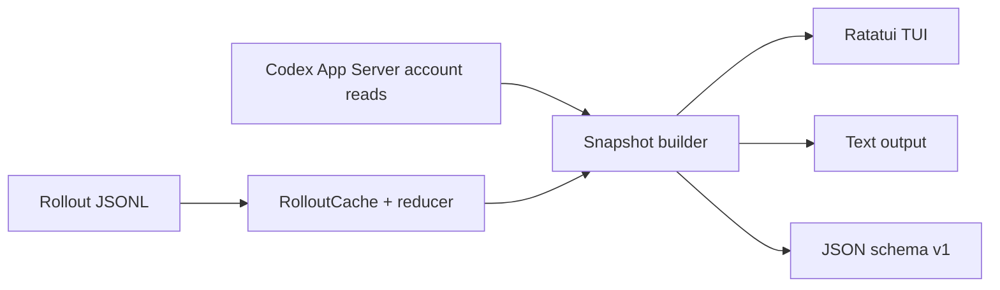

# 实现路径

更新日期：2026-07-13

## 1. 技术选型

使用 Rust 构建单二进制：

- `ratatui` + `crossterm`：TUI 与终端事件；
- `clap`：CLI；
- `serde` + `serde_json`：rollout、App Server 与 JSON v1；
- `chrono`：窗口与时间；
- `walkdir`：受限目录发现；
- `anyhow`：错误边界。

v0.1 不引入 async runtime、文件 watcher 或 SQLite 索引。后台刷新使用一个受控 worker thread，rollout 缓存只存在于 TUI 进程内。

## 2. 实际架构



模块：

```text
src/
  app_server.rs   JSON-RPC stdio 只读客户端
  rollout.rs      文件发现、规范化事件、缓存、全局 reducer
  attribution.rs 多个当前 reset cycle 的 token 聚合与额度估算
  snapshot.rs    来源融合、partial 与账户快照历史
  domain.rs      统一 schema/provenance/confidence
  output.rs      text/JSON section 输出
  tui.rs         Overview/Window/Data Health、筛选与焦点交互
  cli.rs         参数、子命令与退出码
```

## 3. 数据采集

### App Server

每次账户刷新启动 `codex app-server --stdio`，执行：

1. `initialize`；
2. `initialized`；
3. `account/rateLimits/read`；
4. `account/usage/read`。

客户端有统一总超时和子进程回收，不读取 `auth.json`，不调用控制或写接口。TUI 在内存中保留连续账户额度快照；一次性命令只拥有本次快照。

`limits` 子命令先走这条轻量路径。若无服务端额度，再执行本地 rollout 扫描做 stale fallback。

### Rollout

只扫描：

```text
CODEX_HOME/sessions/**/*.jsonl
CODEX_HOME/archived_sessions/**/*.jsonl
```

保留的规范化语义包括 session metadata、title preview、最多 72 字符的 turn 用户消息摘要、turn context、task start/finish、token counter、rate snapshot 和 subagent foreign baseline。未知记录忽略，坏行/不可读文件计入 partial。

subagent 文件可能先声明 child，再嵌入 parent 全历史，最后继续 child。Reducer 只把 parent 累计 token 当作 child counter baseline，不发出 parent turns/calls/rate observations。

## 4. Rollout 缓存

每个文件的 fingerprint 包括 length、mtime，Unix 下再包含 dev、inode 与 ctime。缓存值是规范化事件，不是独立 token delta；这样重新归并时仍能正确处理跨文件累计 counter、reset 与 foreign baseline。

刷新步骤：

1. WalkDir 与 metadata 重新发现候选；
2. 按 mtime 选取 `max_files`，再按时间顺序归并；
3. fingerprint 不变则复用规范化事件；
4. 变化文件完整重读，其他文件不 I/O；
5. 选择集或任一文件变化时重建 reducer；
6. 完全无变化时复用 reducer，只按 `now` 重算 Running/Stale。

最新真实 debug 基准：235 文件、约 232k 行，cold 约 5.7s，warm 约 55ms。

## 5. Token 重建

每个 thread reducer 维护：

```text
active_turn_stack
last_turn_id
previous_cumulative
turn/model metadata
```

相同累计值去重；每字段单调时计算 delta；嵌套 turn 完成后恢复父 turn；task finish 后的最终 delta 使用 `last_turn_id`。Counter 回退时只建立新的累计基线，不把回退样本重复计入，并增加 `ambiguousTokenResets`、把数据标为 partial。`totalTokens` 是总量，cached/reasoning 仅作为 breakdown。

用户消息有显式 `turn_id` 时直接归属对应 turn；缺失时只归入 `active_turn_stack` 顶部，没有 active turn 时不猜测归属。每个 turn 只保留首条摘要；`--redact-content` 在规范化阶段同时丢弃 task 标题与 turn 消息摘要。

Task 来源先识别 subagent，再使用 `originator` 区分 desktop/cli，最后回退到 rollout `source`。Turn 的 reasoning effort 从 `turn_context` 保留到 JSON、text 和 TUI；窄 TUI 面板将 effort 前置合并到 model 单元格。

Recent tasks 和 Turns 不使用独立状态列，而以轻量行背景色及单字符标记表达状态；Turns 底部渲染统一图例，并增加消息摘要列。Tasks/Turns 的点击选择与滚轮 viewport 独立，滚轮按 btop 的面板路由习惯每格移动 3 行；turn 选择按 `turn_id` 跨刷新保持，详情面板使用已有 TurnRecord 展示时间、时长、token breakdown 和归因指标。一次性 text 输出显示消息摘要，JSON schema v1 使用 `messagePreview`。

Window 页维护独立 `WindowScope`，用 `[5h]` / `[Week]`、键盘 `5` / `W` 或整块按钮点击切换。Tasks、Turns、Models、Attribution 和 turn detail 必须从同一 scope 的 `windowAnalyses` 读取，标题和列名不得硬编码成 5h。切换 scope 保留搜索、来源筛选、键盘焦点，以及新 scope 中仍存在的 `thread_id` / `turn_id` 选择。快捷键字符按仓库 btop 风格规则单独渲染，文本输入焦点继续先消费可打印字符。

TUI 单独维护 task 标题/项目名查询、`TaskSourceFilter` 和 `Focus` 状态，不写回 `Snapshot`。名称条件对 task 标题或 `cwd` basename 做大小写不敏感的子串匹配；过滤后的位置映射到 `snapshot.tasks` 的绝对索引，点击、滚动和键盘导航都经过同一映射，确保 Turns 始终绑定正确 thread。历史 `vscode` 来源作为 desktop-class 匹配 Desktop，其他未知来源只出现在 All；无匹配项时 selected thread 为空。顶部筛选控件复用 Tasks 面板边框，不占用 80x24 的数据行；长查询按 Unicode 显示宽度围绕光标水平裁剪。顶层视图 tab 每帧按 Ratatui 实际 padding/divider 计算鼠标 hitbox。

Tasks/Turns 分别维护 selection 与 viewport；键盘选择设置 reveal pending，滚轮只改变 viewport。刷新按 `thread_id` / `turn_id` 恢复仍满足筛选的选择；对象消失或被筛掉时回退到第一条匹配 task，并在必要时把焦点退回 Tasks。可执行焦点跳转时，Tasks/Turns 标题分别显示 `↵` / `←`；Tasks 标题始终预留固定提示宽度，避免筛选控件随焦点切换位移。可见按钮把真实快捷键拆为独立 accent/bold span，标签整体继续共享同一鼠标 hitbox；Tasks/Turns 右边框由共享几何函数绘制比例滚动条，Down/Drag/Up 状态只更新对应 viewport offset，轨道点击、滚轮与数据行选择保持独立。

TUI 颜色集中到 dark/light palette；默认 dark，CLI 的 `--theme light`（别名 `bright`）只传入无子命令的 TUI 路径，运行中按 `t` 切换。palette 不进入 `Snapshot`、采集配置或 `OutputRequest`，所以不会改变采集与一次性 text/JSON。

## 6. 窗口和额度估算

窗口 key 为 limit id、duration 和容差内的 reset time。仅选择当前有效窗口。每个窗口的实际周期都是 `[resetsAt - windowDurationMins, resetsAt)`；因此 week 是服务端当前 `resetsAt - 10080m` 到 `resetsAt` 的 reset cycle，不是 `now - 7d`，也不是自然周。

每个 300/10080 分钟 duration 选择一个可分析 scope。同 duration 有多个候选时，先优先 Codex 产品桶，再优先 `ServerSnapshot` provenance，最后使用稳定 key 排序决定；选择发生歧义时记录 warning。其余候选继续进入 limits gauge。由于 `UsageCall` 缺少 limit id，多桶时保留 duration 级本地 token 构成，但把对应 `WindowAnalysis` 标为 partial，并清空 estimated quota、coverage 和实体 confidence，不能声称调用属于所选桶。

Exact 部分：按窗口时间筛选本地 token events，聚合到 model、turn、task。

Snapshot 增加 `windowAnalyses`，每项携带 descriptor、summary、独立 `partial` / `partialReasons`，以及按 task/turn/model 聚合的 usage。`windows` 子命令和 `snapshot --section windows` 输出该结构。为保持 JSON v1 消费者兼容，原有 task/turn 的 `windowTokenUsage`、`localTokenSharePercent`、`estimatedQuotaPercent`、`quotaConfidence`，以及顶层 `models`、`attribution`，继续投影首选 5h 分析；没有可用 5h 时保持 unavailable/empty，绝不投影 Week。

本地 token share 只有在 rollout 扫描覆盖窗口起点且数据完整时才标为 exact。采集器除现有 truncated/unreadable/skipped/counter-reset 检查外，还比较 `--days` cutoff 与各 scope 的 `startsAt`；lookback 不足时只将对应分析标为 partial，limits gauge 仍可保持服务端完整。完整扫描下周 local token share 可精确结算，quota share 仍走 estimated 口径。

Estimated 部分：

1. 在线优先 App Server 历史；只有服务端历史不足且 rollout 最新值与当前值合理接近时才混用；
2. 百分比回退从回退点开启新 epoch；
3. 每个不超过 5 分钟的正 delta 区间，按本地 token 比例分配；
4. 无调用、长间隔、扫描不完整或未观测的当前额度留在 unattributed；
5. 任何分配仍标记 external activity possible；
6. active/stale 时 confidence 为 Low，确定 settled 后最高 Medium。

这不是官方配额账单。

## 7. 刷新模型

- local refresh gate：2 秒；
- account refresh gate：45 秒；
- 同时只运行一个 worker；
- worker 复用 `Arc<Mutex<RolloutCache>>` 与最近 AccountSnapshot；
- UI thread 只绘制 immutable Snapshot 并处理键盘和鼠标事件。
- 查询、来源筛选和焦点属于 UI 生命周期状态，worker 替换 Snapshot 时不得清空它们。
- Window scope 也属于 UI 生命周期状态；worker 刷新不得擅自从 Week 切回 5h，只有当前 scope 消失时才显示 unavailable。

## 8. 测试

- App Server mock：多桶、legacy、nullable、错误、可选 usage stall、timeout、child reap；
- rollout：duplicate/reset、嵌套 turn、消息归属、archive、redact、stale、parent replay、final token、truncate；
- cache：warm hit、单文件 append、fresh equivalence、foreign baseline、unreadable retry；
- attribution：5h/Week reset-cycle 边界、排除滚动 `now-duration` 口径、reset drift、同 duration 多桶 Codex/Server 优先与 warning、gauge-only 候选、server/local mismatch、correction epoch、long gap、settled，以及 `--days` 覆盖不足的 per-window partial；
- output/CLI：`windows`、`snapshot --section windows`、`windowAnalyses` camelCase、旧 5h 字段投影兼容、section partial/failure、broken pipe、help/usage；
- TUI：dark/light 两套主题下状态背景色、图例、消息摘要和 turn 详情的 TestBackend；覆盖标题/项目名/source 组合筛选、真实快捷键字符样式与直达键、顶层视图 tab 点击、`[5h]` / `[Week]` 的 `5` / `W` 与鼠标 hitbox、scope 切换同步 Tasks/Turns/Models/Attribution、scope 不可用、非连续绝对索引映射、空结果、Unicode 光标编辑、搜索态按键隔离、Tasks→Turns→Tasks 焦点转换、键盘 reveal、点击设置焦点、比例滚动条几何与 Down/Drag/Up、轨道点击、滚轮与选择独立、过滤后绝对索引映射、跨刷新 ID 保持、有效窗口无模型活动、模型按 token 排序与 `top N/M` 裁剪提示，以及 80x24、100x30、120x40 顶栏 hitbox 和布局；并做真实 PTY smoke test。

## 9. 已完成阶段

- Phase 0：能力边界与估算口径；
- Phase 1：rollout parser 与一次性输出；
- Phase 2：App Server 额度和账户用量；
- Phase 3：TUI 三视图；
- Phase 4：状态 provenance 与 stale 降级；
- Phase 5：保守额度估算与来源校准；
- Phase 6：真实 subagent 兼容、缓存、partial 和审查修复。
- Phase 7：Recent tasks 标题/source 筛选与 Tasks/Turns 统一键鼠焦点。
- Phase 8：5h/Week 多窗口分析、Window scope 切换、`windows` 输出与旧 5h schema 兼容。

后续路线见需求文档第 7 节。
