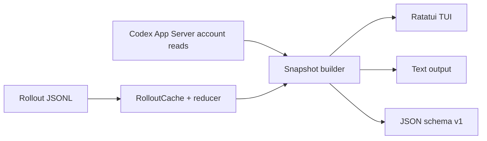

# 实现路径

更新日期：2026-07-12

## 1. 技术选型

使用 Rust 构建单二进制：

- `ratatui` + `crossterm`：TUI 与终端事件；
- `clap`：CLI；
- `serde` + `serde_json`：rollout、App Server 与 JSON v1；
- `chrono`：窗口与时间；
- `walkdir`：受限目录发现；
- `anyhow`：错误边界。

v0.1 不引入 async runtime、文件 watcher 或 SQLite 索引。后台刷新使用一个受控 worker thread，rollout 缓存只存在于 TUI 进程内。

## 2. 实际架构



模块：

```text
src/
  app_server.rs   JSON-RPC stdio 只读客户端
  rollout.rs      文件发现、规范化事件、缓存、全局 reducer
  attribution.rs 当前窗口 token 聚合与额度估算
  snapshot.rs    来源融合、partial 与账户快照历史
  domain.rs      统一 schema/provenance/confidence
  output.rs      text/JSON section 输出
  tui.rs         Overview/Window/Data Health
  cli.rs         参数、子命令与退出码
```

## 3. 数据采集

### App Server

每次账户刷新启动 `codex app-server --stdio`，执行：

1. `initialize`；
2. `initialized`；
3. `account/rateLimits/read`；
4. `account/usage/read`。

客户端有统一总超时和子进程回收，不读取 `auth.json`，不调用控制或写接口。TUI 在内存中保留连续账户额度快照；一次性命令只拥有本次快照。

`limits` 子命令先走这条轻量路径。若无服务端额度，再执行本地 rollout 扫描做 stale fallback。

### Rollout

只扫描：

```text
CODEX_HOME/sessions/**/*.jsonl
CODEX_HOME/archived_sessions/**/*.jsonl
```

保留的规范化语义包括 session metadata、title preview、turn context、task start/finish、token counter、rate snapshot 和 subagent foreign baseline。未知记录忽略，坏行/不可读文件计入 partial。

subagent 文件可能先声明 child，再嵌入 parent 全历史，最后继续 child。Reducer 只把 parent 累计 token 当作 child counter baseline，不发出 parent turns/calls/rate observations。

## 4. Rollout 缓存

每个文件的 fingerprint 包括 length、mtime，Unix 下再包含 dev、inode 与 ctime。缓存值是规范化事件，不是独立 token delta；这样重新归并时仍能正确处理跨文件累计 counter、reset 与 foreign baseline。

刷新步骤：

1. WalkDir 与 metadata 重新发现候选；
2. 按 mtime 选取 `max_files`，再按时间顺序归并；
3. fingerprint 不变则复用规范化事件；
4. 变化文件完整重读，其他文件不 I/O；
5. 选择集或任一文件变化时重建 reducer；
6. 完全无变化时复用 reducer，只按 `now` 重算 Running/Stale。

最新真实 debug 基准：235 文件、约 232k 行，cold 约 5.7s，warm 约 55ms。

## 5. Token 重建

每个 thread reducer 维护：

```text
active_turn_stack
last_turn_id
previous_cumulative
turn/model metadata
```

相同累计值去重；每字段单调时计算 delta；嵌套 turn 完成后恢复父 turn；task finish 后的最终 delta 使用 `last_turn_id`。Counter 回退时只建立新的累计基线，不把回退样本重复计入，并增加 `ambiguousTokenResets`、把数据标为 partial。`totalTokens` 是总量，cached/reasoning 仅作为 breakdown。

## 6. 窗口和额度估算

窗口 key 为 limit id、duration 和容差内的 reset time。仅选择当前有效窗口。

Exact 部分：按窗口时间筛选本地 token events，聚合到 model、turn、task。

Estimated 部分：

1. 在线优先 App Server 历史；只有服务端历史不足且 rollout 最新值与当前值合理接近时才混用；
2. 百分比回退从回退点开启新 epoch；
3. 每个不超过 5 分钟的正 delta 区间，按本地 token 比例分配；
4. 无调用、长间隔、扫描不完整或未观测的当前额度留在 unattributed；
5. 任何分配仍标记 external activity possible；
6. active/stale 时 confidence 为 Low，确定 settled 后最高 Medium。

这不是官方配额账单。

## 7. 刷新模型

- local refresh gate：2 秒；
- account refresh gate：45 秒；
- 同时只运行一个 worker；
- worker 复用 `Arc<Mutex<RolloutCache>>` 与最近 AccountSnapshot；
- UI thread 只绘制 immutable Snapshot 并处理按键。

## 8. 测试

- App Server mock：多桶、legacy、nullable、错误、可选 usage stall、timeout、child reap；
- rollout：duplicate/reset、嵌套 turn、archive、redact、stale、parent replay、final token、truncate；
- cache：warm hit、单文件 append、fresh equivalence、foreign baseline、unreadable retry；
- attribution：窗口、reset drift、server/local mismatch、correction epoch、long gap、settled；
- output/CLI：camelCase、section partial/failure、broken pipe、help/usage；
- TUI：80x24 与 120x40 TestBackend，并做真实 PTY smoke test。

## 9. 已完成阶段

- Phase 0：能力边界与估算口径；
- Phase 1：rollout parser 与一次性输出；
- Phase 2：App Server 额度和账户用量；
- Phase 3：TUI 三视图；
- Phase 4：状态 provenance 与 stale 降级；
- Phase 5：保守额度估算与来源校准；
- Phase 6：真实 subagent 兼容、缓存、partial 和审查修复。

后续路线见需求文档第 7 节。
