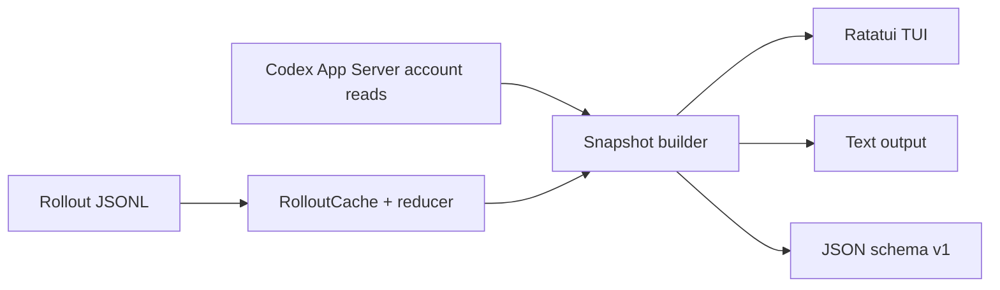

# 实现路径

更新日期：2026-07-14

## 1. 技术选型

使用 Rust 构建单二进制：

- `ratatui` + `crossterm`：TUI 与终端事件；
- `clap`：CLI；
- `serde` + `serde_json`：rollout、App Server 与 JSON v1；
- `chrono`：窗口与时间；
- `walkdir`：受限目录发现；
- `anyhow`：错误边界。

v0.1 不引入 async runtime、文件 watcher 或 SQLite 索引。后台刷新使用一个受控 worker thread，rollout 缓存只存在于 TUI 进程内。

## 2. 实际架构



模块：

```text
src/
  app_server.rs   JSON-RPC stdio 只读客户端
  rollout.rs      文件发现、规范化事件、缓存、全局 reducer
  attribution.rs 当前 codex reset cycle 的 token 聚合与额度估算
  snapshot.rs    来源融合、partial 与账户快照历史
  domain.rs      统一 schema/provenance/confidence
  output.rs      text/JSON section 输出
  tui.rs         Overview/Data Health、筛选与焦点交互
  cli.rs         参数、子命令与退出码
```

## 3. 数据采集

### App Server

每次账户刷新启动 `codex app-server --stdio`，执行：

1. `initialize`；
2. `initialized`；
3. `account/rateLimits/read`；
4. `account/usage/read`。

客户端有统一总超时和子进程回收，不读取 `auth.json`，不调用控制或写接口。TUI 在内存中保留连续账户额度快照；一次性命令只拥有本次快照。

`limits` 子命令先走这条轻量路径。若无服务端额度，再执行本地 rollout 扫描做 stale fallback；fallback 按规范化 `limit_id` 各自保留最新观测，不能只取全局最新一条。

### Rollout

Token 与状态历史只扫描：

```text
CODEX_HOME/sessions/**/*.jsonl
CODEX_HOME/archived_sessions/**/*.jsonl
```

保留的规范化语义包括 session metadata、subagent 的直接 parent thread id、title preview、最多 72 字符的 turn 用户消息摘要、turn context、task start/finish、token counter、rate snapshot 和 subagent foreign baseline。只有 `thread_source=subagent` 或结构化 `source.subagent` 确认身份后才建立 parent link，优先取 `source.subagent.thread_spawn.parent_thread_id`，再兼容顶层 `parent_thread_id` 与旧日志 `forked_from_id` 的 snake/camel 变体；普通 resume/fork 也会带 `forked_from_id`，不得被误归为 subagent。`session_id` 是根会话，不能用于直接父子关系。未知记录忽略，坏行/不可读文件计入 partial。缓存层另外检查 `$CODEX_HOME/session_index.jsonl` 的文件指纹，仅在创建、修改或替换时重新读取，并按 `updated_at` 为每个 thread 选择最新非空 `thread_name`；materialize 使用缓存标题覆盖 title preview。文件缺失、删除、不可读或记录损坏时保留 rollout 回退值，读取失败不缓存为成功结果并在后续刷新重试，redact 模式完全跳过标题索引。单独重命名会在 TUI 下一次刷新生效而无需重解析 rollout。

subagent 文件可能先声明 child，再嵌入 parent 全历史，最后继续 child。Reducer 只把 parent 累计 token 当作 child counter baseline，不发出 parent turns/calls/rate observations。

## 4. Rollout 缓存

每个 rollout 与 session title 索引的 fingerprint 包括 length、mtime，Unix 下再包含 dev、inode 与 ctime。rollout 缓存值是规范化事件，不是独立 token delta；这样重新归并时仍能正确处理跨文件累计 counter、reset 与 foreign baseline。标题索引缓存值是当前 thread title map，文件未变化时 materialize 只复用该 map。

刷新步骤：

1. WalkDir 与 metadata 重新发现候选；
2. 按 mtime 选取 `max_files`，再按时间顺序归并；
3. fingerprint 不变则复用规范化事件；
4. 变化文件完整重读，其他文件不 I/O；
5. 选择集或任一文件变化时重建 reducer；
6. 完全无变化时复用 reducer，只按 `now` 重算 Running/Stale。

最新真实 debug 基准：235 文件、约 232k 行，cold 约 5.7s，warm 约 55ms。

## 5. Token 重建

每个 thread reducer 维护：

```text
active_turn_stack
last_turn_id
previous_cumulative
turn/model metadata
```

相同累计值去重；每字段单调时计算 delta；嵌套 turn 完成后恢复父 turn；task finish 后的最终 delta 使用 `last_turn_id`。Counter 回退时只建立新的累计基线，不把回退样本重复计入，并增加 `ambiguousTokenResets`、把数据标为 partial。`totalTokens` 是总量，cached/reasoning 仅作为 breakdown。

用户消息有显式 `turn_id` 时直接归属对应 turn；缺失时只归入 `active_turn_stack` 顶部，没有 active turn 时不猜测归属。每个 turn 只保留首条摘要；`--redact-content` 在规范化阶段同时丢弃 task 标题与 turn 消息摘要。

Task 来源先识别 subagent，再使用 `originator` 区分 desktop/cli，最后回退到 rollout `source`。Turn 的 reasoning effort 从 `turn_context` 保留到 JSON、text 和 TUI；窄 TUI 面板将 effort 前置合并到 model 单元格，Fast 标识始终追加在模型名称后。

Recent tasks 和 Turns 不使用独立状态列，而以轻量行背景色及单字符标记表达状态；Turns 底部渲染统一图例，并增加消息摘要列。Tasks/Turns 的点击选择与滚轮 viewport 独立，滚轮按 btop 的面板路由习惯每格移动 3 行；turn 选择按 `turn_id` 跨刷新保持，详情面板使用已有 TurnRecord 展示时间、时长、token breakdown 和归因指标。一次性 text 输出显示消息摘要，JSON schema v1 使用 `messagePreview`。

Overview 维护独立 `WindowScope`，在最顶栏中用 `[5h]` / `[Week]`、键盘 `5` / `W` 或整块按钮点击切换。Tasks、Turns、Models、Models 内的 attribution 摘要和 turn detail 必须从同一 scope 的 `windowAnalyses` 读取，标题和列名不得硬编码成 5h。切换 scope 保留搜索、来源筛选、键盘焦点，以及新 scope 中仍存在的 `thread_id` / `turn_id` 选择。独立 Attribution TUI 面板删除，但一次性 text/JSON 的 attribution 数据结构保持兼容。快捷键字符按仓库 btop 风格规则单独渲染，文本输入焦点继续先消费可打印字符。

TUI 单独维护 task 标题/项目名查询、`TaskSourceFilter` 和 `Focus` 状态，不写回 `Snapshot`。名称条件对 task 标题或 `cwd` basename 做大小写不敏感的子串匹配；过滤后的位置映射到 `snapshot.tasks` 的绝对索引，点击、滚动和键盘导航都经过同一映射，确保 Turns 始终绑定正确 thread。历史 `vscode` 来源作为 desktop-class 匹配 Desktop，其他未知来源只出现在 All；无匹配项时 selected thread 为空。顶部筛选控件复用 Tasks 面板边框，不占用 80x24 的数据行；长查询按 Unicode 显示宽度围绕光标水平裁剪。顶层视图 tab 每帧按 Ratatui 实际 padding/divider 计算鼠标 hitbox。

Tasks/Turns 分别维护 selection 与 viewport；键盘选择设置 reveal pending，滚轮只改变 viewport。刷新按 `thread_id` / `turn_id` 恢复仍满足筛选的选择；Recent tasks 偏移为 `0` 时保持顶部锚定，使刷新插入的最新 task 立即可见，非零偏移才按刷新前的首行 `thread_id` 锚定阅读位置。对象消失或被筛掉时回退到第一条匹配 task，并在必要时把焦点退回 Tasks。可执行焦点跳转时，Tasks/Turns 标题分别显示 `↵` / `←`；Tasks 标题始终预留固定提示宽度，避免筛选控件随焦点切换位移。可见按钮把真实快捷键拆为独立 accent/bold span，标签整体继续共享同一鼠标 hitbox；Tasks/Turns 右边框由共享几何函数绘制比例滚动条，Down/Drag/Up 状态只更新对应 viewport offset，轨道点击、滚轮与数据行选择保持独立。

Turns 使用自己的查询、光标、取消恢复状态和筛选后索引投影；模型、推理强度、消息、状态、turn ID 与 Fast 标识共享同一匹配入口。查询非空时标题稳定保留 `[Del]` 命中区，仅在对应面板处于非编辑焦点时强调 `Del`；此时键盘 `Delete` 清空完整查询，编辑焦点中的 `Delete` 仍只删除光标字符。所有 Turns/TurnSearch 到 Tasks/TaskSearch 的焦点转换经过同一入口，先清除 Turns 查询、编辑恢复状态和过滤投影，Tasks 查询保持不变。`V` 控制默认显隐，默认隐藏时 `Enter` / 可点击 `↵` 只设置临时可见状态，`Backspace` / 可点击 `←` 返回 Tasks 并清除该状态。Fast 来自 `thread_settings_applied` 的 `service_tier`，在 turn 激活时快照，避免之后的设置变化回写历史 turn；渲染时追加在模型名称后，普通 turn 不占用额外前缀。

Recent tasks 默认 Flat；`R` / `[R]Tree` 切换 Tree。过滤仍先得到绝对 task index 集合，Tree 只在该集合内为 `source=subagent` 的节点解析 parent 链，再生成带 Unicode connector 前缀的扁平显示投影；缺失/被过滤 parent 成为 orphan root，自引用边和会形成循环的 parent 边在构图时直接拒绝。每个子树使用其中最小的原始 recency position 作为排序 key，使最新 child 把父分支带到前面；该排序在折叠前完成，隐藏后代仍能推动分支。App 以 thread id 保存折叠集合，并在刷新时剔除已消失的 id；投影 DFS 在父节点折叠时记录并跳过完整后代集合，selection、viewport、mouse hitbox、scrollbar 与刷新锚点继续消费同一可见投影。大写 `E` / `[E]Collapse` 以空折叠集合构造当前过滤条件下的完整展开投影，再把所有 `has_children` 节点加入折叠集合，因此不会漏掉嵌套在已折叠祖先下的父节点；若这些节点已经全部折叠，则固定宽度标签切为 `[E]Expand` 并只从集合中移除当前过滤树的父节点。渲染折叠父行时，用父节点及隐藏后代对 `TokenUsage` 分量求和，并按当前 `codex` scope 的非 Spark 本地 token 分母重算 local share 与 estimated quota。展开行与 `Snapshot` 原始实体保持不变。拥有子节点的行保留固定宽度 `[-]` / `[+]` 区域，Tasks 焦点下由 `-` / `+` 操作，鼠标点击整块区域时先选择父节点再切换折叠状态。派生 depth 只属于投影，用于让真实 child 省略重复 project；被过滤 parent 的 orphan root 保持完整标签。

Turns 与 Models 首次启动默认可见，`V` / `[V]Turns` 和 `M` / `[M]Models` 在最顶栏共同切换对应面板显隐；隐藏时主布局接管释放的空间，顶栏恢复入口与 scope 控件保持可用。Models 使用单一外框，内容先渲染当前 `codex` scope 的 gauge、本地非 Spark token、Low-confidence EST 与数据质量摘要，再渲染无嵌套边框的模型表；即使模型为空，unavailable/归因信息仍然存在。其他额度桶继续由顶部 gauge 和 Data Health 展示，不进入 Models attribution。

非搜索状态的 `Esc` 打开覆盖式退出确认弹窗，弹窗吞掉底层键鼠事件，`Enter` 确认、`Esc` 取消；`Ctrl-C` 和既有 `q` 仍直接退出。搜索输入状态继续优先消费 `Esc`，只恢复编辑前查询。

TUI 颜色集中到 dark/light palette；首次运行默认 dark，CLI 的 `--theme light`（别名 `bright`）只传入无子命令的 TUI 路径并优先于保存值，运行中按 `t` 切换。palette 不进入 `Snapshot`、采集配置或 `OutputRequest`，所以不会改变采集与一次性 text/JSON。

新增独立 `ui_state` 模块，把主题、View、WindowScope、Turns/Models 显隐、TaskListMode 和 TaskSourceFilter 映射为版本化 camelCase JSON。路径按 `CODEX_USAGE_MONIT_STATE_DIR`、`XDG_STATE_HOME`、平台用户级 state 目录依次解析；损坏/缺失文件回退默认值，未来 schema 禁止旧版本覆盖，写入使用私有目录和同目录原子替换。事件处理前后只比较上述稳定偏好，有变化时写回并在正常退出兜底；搜索、焦点、selection、viewport、临时 Turns 与 thread 折叠集合留在进程内。

## 6. 窗口和额度估算

窗口 key 为 limit id、duration 和容差内的 reset time。仅选择当前有效窗口。每个窗口的实际周期都是 `[resetsAt - windowDurationMins, resetsAt)`；因此 week 是服务端当前 `resetsAt - 10080m` 到 `resetsAt` 的 reset cycle，不是 `now - 7d`，也不是自然周。

每个 300/10080 分钟 duration 只选择规范化 `limit_id == codex` 的当前窗口作为可分析 scope；服务端优先于同桶的离线 stale fallback。`codex_bengalfox` 和其他桶继续进入 limits gauge/Data Health，但不生成 `WindowAnalysis`。按所选窗口自身的 reset 边界过滤调用，模型名 trim 后与 `gpt-5.3-codex-spark` 大小写不敏感精确相等时排除；其他调用（包括 None/空模型）进入普通 `codex` 分母。

Exact 部分：按窗口时间筛选本地 token events，聚合到 model、turn、task。

Snapshot 增加 `windowAnalyses`，每项携带 descriptor、summary、独立 `partial` / `partialReasons`，以及按 task/turn/model 聚合的 usage；同一 duration 最多一个普通 `codex` 分析。`windows` 子命令和 `snapshot --section windows` 输出该结构。为保持 JSON v1 消费者兼容，原有 task/turn 的 `windowTokenUsage`、`localTokenSharePercent`、`estimatedQuotaPercent`、`quotaConfidence`，以及顶层 `models`、`attribution` 和旧 summary 字段继续保留；首选字段固定投影 5h `codex` 分析，没有可用 5h 时保持 unavailable/empty，绝不投影 Week。

本地 token share 只有在 rollout 扫描覆盖窗口起点且数据完整时才标为 exact。采集器除现有 truncated/unreadable/skipped/counter-reset 检查外，还比较 `--days` cutoff 与各 scope 的 `startsAt`；lookback 不足时只将对应分析标为 partial，limits gauge 仍可保持服务端完整。完整扫描下周 local token share 可精确结算，quota share 仍走 estimated 口径。

Estimated 部分：

1. 读取所选当前 `codex` 窗口的 `usedPercent`；
2. LOCAL 对 task/turn/model 分别计算原始 `entity_non_spark_tokens / all_local_non_spark_tokens`；
3. EST 按模型与 `priority`/Standard 的短上下文 input、cached input、output 价格生成整数成本单位，计算 `estimatedQuotaPercent = usedPercent * entityPriceUnits / allPriceUnits`；
4. 所有可用实体结果标为 Low，TUI/text 加 `~`，summary 保留 `externalActivityPossible`；
5. partial、lookback 不完整与 stale 继续记录质量问题，但不清空仍可计算的 estimate；
6. 当前 `codex` 窗口或本地非 Spark 分母不存在时保持 unavailable。

这不是官方配额账单。

## 7. 刷新模型

- local refresh gate：2 秒；
- account refresh gate：45 秒；
- 同时只运行一个 worker；
- worker 复用 `Arc<Mutex<RolloutCache>>` 与最近 AccountSnapshot；
- UI thread 只绘制 immutable Snapshot 并处理键盘和鼠标事件。
- 查询、来源筛选和焦点属于 UI 生命周期状态，worker 替换 Snapshot 时不得清空它们。
- Overview scope 与 Turns/Models 显隐属于持久化菜单状态；worker 刷新不得擅自从 Week 切回 5h 或重新显示隐藏面板，当前 scope 消失时只显示 unavailable。

## 8. 测试

- App Server mock：多桶、legacy、nullable、错误、可选 usage stall、timeout、child reap；
- rollout：duplicate/reset、嵌套 turn、消息归属、archive、redact、stale、parent replay、final token、truncate；
- cache：warm hit、单文件 append、fresh equivalence、foreign baseline、unreadable retry；
- attribution：5h/Week reset-cycle 边界、排除滚动 `now-duration` 口径、reset drift、只选择 `codex`、Spark 精确模型名大小写不敏感排除、缺失模型纳入、task/turn/model 公式求和、partial/stale 保留 Low estimate、无分母 unavailable，以及 `codex_bengalfox` gauge-only；
- output/CLI：`windows`、`snapshot --section windows`、`windowAnalyses` camelCase、Low estimate 的 `~`、旧 5h 字段和 attribution summary schema 兼容、section partial/failure、broken pipe、help/usage；
- TUI：dark/light 两套主题下状态背景色、图例、消息摘要和 turn 详情的 TestBackend；覆盖标题/项目名/source 组合筛选、非编辑态 `Delete` / `[Del]` 清空与编辑态按键隔离、Turns→Tasks 自动重置 Turns Filter、真实快捷键字符样式与直达键、两个顶层视图 tab 点击、最顶栏 `[V]Turns` / `[M]Models` / `[5h]` / `[Week]` 的键盘与鼠标 hitbox、scope 切换同步 Tasks/Turns/Models/归因摘要、Turns/Models 显隐与布局回收、scope 不可用、`codex_bengalfox` gauge-only、退出确认键鼠阻断、`E` 在 Collapse/Expand 间切换多层节点、折叠树隐藏后代 token/占比/额度汇总、Fast 位于模型名后、稳定菜单偏好 round-trip 与显式主题优先级、非连续绝对索引映射、空结果、Unicode 光标编辑、搜索态按键隔离、Tasks→Turns→Tasks 焦点转换、键盘 reveal、点击设置焦点、比例滚动条几何与 Down/Drag/Up、轨道点击、滚轮与选择独立、过滤后绝对索引映射、跨刷新 ID 保持、有效窗口无模型活动、模型按 token 排序与 `top N/M` 裁剪提示，以及极窄、60x24、80x24、100x30、120x40 顶栏 hitbox 和布局；并做真实 PTY smoke test。

## 9. 已完成阶段

- Phase 0：能力边界与估算口径；
- Phase 1：rollout parser 与一次性输出；
- Phase 2：App Server 额度和账户用量；
- Phase 3：TUI 基础视图（当前收敛为 Overview 与 Data Health）；
- Phase 4：状态 provenance 与 stale 降级；
- Phase 5：保守额度估算与来源校准；
- Phase 6：真实 subagent 兼容、缓存、partial 和审查修复。
- Phase 7：Recent tasks 标题/source 筛选与 Tasks/Turns 统一键鼠焦点。
- Phase 8：5h/Week 多窗口分析、Overview scope 切换、`windows` 输出与旧 5h schema 兼容。

后续路线见需求文档第 7 节。
