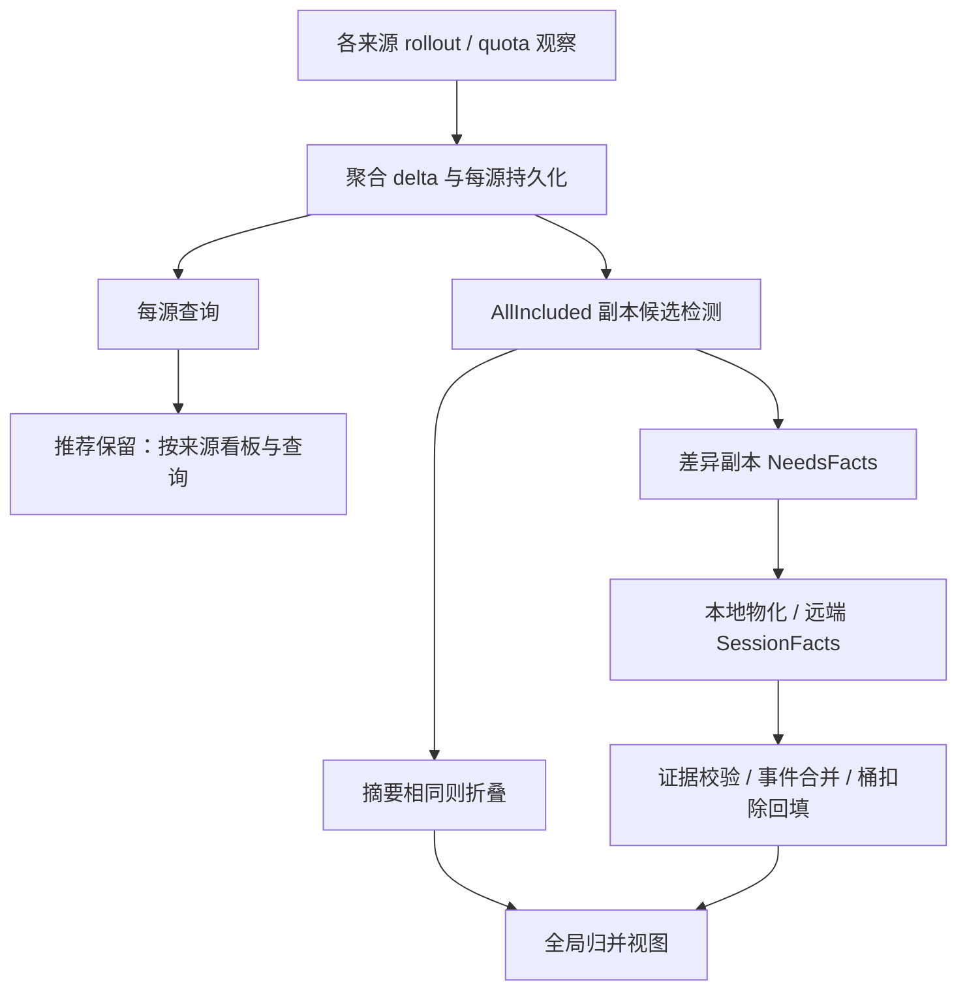

# 项目瘦身与外部库复用建议（待集中审核）

整理日期：2026-09-26。当前核对基线：`1c153229d5c167a0b02eca12fbc6ce4c4770e26f`，版本 0.5.2，工具链 Rust 1.97.0。

本文合并全项目生态审查、代码复杂度分析和“收窄跨机归并范围”的设计建议，供一次集中审核。**以下待办是建议，不表示产品取舍已经获批；本次只提交文档，不修改产品行为、数据格式或依赖。**

最初审查与生态检索日期为 2026-09-21，源码基线为 `177838bb669ce3fcf61075e23bb3997a34682670`（0.5.1）。本次核对其后的提交，更新了已经落地的 Windows 迁移状态。文中复杂度分组统计保留原快照口径；当前总物理行数另列。源码证据使用对应 commit 的永久链接；外部库资料是调研依据，实施时仍须核对实际选用版本。

## 1. 推荐决策与审核顺序

我的建议是：先完成明确的小范围机制替换；把最大的瘦身决策放在跨源同会话归并的产品边界上；随后才决定剩余存储是否需要迁移 SQLite。整个 TUI、同步协议或更新器没有可以直接接管其业务规则的通用库。

跨机部分推荐下文的 **A 方案：按来源展示和查询，停止跨来源同会话的事件级去重与分叉合并**。这个判断以“主要服务于多台机器的日常用量监控”为前提。如果“同一会话跨机复制、迁移后仍得到精确的全局唯一用量”是核心需求，应保留 C 方案，并接受相应复杂度。这项能力损失必须先审定，不能作为内部重构悄悄上线。

| 编号 | 建议 | 本次判断 | 审核关注点 |
| --- | --- | --- | --- |
| R1 | `semver` 替换手写版本解析；标准库文件锁替换 `fs2` | 优先实施，分别提交 | 收益明确；保持升级优先级和显式解锁语义 |
| R2 | `zeroize`、`windows-service`、`winreg` | 已落地，不重复排期 | 保留现有边界与回归，不以清零所有 unsafe 为目标 |
| R3 | 跨机归并采用 A 方案 | 推荐，需先审定产品语义 | 放弃跨源唯一会话总量；保留每源结果和多机看板 |
| R4 | TUI 读取独立的应用查询结果，将同步/历史编排移出界面层 | 随 R3 分批实施 | 降低修改影响范围；拆文件本身不算减码收益 |
| R5 | 复用 `quick-xml`；统一私有临时文件/发布边界 | 小范围整理 | 不改服务指纹、权限、崩溃恢复和原子发布契约 |
| R6 | SQLite / `rusqlite` | R3 范围稳定后做有界原型 | 不先迁移准备删除的 facts 数据；原型不等于全面迁移 |
| R7 | `tui-input`、`gix-url` | 有兼容性证明和净收益才采用 | grapheme 行为、持久化 Git 指纹不能漂移 |
| R8 | `tracing`、`notify`、进程库、下载库等 | 按明确需求再评估 | 不为减行数一次性引入大量依赖 |

建议集中审核时优先决定 R3，再审核 R1/R5 的边界，以及 R6/R7 的原型验收门槛。R2 是当前事实，不能再次算作这份提案的预期收益。

## 2. 25 万行的实际复杂度在哪里

当前提交的 Git 跟踪 Rust 文件为 **122 个、240,768 个物理行**：`src` 111 个文件、231,439 行，`tests` 10 个文件、9,235 行，另有 `build.rs` 94 行。这个数字包含注释、空行以及大量内嵌单元测试。

初次审查快照共有 240,150 个 Rust 物理行。静态拆分 `#[cfg(test)]` 测试区域后，测试区域约 105,730 行，非测试实现区域约 134,420 行；再排除空行和注释，实现约 **121,928 行**。同期 Python / shell / PowerShell / YAML 脚本另约 7,033 个物理行。以下是该快照按文件主要职责划分的互斥分组，不是当前 HEAD 的逐行复算，也不是编译器级条件展开或圈复杂度测量。

| 职责分组 | 非测试、非空、非注释实现行数（约） | 占比 | 主要复杂度 |
| --- | ---: | ---: | --- |
| 历史持久化与归并 | 31,553 | 26% | 多数据族原子提交、恢复、代际发布、证据与投影 |
| 远端同步与 agent | 27,976 | 23% | 分页、游标、预算、来源身份、facts、失败恢复 |
| TUI | 22,027 | 18% | 多视图交互与渲染，加上历史/同步的应用编排 |
| 安装、服务、升级生命周期 | 12,622 | 10% | 三平台进程/权限、安装所有权、升级与回滚 |
| 采集、解析与缓存 | 11,029 | 9% | 增量读取、损坏输入、有界扫描、数据归属 |
| CLI 与报告 | 8,931 | 7% | 查询入口、兼容输出、配置与管理流程 |
| 用量模型、定价与聚合 | 4,133 | 3% | 精确数值、覆盖度、价格版本与估算 |
| 共享工具与诊断 | 3,657 | 3% | 私有日志、文件和进程共用边界 |

百分比四舍五入。统计用于定位维护热点，不能推导“删除测试即可瘦身”或“这几组都能换库”。原始计数可通过固定 commit 下的 `git ls-files '*.rs'` 加逐文件行数复核；生产/测试分类是静态估算，实施后的净减码应重新以同一口径衡量。

主要负担有四层：

1. **产品语义**：同一 thread 的多个来源副本既可能重复，也可能各自继续产生事件；还要处理 partial、不同价格版本、项目归属、账户额度与 subagent。通用库不知道这些规则。
2. **存储机制**：为了让多个进程看到一致结果，实现了 redo、不可变 generation、manifest、staging、锁和 GC。一部分可以交给成熟数据库。
3. **进程与平台生命周期**：TUI、CLI、recorder、服务宿主、remote agent 可以并行或接续运行。支持多入口并发写入会把锁、所有权和恢复带到很多模块。
4. **展示与编排耦合**：历史读取、远端刷新、后台结果合并与输入/渲染集中在较大的 TUI 实现中。抽出应用层可以降低修改风险，但不会自动删除这些功能。

因此，换几十行 parser 能改善正确性，却无法解决整体体量；真正的大幅缩减要来自少承担一项复杂能力，或者移交一整类通用机制。暂不建议为瘦身强制改成唯一常驻 daemon：这会引入新的 IPC、启动可用性和部署契约，应作为独立架构决策，而不是 SQLite 或 TUI 拆分的隐含前提。

## 3. “收窄跨机归并范围”到底改变什么

### 3.1 先分开三种能力

| 能力 | 当前用途 | 推荐 A 方案 |
| --- | --- | --- |
| 多机采集与看板 | 一处连接多台机器，读取各自用量、趋势、模型和状态 | 保留 |
| 逻辑项目分组 | 用户把不同来源的项目实例放到一个逻辑项目下 | 可保留为标签/分组；保留来源列，合计注明观察记录口径 |
| 同会话副本归并 | 对多个来源中同一 thread 的重复事件去重，并合入各自独有的后续事件 | 删除 |

这里的“来源”是保存并提供记录的节点。**`NodeId` 证明记录由谁观察/导出，不证明 token 一定在这台机器上执行产生。** 如果复制了会话目录，两个来源都可能包含同一批历史。因此保留下来的每源数字应叫“该来源记录的用量”，不能宣称就是各机器独占的真实消费。

### 3.2 当前实现：先同步每源聚合，再按需补齐证据，最后构造归并查询结果

当前不是把每台机器总数直接相加，也不是每次同步都传输所有事件。主路径如下。

**第一步，保留物理来源身份。** 每个会话副本由 `(source_id, thread_id)` 标识，见 [SessionReplicaKey](https://github.com/ghostroller/codex-usage-monit/blob/1c153229d5c167a0b02eca12fbc6ce4c4770e26f/src/source_model.rs#L270)。项目实例同样具有来源维度。Git 指纹和仓库相对路径用来辅助提出项目映射建议，项目跨源合并需要用户确认；同项目或相似标题不会自动把不同 thread 变成同一会话。

**第二步，同步常规聚合数据。** [DeltaPayload](https://github.com/ghostroller/codex-usage-monit/blob/1c153229d5c167a0b02eca12fbc6ce4c4770e26f/src/remote_protocol.rs#L2512) 包含 15 分钟桶、UTC 日会话摘要、quota 变化和带 revision 的 live 数据等。数据经分页、游标和本地发布流程进入每源存储；这条链路本身就有断点续传和一致性要求，与副本归并不是同一件事。

**第三步，为跨源归并识别副本候选。** [history_query](https://github.com/ghostroller/codex-usage-monit/blob/1c153229d5c167a0b02eca12fbc6ce4c4770e26f/src/history_query.rs#L771) 仅在 `AllIncluded` 查询下启用检测；同步后的 facts planner 也独立使用候选检测规则，不受当前查看哪个来源影响。候选按相同 thread 和日范围组织，且需要不同来源；[logical_replica](https://github.com/ghostroller/codex-usage-monit/blob/1c153229d5c167a0b02eca12fbc6ce4c4770e26f/src/logical_replica.rs#L76) 判断摘要是否足以处理。完整、精确且范围、覆盖、事件/项目分解指纹、事件数量和指标等一致时，可以折叠完全相同的副本，无需补 facts。

**第四步，仅对 `NeedsFacts` 候选补充事件证据。** 手动同步和自动同步都有后续入口。[replica_fact_followup](https://github.com/ghostroller/codex-usage-monit/blob/1c153229d5c167a0b02eca12fbc6ce4c4770e26f/src/replica_fact_followup.rs#L306) 规划有界补齐，远端走 `SessionFacts`，本地也可能重新物化对应 thread 的事件。facts 是事件 ID、度量和归属等证据，不等于上传完整对话文本。它仍然需要独立游标、分页、冻结快照、配额/TTL、staging 和发布校验，产生了第二条数据链路。

**第五步，在查询时去重、合并和回填。** [reconciliation](https://github.com/ghostroller/codex-usage-monit/blob/1c153229d5c167a0b02eca12fbc6ce4c4770e26f/src/history_query/reconciliation.rs#L1376) 验证 facts 与当前摘要、revision、覆盖度和指标一致，按事件 ID 做集合合并：相同事件算一次，各来源独有的事件保留。同一事件 ID 的内容冲突时，当前代码选证据更强的参与者提供该事件并给出告警，仍可保留其他独有事件；并非遇到任何冲突都退回整个来源。证据不足以安全合并时，才选择一个权威副本并标记限制。

权威选择不是简单 `max(tokens)`，而是比较模型目录兼容性、当前 revision、精确身份和覆盖证据、partial 情况等，最后用稳定来源顺序破除平局。完整可验证的事件集合也不意味着每项费用都完全精确；价格或单请求估算的不确定性仍需保留。

归并结果还要从原始桶中扣除已知重复的 thread/project 部分，再补入唯一事件，保住同桶内无关项目；无法分解的残余只能保守处理并注明 partial/lower bound。它修改的是查询投影，不是抹去物理来源历史。复杂度不只在一个 `union` 函数，而在于证明“可以扣掉哪些、补上哪些、哪些仍不确定”。

**第六步，多处界面消费合并结果。** `AllIncluded` 不只在 Summary 的来源选择器里；[TUI](https://github.com/ghostroller/codex-usage-monit/blob/1c153229d5c167a0b02eca12fbc6ce4c4770e26f/src/tui.rs#L472) 为 Overview/Models 独立请求 `AllIncluded`，再交给 [remote_overview](https://github.com/ghostroller/codex-usage-monit/blob/1c153229d5c167a0b02eca12fbc6ce4c4770e26f/src/remote_overview.rs#L50) 投影。Health 和报告也使用共用历史加载路径。只删一个按钮会留下后台查询、facts 同步和维护成本。精确来源查询虽然不做跨源归并，当前仍共用桶/摘要加载和项目映射流程，也需重新划清依赖。

### 3.3 为什么不能用“求和”或“取最大值”替代

假设同一 thread 有公共历史 100；复制到 A、B 后，A 新增 20，B 新增 30。A 记录 120，B 记录 130。

| 处理方式 | 结果 | 含义 |
| --- | ---: | --- |
| 当前实现，且证据足够 | 150 | 公共部分只计一次，两条独有后续都保留 |
| 直接求和 | 250 | 两份观察记录之和，公共历史重复计数 |
| 取最大值或只选 B | 130 | 丢失 A 的 20，不能称全局精确用量 |
| 推荐 A 方案 | A=120，B=130 | 每源记录都可查询，不承诺一个全局唯一总量 |

若提供可选合计，只能另列“来源记录合计：250（未跨源去重）”。**不能让现有 `All`、JSON 字段或图表在同名下静默从 150 变成 250。** 当两个来源恰好没有交集，观察记录求和数值可能等于唯一总量，但系统不应据此对所有场景作保证。

### 3.4 三种范围的取舍

| 方案 | 保留能力 | 失去或限制 | 复杂度判断 |
| --- | --- | --- | --- |
| **A：来源隔离，推荐** | 多机连接、每源统计、趋势/模型/任务查询、显式项目分组 | 不再给出跨源同会话的唯一总量；复制历史可能在多个来源重复出现 | 最大程度移除候选检测、facts 后续、事件合并及相应展示规则 |
| B：仅折叠严格证明相同的完整摘要 | 相同副本可以展示一次；差异副本分别展示或标未知 | 不能合并跨机分叉；无法证明相同时没有精确全局总量 | 仍要维护摘要检测、分组和桶扣除，收益有限 |
| C：当前完整归并 | 证据足够时支持复制、迁移和分叉后的唯一事件投影 | 继续承担双数据链路和证据不完整时的解释 | 能力最强，复杂度最高 |

不建议长期并行保留 A/C 两套完整产品模式来声称瘦身。一个配置开关只能减少运行时开销，不能删除被支持模式的实现、兼容和测试负担。B 可以是独立产品选择，但不宜未经评估就作为永久“折中层”。

### 3.5 A 方案保留的边界

- 保留 SSH 连接、远端安装/更新、聚合 delta、分页、游标、来源身份、revision/tombstone、带宽预算、失败重试、健康状态与私有文件安全。不能把整个 remote 子系统列为可删除代码。
- 保留每源任务和 subagent 的真实归属。父子会话通常有不同 thread ID，子代理产生的独有用量不是“副本重复”；本地 lineage 规则不能连带删除。
- 保留显式逻辑项目映射，但不借此做跨源会话去重。跨源项目合计也必须使用“来源记录”口径，标识键继续携带来源。
- **账户 quota 单独处理。** 用户明确认定多个来源属于同一账户时，仍可汇聚账户额度观察；百分比不能相加。这是账户状态观测，与 token 事件去重不同。保留时间槽、新旧观察、reset 聚类及来源证据规则，远端也不应再次转发已经导入的额度数据。
- 保留覆盖度、离线/过期、partial 和价格不确定性。去掉跨源归并不能把每源已有的不完整数据伪装为完整。
- 保留原始桶和来源历史；已有派生 facts 的退役要做明确格式迁移和清理，不能在首次启动时无条件删除旧目录。

## 4. 实现路径与验收

以下分批是可独立审查的边界，不是工期承诺。只有 R3 获得认可，才执行 A 方案的代码路线。每批应记录实际删除的生产代码、剩余适配代码和兼容窗口，不能只统计挪到新文件的行数。

| 阶段 | 具体工作 | 退出条件 |
| --- | --- | --- |
| C0：冻结语义 | 明确来源记录、可选合计、账户 GLOBAL、任务/项目 ID、CLI/JSON 兼容策略；列出所有 `AllIncluded` 消费者 | 用下表场景固定旧/新结果；用户可看见能力变化 |
| C1：查询与界面迁移 | 引入按来源的报告集合，复用精确来源查询；迁移 Overview、Models、Summary、Trends、Health、CLI/JSON 和共用报告加载器；逐步将查询/同步编排移出 TUI | 所有消费者均遵守新语义；同名输出没有偷换含义；每源结果与旧精确来源路径一致 |
| C2：停止本中心的 facts 补齐 | 同时关闭手动、自动同步的 facts follow-up 和本中心本地物化；保留正常同步收尾 | 本中心的 `NeedsFacts` 场景不发 `SessionFacts`、不额外扫描本地 facts；主同步、预算、健康状态仍正确；旧 v5 请求的服务端支持及物化依赖留到 C4 |
| C3：删除无消费者的中心逻辑 | 删去旧归并查询、中心 facts 规划/摄取等已不再可达的实现；先拆出共享类型和存储职责 | 没有隐藏的 `AllIncluded` 入口、永久双引擎或仅通过测试占位器遮住生产调用 |
| C4：协调协议与状态迁移 | 在明确的协议版本边界删除 agent facts handler/exporter/wire DTO；检查旧磁盘状态并迁移派生数据 | 版本不匹配有明确提示；支持的升级路径可验证；仍被 v5 对端调用的 handler 不提前删除 |
| C5：收尾及效果评估 | 清理废弃状态、测试夹具和文档；相关本地平台验证一次完整批次；重新评估存储原型 | 兼容窗口有结束点，净减码与性能实测可复核，无常驻旧引擎 |

**建议 C0 审定以下默认行为，而不是把决定留到编码时：**

- 多来源看板默认列出每源卡片/行，不提供“全局唯一 token/费用”大数字。单来源视图保持当前精确来源语义；账户 quota 的 GLOBAL 单独显示。任何 token 占比、EST 比例或图表分母必须来自同一来源和时间范围，或明确标为未去重记录合计口径。
- CLI `summary` / `trends` 未指定来源时，建议输出带来源标识的报告集合；人类可读输出分来源分节，JSON 使用明确的新 schema/version 和 `sources` 集合，不继续复用旧顶层唯一总量字段。显式 `local` / 具体来源入口保留原查询语义。新的输出结构应在变更说明和脚本迁移示例中给出。
- 旧 `--source all` 不能静默变成求和；建议在切换版本明确提示该跨源唯一归并入口已退役，引导到新的多来源报告入口。若另设“观察记录合计”，使用独立命名和显式选项，不把它设为唯一用量的兼容替身。
- 迁移已保存的 All 选择到多来源看板，保留具体来源选择；来源离线/不可用时显示该来源状态，不自动回落到 local。检查 UI 状态版本、缓存键、已保存过滤器和 `logical-thread:` 身份；历史逻辑会话 ID 不能直接当作来源会话 ID，需显式失效说明或迁移规则。跨源逻辑项目仍保留来源维度。
- 集合报告保留成功来源的结果，对失败来源列出错误，并标明集合不完整；全部来源失败时返回失败。C0 应沿用现有 partial / 无数据 / 致命错误的退出码约定，固定多来源组合场景的映射，不把部分成功无声报为完整成功。
- 共用 [collect_and_load_report_history](https://github.com/ghostroller/codex-usage-monit/blob/1c153229d5c167a0b02eca12fbc6ce4c4770e26f/src/cli.rs#L3764) 也需迁移，不能遗漏 Health、后台刷新或非当前可见页面。为上述默认、显式来源、旧选项、旧 UI 状态和 JSON 迁移分别保留入口回归。

**C0 的最低场景表：**

| 场景 | 新方案应验证的结果 |
| --- | --- |
| 两个来源各自独立会话 | 每源结果保持，若显示合计则明确记录口径 |
| 完整复制的同一会话 | 两来源各显示自己的记录，不再隐式折叠 |
| 100 公共前缀 + 20/30 分叉 | A=120、B=130；不再宣称唯一总量150 |
| 同事件 ID 内容冲突、facts 不完整或过期 | 每源修订/partial 保留；不再产生跨源权威选择 |
| 被排除来源、离线来源、单源故障 | 看板选集与数据新鲜度明确；不污染其他来源查询 |
| 父会话与 subagent | 独有子会话用量不被当成重复副本消除 |
| 一个账户被多个来源观察 | 保留账户额度合并规则，不对百分比求和 |
| 历史升级、重启、分页失败与重试 | 来源历史可读、游标不越过未提交数据、恢复保持幂等 |

**几个容易误做的实现点：**

1. 自动同步配置、来源 exclude 和 quota 分离都不是专用 facts-off 开关。停自动同步仍可能手动触发；exclude 改变来源纳入及账户 quota 的合并规则；脱敏也不等于取消事件证据。需要在生产调用链上明确截断后续，并以调用计数/transport spy 验证。
2. 保留 [finalize_remote_sync_attempt](https://github.com/ghostroller/codex-usage-monit/blob/1c153229d5c167a0b02eca12fbc6ce4c4770e26f/src/remote_sync_attempt.rs#L133) 等共用收尾：host/config fence、metadata、budget、健康状态和 quota 仍要正确提交。不能通过提前 return 或测试用 deferred transport 的报错模拟停用。
3. `source_history`、`source_export`、`remote_export_state` 同时支持聚合同步与 facts。`session_evidence` 也承载共享摘要/指标。先按字段、类型和调用者拆分，不能整目录删除；会话摘要是否还能删要看每源任务查询等消费者，不预设答案。
4. 当前 wire 为严格匹配的 v5，并非自动兼容不同主版本。去掉 capability 声明不足以保证旧中心不再请求 facts。C3 删除限于已经无消费者的中心实现；需要保持的 v5 handler 及其依赖留到 C4 同步移除。协调发布期间给出中心/agent 升级顺序和版本不匹配提示，不能暗示任意新旧版本混用。
5. 带 `deny_unknown_fields` 的持久化状态不能靠删 Rust 字段就读取旧数据。为实际支持的旧格式保留独立读取 DTO 或显式迁移；在对应锁下退役可重建 facts 命名空间，保留源身份、聚合桶、quota 与提交状态。不要把“新程序不读旧派生数据”说成“旧二进制可以无损回滚”。
6. 聚合 delta 的请求范围描述采集覆盖，并不意味着可以按此范围丢掉 journal 里的旧变更后继续推进游标；会造成未消费变更永久丢失。保留现有增量协议的提交语义。
7. 可以暂时用旧查询做影子对照和离线验收；设定删除里程碑，避免迁移结束后继续同时维护两套生产引擎。任何磁盘破坏性迁移前，明确可用的备份/重建或导出路径。

**收益的可验证边界。** 原快照中 `remote_fact_exporter`、`remote_fact_sync`、`replica_fact_followup` 三个模块在测试区前分别约 2,235、1,652、982 个物理行，合计 4,869 行，包含注释和可能共享的定义。这是直接审查范围，**不是可承诺的净删除量**；另有归并查询、协议、存储及 UI 适配可收缩。相反，历史与 remote 合计约 6 万实现行绝不全是副本归并。

预期收益应测量：完成 C4 后是否完全消除该功能的 facts 请求和本地物化；复制/分叉场景同步传输量及延迟；冷启动和查询延迟；派生存储占用；净生产代码及测试维护面。当前 [remote_collection](https://github.com/ghostroller/codex-usage-monit/blob/1c153229d5c167a0b02eca12fbc6ce4c4770e26f/src/remote_collection.rs#L27) 仍有固定 35 天范围的聚合发现/缓存扫描，不能承诺 A 方案会消除所有扫描或保证固定百分比提速。

实施前可从现有诊断计数评估副本候选频率、facts 字节量、补齐延迟和真正发生分叉归并的频率；缺少相关度量时只新增固定字段计数，不记录对话内容。若该能力使用频繁且价值高，应回到 C 方案，而不是为删除行数硬推 A。

## 5. 通用机制与生态候选的逐项意见

下面保留初次生态调研的细节和固定基线源码证据。除注明“已落地”的第 2、4 项外，当前检查未发现相应替换已经完成；库 API 和版本描述以调研日期为准，实施前再次核验。

**1. SemVer 是最明确的换库收益。**

证据：[update.rs:755](https://github.com/ghostroller/codex-usage-monit/blob/177838bb669ce3fcf61075e23bb3997a34682670/src/update.rs#L755) 的 `compare_versions` 自行拆分 major/minor/patch、预发布标识并排序；[update.rs:733](https://github.com/ghostroller/codex-usage-monit/blob/177838bb669ce3fcf61075e23bb3997a34682670/src/update.rs#L733) 用它执行禁止降级和同版本 build 冲突检查。

当前解析接受 `01.0.0`、`1.0.0-01`，并在验证前丢弃 `+` 之后的全部内容，因此也接受空 build metadata 等非法形式。这是解析契约偏离，不代表已证明正常发布路径能够利用它绕过升级保护。标准库候选以外，`semver` 正好覆盖这里的标准规则；`Cargo.lock` 基线已经包含 1.0.28，可以将其显式声明为直接依赖。

替换为两个 `Version::parse` 加 `cmp_precedence`，保留现有错误上下文。必须使用 **`cmp_precedence` 而非默认 `Ord`**，因为本项目的升级优先级忽略 build metadata，实际源码 build 身份由另一字段判断。禁止降级和同版本不同 build 的业务判断保持独立。[semver 官方 API](https://docs.rs/semver/latest/semver/struct.Version.html)

验证范围：既有升级顺序测试，加非法前导零、空/非法 metadata、长数字预发布段、不同 metadata 相同优先级、同版本不同源码 build 等边界。无需因此重写发布脚本。

**2. `zeroize` 已落地，保留为已完成项。**

当前 [windows_scm.rs:396](https://github.com/ghostroller/codex-usage-monit/blob/1c153229d5c167a0b02eca12fbc6ce4c4770e26f/src/windows_scm.rs#L396) 已使用 `Secret(Zeroizing<Vec<u16>>)`；UTF-8 缓冲在读取前即由 `Zeroizing` 管理，并预分配 8193 字节，UTF-16 也预留完整容量。原基线中部分读取后 `?` 提前返回、绕过手工清零的问题已被这次修改覆盖，不再作为当前缺陷。

后续应保持 8 KiB 输入上限、成功/报错路径的统一生命周期，以及减少缓冲扩容的策略。库不能追溯抹除旧分配或操作系统内的副本。[zeroize 官方保障及限制](https://docs.rs/zeroize/latest/zeroize/)

相关错误路径测试已见于 [windows_scm.rs:1191](https://github.com/ghostroller/codex-usage-monit/blob/1c153229d5c167a0b02eca12fbc6ce4c4770e26f/src/windows_scm.rs#L1191)，本次未执行。不通过读取已释放内存来测试清零，也不为了迁移服务包装库而引入新的未清理 `OsString` 密码副本。

**3. `fs2` 可以退役，文件锁 guard 应保留。**

全仓库使用 `fs2` 的部分只涉及 shared/exclusive lock、try lock、unlock 和 `lock_contended_error`；没有发现 allocate 或磁盘空间 API 用途。项目工具链高于 1.89，标准库已经提供这些文件锁 API，可用 `TryLockError::WouldBlock` 替代九处重复的 `lock_is_contended`。

代表位置：[private_state_store.rs:191](https://github.com/ghostroller/codex-usage-monit/blob/177838bb669ce3fcf61075e23bb3997a34682670/src/private_state_store.rs#L191)、[history_profile_lease.rs:1425](https://github.com/ghostroller/codex-usage-monit/blob/177838bb669ce3fcf61075e23bb3997a34682670/src/history_profile_lease.rs#L1425)、[history_ownership.rs:1371](https://github.com/ghostroller/codex-usage-monit/blob/177838bb669ce3fcf61075e23bb3997a34682670/src/history_ownership.rs#L1371)。这是减少外部依赖的机会，不必为了“使用库”再选一个新的锁库。[Rust File 锁 API](https://doc.rust-lang.org/std/fs/struct.File.html#method.try_lock)

保留 [file_lock.rs:40](https://github.com/ghostroller/codex-usage-monit/blob/177838bb669ce3fcf61075e23bb3997a34682670/src/file_lock.rs#L40) 以及诊断、ownership、profile 的显式 Drop unlock。继承或复制的文件描述符可能延长锁寿命，单纯 drop 当前 File 不等于立即释放。此前仓库已经为此修复过问题，换 std 不应丢掉该行为。验证需要覆盖竞争、继承、失败路径释放及 Windows shared/exclusive 行为。

**4. Windows 服务与注册表通用包装迁移已落地，剩余原生边界有明确理由。**

当前 [windows_scm.rs:432](https://github.com/ghostroller/codex-usage-monit/blob/1c153229d5c167a0b02eca12fbc6ce4c4770e26f/src/windows_scm.rs#L432) 起的 manager/open/query/start/stop/delete/recovery 已使用 `windows-service`；[runtime.rs:31](https://github.com/ghostroller/codex-usage-monit/blob/1c153229d5c167a0b02eca12fbc6ce4c4770e26f/src/windows_scm/runtime.rs#L31) 起的 dispatcher/control/status 也已迁移。原生 `CreateServiceW` 保留密码单一受擦除缓冲区和 ImagePath 引号契约，`ChangeServiceConfigW` 保留 NULL 表示“不修改”的局部变更语义；不是遗漏的通用句柄包装。[windows-service](https://docs.rs/windows-service/latest/windows_service/)、[Service API](https://docs.rs/windows-service/latest/windows_service/service/struct.Service.html)

库不能替代 receipt 所有权、账户 SID/ACL、候选二进制身份、ready heartbeat、停止超时、防降级和升级事务。SCM 子进程的原子 Job 归属也必须保留，不能退化成启动后再加入 Job。后续不以删除所有 raw API 为验收目标。

注册表的 [installation/native.rs:48](https://github.com/ghostroller/codex-usage-monit/blob/1c153229d5c167a0b02eca12fbc6ce4c4770e26f/src/installation/native.rs#L48) 起已由 `winreg::RegKey` 接管打开、创建和句柄释放，常规写入/删除也使用库。**仍保留原生有界 reader**：256 KiB 上限、最多 8 次重试、未知类型及原始 UTF-16；`get_raw_value` 的循环扩容不能等价替换。继续保留 HKCU 范围、`REG_EXPAND_SZ` 原始类型和字节、实际返回句柄上的归属检查、compare-write 前二次读取，以及卸载所有权规则。[winreg 读取源码](https://docs.rs/winreg/latest/src/winreg/reg_key.rs.html)

这些结论来自当前代码核对，不是仅看 Cargo 中新增了依赖；本次文档整理没有重跑其平台测试。

**5. launchd 的 XML 优先复用已有依赖。**

[service.rs:1572](https://github.com/ghostroller/codex-usage-monit/blob/177838bb669ce3fcf61075e23bb3997a34682670/src/service.rs#L1572)、1599、3590 附近有字符串搜索式 plist 字段解析；3795 附近重复转义 XML 字符。项目已经使用 `quick-xml`，可以优先用 `Reader` 和 escape API 收敛这部分。[quick-xml Reader](https://docs.rs/quick-xml/latest/quick_xml/reader/struct.Reader.html)、[escape](https://docs.rs/quick-xml/latest/quick_xml/escape/fn.escape.html)

完整的 [plist 库](https://docs.rs/plist/latest/plist/) 是需要通用 plist 编解码时的候选。目前更小的边界是保留生成格式和服务指纹，只替换解析原语。调研时联网文档对应 0.42，实际实现应核对锁定 0.41 的 API 和输出，特别是回车转义是否改变服务指纹。迁移应覆盖重复键、错误类型、嵌套位置、转义与换行；`launchctl print` 文本解析不是 XML，不能一并算作节省。

**6. 临时文件确有重复，但先统一策略，再引入 `tempfile`。**

至少 [cache.rs:167](https://github.com/ghostroller/codex-usage-monit/blob/177838bb669ce3fcf61075e23bb3997a34682670/src/cache.rs#L167)、[private_state_store.rs:324](https://github.com/ghostroller/codex-usage-monit/blob/177838bb669ce3fcf61075e23bb3997a34682670/src/private_state_store.rs#L324)、[history.rs:4431](https://github.com/ghostroller/codex-usage-monit/blob/177838bb669ce3fcf61075e23bb3997a34682670/src/history.rs#L4431)、[source_history.rs:3348](https://github.com/ghostroller/codex-usage-monit/blob/177838bb669ce3fcf61075e23bb3997a34682670/src/source_history.rs#L3348)、[history_ownership.rs:1154](https://github.com/ghostroller/codex-usage-monit/blob/177838bb669ce3fcf61075e23bb3997a34682670/src/history_ownership.rs#L1154)、[history_profile_lease.rs:1005](https://github.com/ghostroller/codex-usage-monit/blob/177838bb669ce3fcf61075e23bb3997a34682670/src/history_profile_lease.rs#L1005) 重复 PID/序号命名、create_new、冲突重试和清理逻辑。

`tempfile` 已是开发依赖，适合接管普通临时文件分配与 RAII 清理；必要时可通过 Builder 的自定义创建回调保留底层打开策略。[Builder](https://docs.rs/tempfile/latest/tempfile/struct.Builder.html#method.make_in)

这里有两个不能忽略的迁移成本。第一，[source_history.rs:3019](https://github.com/ghostroller/codex-usage-monit/blob/177838bb669ce3fcf61075e23bb3997a34682670/src/source_history.rs#L3019) 从 `.target.pid.sequence.tmp` 反解发布目标，崩溃后的清理依赖它；改成随机命名需要同步设计兼容的恢复规则，Drop 也不能代替崩溃恢复。第二，`NamedTempFile::persist` 不负责同步文件内容和父目录，不能替换现有 fsync、Windows write-through/打开读者下替换、ACL、no-follow 与文件身份验证。[persist 文档](https://docs.rs/tempfile/latest/tempfile/struct.NamedTempFile.html#method.persist)

因此建议先将策略相同的调用点归入共享私有文件组件，再从没有恢复命名要求的调用点引库，实际比较净减码。同类 `atomic-write-file` 明确不保留 ACL，非 Unix 还不保留部分权限/ownership 语义，不是此项目的直接替换品。[atomic-write-file](https://docs.rs/atomic-write-file/latest/atomic_write_file/)

**7. 历史存储是最大的架构级候选：先验证 SQLite。**

具体的通用数据库机制已经出现在多个位置：

- [local_observation.rs:170](https://github.com/ghostroller/codex-usage-monit/blob/177838bb669ce3fcf61075e23bb3997a34682670/src/source_history/local_observation.rs#L170) 保存 pending redo batch；273 起恢复，395 起发布 journal 后依次更新多个数据族，602 起读者识别 pending 并阻止混合快照。
- [remote_generation.rs:811](https://github.com/ghostroller/codex-usage-monit/blob/177838bb669ce3fcf61075e23bb3997a34682670/src/source_history/remote_generation.rs#L811) 复制 immutable generation、应用变更、验证、切换 active manifest；后续还有 orphan 清理、容量管理和 GC。
- [session_evidence.rs:18](https://github.com/ghostroller/codex-usage-monit/blob/177838bb669ce3fcf61075e23bb3997a34682670/src/source_history/session_evidence.rs#L18) 管理 facts、manifest、staging 与发布层次。

这些结构可以由数据库事务、一致读、索引和恢复机制承接一部分。`rusqlite` 的同步 API 与当前架构相符，SQLite 不要求独立数据库服务；WAL 模式适合 TUI、recorder、报告命令同时读取并短事务写入，但仍只有一个 writer，busy 策略必须明确。[rusqlite](https://github.com/rusqlite/rusqlite)、[SQLite 隔离](https://www.sqlite.org/isolation.html)、[SQLite WAL](https://www.sqlite.org/wal.html)

建议在 R3 产品范围确定后，原型仅覆盖一次本地 observation 的同 revision 多数据族提交、进程重启恢复和一致读取。复用现有故障注入与多进程测试，测量写放大、冷启动、查询延迟、磁盘占用和总维护代码，确认收益后再评估仍需保留的远端 generation。若选择 A 方案，不应再迁移准备退役的 facts；不要先把所有 JSON 迁成一个大表。

迁移仍需明确：旧格式导入和回退、schema 演进、精确 `u128` 的存储编码（不能改成 REAL 或直接塞入 signed INTEGER）、WAL/SHM 权限、磁盘预算与 checkpoint、自定义 history-root 的文件系统支持。WAL 不支持网络文件系统；bundled SQLite 引入 C 编译链，需要验证 Windows/MSVC、macOS 和 Linux/musl。

远端未完成分页的 staging、revision/tombstone、来源身份、脱敏、quota provenance、exact/partial 和 evidence dominance 都是应用语义，数据库不会代替。profile lease 也不是普通写事务，不能直接改成长事务。

纯 Rust 的 redb 可作为对照，但不是当然更优。调研时检索到 4.3.0 已引入 `experimental-multiprocess`；默认仍是 `ExclusiveWriter`，应将实验多进程能力与项目现有并发进程模型分开评估，而不是沿用“完全不支持多进程”的旧结论。[redb changelog](https://docs.rs/crate/redb/latest/source/CHANGELOG.md)、[并发模式源码文档](https://docs.rs/redb/latest/src/redb/db.rs.html)

此前 [review-follow-up.md](https://github.com/ghostroller/codex-usage-monit/blob/177838bb669ce3fcf61075e23bb3997a34682670/docs/review-follow-up.md) 已记录跨文件中断修复。本次没有证明该修复失效，因此这是一项维护成本评估，不是“当前历史必然损坏”的缺陷结论。

**8. TUI 输入库有价值，但存在已确认的行为差异。**

候选是 [text.rs:8](https://github.com/ghostroller/codex-usage-monit/blob/177838bb669ce3fcf61075e23bb3997a34682670/src/tui/text.rs#L8) 至 58 行的编辑原语，以及 [tui.rs:5226](https://github.com/ghostroller/codex-usage-monit/blob/177838bb669ce3fcf61075e23bb3997a34682670/src/tui.rs#L5226)、8404、8431 的远端字段/任务/回合输入分发。`tui-input` 支持 grapheme 移动、删除和显示宽度，当前上游 0.15.x 的 Ratatui/Crossterm 版本也与项目相容。[Input API](https://docs.rs/tui-input/latest/tui_input/struct.Input.html)、[上游清单](https://raw.githubusercontent.com/sayanarijit/tui-input/main/Cargo.toml)

但是其 `InsertChar` 按 codepoint 将 cursor 加一，而项目已有 [tests.rs:8928](https://github.com/ghostroller/codex-usage-monit/blob/177838bb669ce3fcf61075e23bb3997a34682670/src/tui/tests.rs#L8928) 要求：在 `👩💻` 之间插入 ZWJ 后，光标移动到整个 `👩‍💻` 后方，下一次输入得到 `👩‍💻x`。直接替换会使光标停在合并 grapheme 内，必须保留插入后对齐与坐标转换适配。[上游输入实现](https://raw.githubusercontent.com/sayanarijit/tui-input/main/src/input.rs)

居中光标窗口、compact 显示、搜索取消恢复、鼠标命中区域和快捷键优先级仍属于 UI。建议只做一个输入框原型，验证最终代码确实更少，再推广；不要把整个 text 模块或 TUI 的体积记为潜在节省。必须复用现有 grapheme、键盘、鼠标和 compact 终端回归。

**9. Git URL 解析可交给 `gix-url`，指纹规则必须自己保留。**

[git_repository.rs:1152](https://github.com/ghostroller/codex-usage-monit/blob/177838bb669ce3fcf61075e23bb3997a34682670/src/git_repository.rs#L1152) 至 1274 约 123 行手写 scheme、SCP、IPv6、端口和路径处理。专门的 `gix-url` 比只支持普通 URL 的解析器更接近 Git 语法，无需为此引入整个 git2 或 gix 仓库操作层。[gix-url](https://docs.rs/gix-url/latest/gix_url/)

但这里的规范化结果进入持久化 `git-sha256-v1` 指纹。库的百分号解码、SSH `/~`、IPv6 括号和 path/query 表示与当前规则存在差异；错误还可能包含完整原始 URL。必须保留兼容 adapter 和脱敏错误，不能让库的 Display 输出直接决定身份或进入日志。先对现有样本和特殊路径进行差分验证，再决定净收益。[Url 语义与错误说明](https://docs.rs/gix-url/latest/gix_url/struct.Url.html)

**10. tracing 可统一部分基础设施，不应直接替换私有日志系统。**

[trace.rs:28](https://github.com/ghostroller/codex-usage-monit/blob/177838bb669ce3fcf61075e23bb3997a34682670/src/trace.rs#L28) 自建 span ID、活动表、时间和 Drop 收尾；[event_log.rs:26](https://github.com/ghostroller/codex-usage-monit/blob/177838bb669ce3fcf61075e23bb3997a34682670/src/event_log.rs#L26) 与 perf/startup 也分别管理级别、状态和输出。`tracing-subscriber` 的 Layer 可以承接过滤、span 和事件分发，支持自定义 writer/formatter，不强制采用异步 runtime。[Layer](https://docs.rs/tracing-subscriber/latest/tracing_subscriber/layer/trait.Layer.html)、[formatter/writer API](https://docs.rs/tracing-subscriber/latest/tracing_subscriber/fmt/struct.Layer.html)

不过现有系统具有固定 JSON schema、abandoned 状态、明确 finish 边界、事件恢复/去重，以及只接收静态标签、计数、摘要的 TraceFields。原样改成自由 `info!`/`debug!` 会削弱当前输入约束；需要 typed facade，跨 worker 的上下文传播也要明确。

[diagnostic_log.rs:8](https://github.com/ghostroller/codex-usage-monit/blob/177838bb669ce3fcf61075e23bb3997a34682670/src/diagnostic_log.rs#L8) 使用持锁 copy-then-truncate，保留 8 MiB 限额、完整 JSONL、私有权限和打开文件的并发语义。标准 `tracing-appender` rolling 按时间轮换，不等价于这个写入器。当前没有证明适配后能净减很多代码，建议有统一第三方日志/调用链诊断需求时再迁移。[tracing-appender Rotation](https://docs.rs/tracing-appender/latest/tracing_appender/rolling/struct.Rotation.html)

## 6. 其余子系统暂不整体替换

| 子系统 / 候选 | 判断及理由 |
| --- | --- |
| CLI、TUI 基础、JSON/XML、压缩、哈希 | 已复用 clap、Ratatui/Crossterm、Serde、quick-xml、flate2、sha2/hmac/base64；不是自己重写这些基础库。 |
| 进程树 → process-wrap | 可评估普通进程组/Job 的封装，但有界输出、取消、drain、PID 重用防护需保留；Windows SCM child 的原子 Job 归属不能降级为先 spawn 再 assign。 |
| SSH → openssh/russh/ssh2 | 现有实现调用系统 OpenSSH，不是自写 SSH；保留用户 ssh config、agent、ProxyJump 和 host-key 策略很有价值。openssh crate 当前只支持 Unix。 |
| 下载 → ureq | 同步 API 可减少本机自更新对解释器的依赖，但远端初次 bootstrap 仍需脚本，不能删掉那条链路；这是可用性需求，不是确定的减码收益。 |
| 更新器 → 通用 self updater / cargo-dist | 版本目录、稳定 launcher、recorder 心跳、receipt/rollback 与精确 SHA 发布门禁仍需维护，没有整体替换收益的证据。 |
| 窄 tar 解码 → tar | release.rs:195 约 53 行只接受一个固定名称普通二进制，严格限制尺寸、成员和尾部；库仍需同样策略。净减码有限，暂留；不能换成直接 unpack。 |
| Rollout / session_index → 通用 JSONL reader | 已使用 serde_json、walkdir；增量 tail guard、最新标题、as-of、超长行恢复和来源归属属于应用语义。session_index 读的是 JSONL，并无 SQLite CLI 可以直接替换。 |
| 发现文件 → notify | 可以降低部分空闲轮询，但网络文件系统、漏事件和目录规模仍要求兜底扫描；属于性能扩展，需先测量。 |
| 搜索 → nucleo | 当前是子串过滤，不是自写 fuzzy matcher；没有模糊搜索需求就无需引入。 |
| 堆叠面积图 → Ratatui Chart | 当前 Ratatui 已有 Area/fill_to_y，但项目还有堆叠、缺失留空、partial 覆盖和窄屏日期映射。没有证据说明迁移能省掉这些语义。 |
| 数值 → rust_decimal | 当前 PicoUsd 是固定刻度 u128，运算和覆盖/区间逻辑并非通用小数引擎；rust_decimal 的系数是 96 位，不能无损替代完整 u128 契约。继续保留定点类型。 |
| exact_json → serde_with | DisplayFromStr/PickFirst 可替代部分 Serde 适配，但还要兼容旧数字输入、拒绝负数/浮点与 lossy diagnostic path。单为约百行适配引入依赖收益有限。 |
| 同步、调度、归并 → 通用 RPC/重试/CRDT | 带宽预算、硬暂停、分页提交、revision、tombstone、证据支配与显式来源映射是核心业务。通用库不能替代规则；没有必要为了 framing/等待引入完整网络 runtime。 |
| Python / shell / CI | 已使用 tarfile、zipfile、hashlib、subprocess 和 gh；剩余部分主要是隔离快照、同 SHA 证据复用与发布策略。无需仅为减少 shell 行数更换平台。 |

上述保留/候选结论参考的官方资料：[process-wrap](https://docs.rs/process-wrap/latest/process_wrap/)、[Windows 实现](https://docs.rs/crate/process-wrap/latest/source/src/windows.rs)、[openssh 平台边界](https://docs.rs/openssh/latest/openssh/)、[ureq](https://docs.rs/ureq/latest/ureq/)、[tar raw entries](https://docs.rs/tar/latest/tar/struct.Entries.html)、[notify 已知限制](https://docs.rs/notify/latest/notify/)、[Ratatui GraphType](https://docs.rs/ratatui/latest/ratatui/widgets/enum.GraphType.html)、[rust_decimal 数值表示](https://docs.rs/rust_decimal/latest/rust_decimal/)、[serde_with DisplayFromStr](https://docs.rs/serde_with/latest/serde_with/struct.DisplayFromStr.html)、[PickFirst](https://docs.rs/serde_with/latest/serde_with/struct.PickFirst.html)。

## 7. 交付、验证与暂缓条件

建议代码提交顺序为：R1 的 semver 与 std 文件锁各一批；R5 的 XML/私有文件封装各一批；获批后的 R3 按 C0–C5 展开，R4 跟随消费者迁移；最后根据剩余机制和测量结果决定 R6/R7 原型是否继续。小范围库替换不必等待整个跨机范围调整，但不应与 wire/存储迁移混在同一个提交中。R2 已完成，不重复安排或计算收益。

每次换库以三个结果验收：旧的手写机制实际删除；适配后总维护代码和依赖成本合理；保留的业务契约回归通过。新的依赖应在实施时核验解析版本、features、MSRV、许可证、公告与目标平台构建，不能将“调研到库存在”当作依赖安全审计。`latest` 文档只能作为入口，代码评审必须针对锁定版本。

实现验证遵守 [AGENTS.md](../AGENTS.md)、[testing.md](testing.md) 和当时机器的 `.agent/environment.local.md`：先跑受影响的本地测试，平台敏感批次稳定后完成相关原生平台验证；Windows 当前可直接在本机执行，Linux/macOS 行为仍需对应环境。TUI 改动保留快捷键、grapheme、键盘/鼠标与 compact 覆盖；持久化/锁/分页改动复用确定性的故障和并发回归。记录源码 SHA、dirty snapshot、平台架构、完整命令、跳过项、结果和日志，不把构建成功或跨平台 type-check 当成原生运行证据。

当前机器指引要求只有明确请求时才执行 GitHub CI，因此文档提交或后续每个小提交都不自动触发 hosted CI；集成/发布另按明确任务要求及仓库同 SHA 证据流程进行。不要为普通验证创建 release tag。

下列情况应暂缓相应迁移：

- 跨源复制/分叉后的唯一用量被认定为核心需求：保留 C，不执行 R3 的删除路线；库替换与局部解耦仍可继续。
- 适配 `tui-input` 或 `gix-url` 后代码更多，或无法保持 grapheme/指纹契约：保留现状，不为换库而换库。
- SQLite 原型不能证明恢复/一致读至少等价、平台构建和私有文件权限可控，或净维护成本没有改善：不进行全库迁移。
- 新 wire/状态格式缺少可检验的升级与不匹配处理：停在保留兼容实现的迁移阶段，不先删对端仍会使用的服务端能力。

本次交付是一份可审核的建议文档。检查范围为当前代码事实、源码链接/行号、相对链接、表格数字与文档格式；生态依据沿用 2026-09-21 的官方资料调研。未修改产品代码、安装依赖、运行 Rust 测试、性能基准、原生平台套件或 CI；当前文档不提供新的运行测试通过结论。
