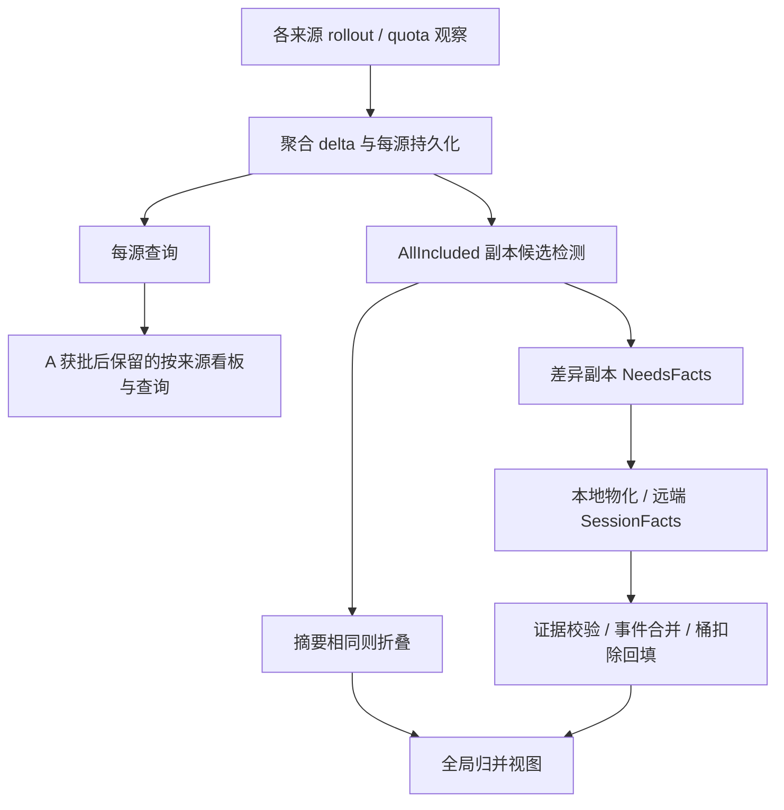

# 项目瘦身与外部库复用建议（审核修订版）

整理日期：2026-09-26。审核修订日期：2026-09-26。

| 基线或配套文件 | 说明 |
| --- | --- |
| 原提案记录的代码基线 | `1c153229d5c167a0b02eca12fbc6ce4c4770e26f`；版本 0.5.2；工具链 Rust 1.97.0 |
| 审核读取提交 | `abef359eac136a2b004c7e4b98890cee27bd37fe`；本次修订以该提交中的原提案为底稿，不代表重新审查了未来 HEAD |
| 初次生态审查快照 | 2026-09-21，`177838bb669ce3fcf61075e23bb3997a34682670`，版本 0.5.1 |
| 审核意见 | [`refactoring-review-2026-09-26.zh-CN.md`](refactoring-review-2026-09-26.zh-CN.md) |
| 本地执行方案 | [`refactoring-execution-plan-2026-09-26.zh-CN.md`](refactoring-execution-plan-2026-09-26.zh-CN.md) |
| 原提案留档 | [审查提交中的原文](https://github.com/ghostroller/codex-usage-monit/blob/abef359eac136a2b004c7e4b98890cee27bd37fe/docs/refactoring-proposal-2026-09-26.zh-CN.md) |
| 本地实施复核 | 2026-09-26；实际开工 HEAD `abef359eac136a2b004c7e4b98890cee27bd37fe`；保留开工时已修订的本文及两份未跟踪配套文档；M0—M6 的实际结果见执行方案第 11 节 |

本文合并全项目生态审查、复杂度分析、跨源归并产品取舍与后续审核意见，是可直接替换原提案的完整版本。**提案最初交接仅修订文档；后续获准的 M0—M6 实施与测试结果单独记录在执行方案第 11 节。A 方案、SQLite 原型和生产迁移仍未获实施授权。**

本次主要修订：R4 前移并独立于 R3；明确查询与写入的边界；补充 A 路线的删除依赖清单和同机旧进程兼容矩阵；文件锁增加新旧实现互操作验收；XML 解析与生成分离；临时文件按契约归类；SQLite 增加明确的原型门槛；R7 本轮默认暂缓。

文中“当前实现”均指上述审查基线。统计保留其原始日期和口径，不能当作本次重新测量的结果。源码事实、风险推导与实施要求应分开理解：调用结构推导出的风险不是已复现故障，新增验收条件也不证明现有实现不安全。实施时按实际 HEAD 复核符号、锁定依赖及适用公告，不机械套用旧行号，不回退用户已有工作。

**与执行方案 M0 的衔接：**配套执行方案中的“待修订提案”及 D1—D8 文字修改要求，已合入本版本。将本文件放入项目后，M0 应核对这些修订是否仍适用，而不是再重写同一份提案；实际 HEAD、查询入口清单、候选删除清单和工作区状态仍需本地 agent 检查，不能据此把整个 M0 标为完成。

## 1. 推荐决策与审核顺序

建议先完成边界明确的小范围机制替换，同时前移保持外部行为的应用层解耦；跨源归并作为单独的产品决定；数据库作为单独的原型与架构决定。整个 TUI、同步协议或更新器没有可以直接接管全部业务规则的通用库。

跨机部分有条件支持下文的 **A 方案：按来源展示和查询，停止跨来源同会话的事件级去重与分叉合并**。前提是项目明确接受收窄为“多台机器各自记录的日常用量监控”。若复制、迁移或分叉会话后的可信全局唯一用量仍是核心需求，应保留 C 方案，并接受相应复杂度。不能用内部重构的名义悄悄移除该能力。

### 1.1 R1—R8 审核后的判断

| 编号 | 建议 | 审核后判断 | 实施边界 |
| --- | --- | --- | --- |
| R1 | `semver` 替换手写版本解析；标准库文件锁替换 `fs2` | 优先推进，分别提交 | 保持升级优先级、源码 build 身份和显式解锁；补新旧锁实现互操作测试 |
| R2 | `zeroize`、`windows-service`、`winreg` | 基线已落地，不重复排期 | 保留回归，不再计入未来收益，不以清零所有 raw API 或 unsafe 为目标 |
| R3 | 跨机归并采用 A 方案 | 方向有条件支持，删除实施未批准 | 先记录产品取舍、删除依赖和兼容/回滚策略；不自动改变 `All`、JSON 或磁盘状态 |
| R4 | 将 CLI/TUI 的历史与同步编排移到应用层 | 前移，可独立于 R3 实施 | 第一阶段保持当前归并、来源选择、输出和可见错误语义；拆文件本身不是瘦身收益 |
| R5 | 复用 `quick-xml`；统一同契约私有临时文件边界 | 小范围推进，解析与生成分开 | 不改服务指纹、权限、恢复命名和持久化发布契约；不强制全量引入 `tempfile` |
| R6 | SQLite / `rusqlite` | 支持有界原型候选，不批准全面迁移 | 原型需明确列入任务；仅用隔离数据；实际版本、安全、revision、持久性等须有证据 |
| R7 | `tui-input`、`gix-url` | 本轮默认暂缓，包括主动原型 | 未来有实际需求、兼容性证明和净维护收益时再评估 |
| R8 | `tracing`、`notify`、进程库、下载库等 | 按明确需求再评估 | 不作为默认瘦身工作包，不一次引入大量依赖 |

### 1.2 三类决定不能捆绑批准

**保持行为的机制替换与内部解耦**，主要是 R1、R4 和限定范围的 R5；**产品能力收窄**是 R3；**持久化架构切换**是 R6。批准其中一类，不代表批准另外两类。

用户委托按配套执行方案的默认范围实施时，可推进 M0—M6；仅将文档加入仓库，不等于下达全部代码执行命令。未明确批准 A 时，保留现有 C 及 facts 生产路径；未明确委托 SQLite 原型时，不启动原型；原型通过后也不能自动迁移真实历史。遇到关闭的决策门，继续其他独立工作。

因此，实施不必等待 A/C 决定：R1、保持行为的 R4、限定范围的 R5 可以先行。R3 的产品讨论可以并行进行；R6 的生产范围应在目标数据边界稳定后再确定。不要把所有候选库按表格顺序逐一换掉。

## 2. 25 万行的实际复杂度在哪里

原提案在 `1c153229…` 基线记录：Git 跟踪 Rust 文件为 **122 个、240,768 个物理行**，其中 `src` 111 个文件、231,439 行，`tests` 10 个文件、9,235 行，另有 `build.rs` 94 行。数字包含注释、空行与大量内嵌单元测试，不是本次对新 HEAD 的重新统计。[原统计与口径](https://github.com/ghostroller/codex-usage-monit/blob/abef359eac136a2b004c7e4b98890cee27bd37fe/docs/refactoring-proposal-2026-09-26.zh-CN.md)

初次审查快照共有 240,150 个 Rust 物理行。静态拆分 `#[cfg(test)]` 测试区域后，测试区域约 105,730 行，非测试实现区域约 134,420 行；再排除空行和注释，实现约 **121,928 行**。同期 Python / shell / PowerShell / YAML 脚本另约 7,033 个物理行。下表是该初次快照按文件主要职责划分的互斥分组，不是当前 HEAD 的逐行复算，也不是编译器级条件展开或圈复杂度测量。

| 职责分组 | 非测试、非空、非注释实现行数（约） | 占比 | 主要复杂度 |
| --- | ---: | ---: | --- |
| 历史持久化与归并 | 31,553 | 26% | 多数据族原子提交、恢复、代际发布、证据与投影 |
| 远端同步与 agent | 27,976 | 23% | 分页、游标、预算、来源身份、facts、失败恢复 |
| TUI | 22,027 | 18% | 多视图交互与渲染，加上历史/同步的应用编排 |
| 安装、服务、升级生命周期 | 12,622 | 10% | 三平台进程/权限、安装所有权、升级与回滚 |
| 采集、解析与缓存 | 11,029 | 9% | 增量读取、损坏输入、有界扫描、数据归属 |
| CLI 与报告 | 8,931 | 7% | 查询入口、兼容输出、配置与管理流程 |
| 用量模型、定价与聚合 | 4,133 | 3% | 精确数值、覆盖度、价格版本与估算 |
| 共享工具与诊断 | 3,657 | 3% | 私有日志、文件和进程共用边界 |

百分比四舍五入。统计用于定位维护热点，不能推导“删除测试即可瘦身”或“这几组都能换库”。原始计数可通过固定 commit 的 `git ls-files '*.rs'` 加逐文件行数复核；生产/测试分类是静态估算，实施前后须以相同口径比较，并剔除纯移动。

主要负担有四层：

1. **产品语义**：同一 thread 的来源副本可能重复，也可能各自继续产生事件；还要处理 partial、价格版本、项目归属、账户额度与 subagent。通用库不知道这些规则。
2. **存储机制**：多进程一致读取引出了 redo、不可变 generation、manifest、staging、锁和 GC，其中一部分可以交给成熟数据库。
3. **进程与平台生命周期**：TUI、CLI、recorder、服务宿主、remote agent 并行或接续运行，带来锁、所有权与恢复责任。
4. **展示与编排耦合**：历史读取、远端刷新、后台结果合并和输入/渲染集中在较大的 TUI 实现中。抽出应用层可以降低修改风险，但不会自动删除这些功能。

换几十行 parser 可以改善正确性，但不会解决整体体量。大幅减负需要停止承担一项复杂能力，或移交一类通用机制。暂不建议为瘦身强制改成唯一常驻 daemon：IPC、启动可用性和部署契约应作为独立架构决策，而不是 SQLite 或 TUI 拆分的隐含前提。

## 3. “收窄跨机归并范围”到底改变什么

本节及第 4 节的 C0—C5 是待产品决定的条件路线，不属于默认保持行为的重构。

### 3.1 先分开三种能力

| 能力 | 基线用途 | 选择 A 后 |
| --- | --- | --- |
| 多机采集与看板 | 一处连接多台机器，读取各自用量、趋势、模型和状态 | 保留 |
| 逻辑项目分组 | 用户把不同来源的项目实例放到一个逻辑项目下 | 可保留为标签/分组；保留来源列，合计注明观察记录口径 |
| 同会话副本归并 | 对多个来源中同一 thread 的重复事件去重，合入各自独有的后续事件 | 在协调迁移完成后退役 |

这里的“来源”是保存并提供记录的节点。**`NodeId` 表示记录由谁观察/导出，不证明 token 一定在这台机器上执行产生。** 复制会话目录后，多个来源可能包含同一批历史。因此应称“该来源记录的用量”，不能宣称各机器独占的真实消费。[来源模型](https://github.com/ghostroller/codex-usage-monit/blob/1c153229d5c167a0b02eca12fbc6ce4c4770e26f/src/source_model.rs#L270)

### 3.2 当前实现：每源聚合、按需证据、归并查询投影

当前不是把各机器总数直接相加，也不是每次同步都传输全部事件。主路径如下。

**第一步，保留来源身份。** 每个会话副本由 `(source_id, thread_id)` 标识，项目实例同样带来源维度。Git 指纹和仓库相对路径辅助提出项目映射建议；跨源项目合并需要用户确认。同项目或相似标题不会自动把不同 thread 变成同一会话。[SessionReplicaKey](https://github.com/ghostroller/codex-usage-monit/blob/1c153229d5c167a0b02eca12fbc6ce4c4770e26f/src/source_model.rs#L270)

**第二步，同步常规聚合。** `DeltaPayload` 包含 15 分钟桶、UTC 日会话摘要、quota 变化及带 revision 的 live 数据等，经分页、游标和发布流程进入每源存储。这条链路本身有断点续传和一致性要求，与副本归并不是同一件事。[DeltaPayload](https://github.com/ghostroller/codex-usage-monit/blob/1c153229d5c167a0b02eca12fbc6ce4c4770e26f/src/remote_protocol.rs#L2512)

**第三步，识别副本候选。** 查询层仅在 `AllIncluded` 下启用检测；同步后的 facts planner 也独立使用候选检测规则，不受当前查看哪个来源影响。候选按相同 thread 和日范围组织，要求不同来源。完整、精确且范围、覆盖、事件/项目分解指纹、事件数量和指标等一致时，可折叠相同副本，无需补 facts。[history_query](https://github.com/ghostroller/codex-usage-monit/blob/1c153229d5c167a0b02eca12fbc6ce4c4770e26f/src/history_query.rs#L771)、[logical_replica](https://github.com/ghostroller/codex-usage-monit/blob/1c153229d5c167a0b02eca12fbc6ce4c4770e26f/src/logical_replica.rs#L76)

**第四步，仅为 `NeedsFacts` 补事件证据。** 手动、自动同步都有 follow-up。远端走 `SessionFacts`，本地也可能重新物化对应 thread 的事件。facts 是事件 ID、度量及归属等证据，不等于上传完整对话文本；但需要独立游标、分页、冻结快照、配额/TTL、staging 和发布校验，形成第二条数据链路。[replica_fact_followup](https://github.com/ghostroller/codex-usage-monit/blob/1c153229d5c167a0b02eca12fbc6ce4c4770e26f/src/replica_fact_followup.rs#L306)

**第五步，查询时去重、合并和回填。** 归并验证 facts 与当前摘要、revision、覆盖度和指标一致，按事件 ID 合并：相同事件算一次，各源独有事件保留。同 ID 内容冲突时，选证据更强的参与者提供该事件并告警，仍可保留其他独有事件；不是遇到任何冲突就退回整个来源。证据不足时才选择权威副本并标记限制。[reconciliation](https://github.com/ghostroller/codex-usage-monit/blob/1c153229d5c167a0b02eca12fbc6ce4c4770e26f/src/history_query/reconciliation.rs#L1376)

权威选择不是 `max(tokens)`，而是比较模型目录兼容性、当前 revision、精确身份与覆盖证据、partial 等，最后用稳定来源顺序破除平局。完整事件集合也不意味着每项费用完全精确；价格和单请求估算的不确定性仍需保留。

查询投影还要从原始桶中扣除已知重复的 thread/project 部分，再补入唯一事件，保住同桶内无关项目。不能分解的残余只能保守处理并注明 partial/lower bound。这不抹去物理来源历史；复杂度在于证明哪些可以扣、哪些可以补、哪些仍不确定，而不只是一个 `union` 函数。

**第六步，多处界面消费归并结果。** `AllIncluded` 不只在 Summary 来源选择器里，Overview/Models 也独立请求，再交给 `remote_overview` 投影。Health 和报告使用共用历史路径。只删按钮会留下后台查询、facts 同步和维护负担。精确来源查询不做跨源归并，但仍共用桶/摘要加载、项目映射及账户 quota 路径，需要按实际依赖拆分。[TUI](https://github.com/ghostroller/codex-usage-monit/blob/1c153229d5c167a0b02eca12fbc6ce4c4770e26f/src/tui.rs#L472)、[remote_overview](https://github.com/ghostroller/codex-usage-monit/blob/1c153229d5c167a0b02eca12fbc6ce4c4770e26f/src/remote_overview.rs#L50)



### 3.3 为什么不能用“求和”或“取最大值”替代

同一 thread 有公共历史 100；复制到 A、B 后，A 新增 20，B 新增 30。A 记录 120，B 记录 130。

| 处理方式 | 结果 | 含义 |
| --- | ---: | --- |
| 当前实现，且证据足够 | 150 | 公共部分只计一次，两条独有后续都保留 |
| 直接求和 | 250 | 两份观察记录之和，公共历史重复计数 |
| 取最大值或只选 B | 130 | 丢失 A 的 20，不能称全局精确用量 |
| A 方案 | A=120，B=130 | 每源记录可查询，不承诺一个全局唯一总量 |

若提供可选合计，只能另列“来源记录合计：250（未跨源去重）”。**不能让现有 `All`、JSON 字段或图表同名静默从 150 变成 250。** 两个来源无交集时，记录之和可能恰好等于唯一总量，但不能据此对所有场景作保证。

### 3.4 三种范围的取舍

| 方案 | 保留能力 | 失去或限制 | 复杂度判断 |
| --- | --- | --- | --- |
| A：来源隔离，有条件支持 | 多机连接、每源统计、趋势/模型/任务查询、显式项目分组 | 不再给出跨源同会话唯一总量；复制历史可能重复出现 | 有机会最大程度退役候选检测、facts 后续、事件合并及相应展示规则 |
| B：仅折叠严格证明相同的完整摘要 | 相同副本展示一次，差异副本分列或标未知 | 不能合并跨机分叉；无法证明相同时没有精确全局总量 | 仍维护摘要检测、分组和桶扣除，收益有限 |
| C：当前完整归并 | 证据足够时支持复制、迁移、分叉后的唯一事件投影 | 持续承担双数据链路与证据不完整时的解释 | 能力最完整，相关维护责任也最多 |

不建议长期并行维护 A/C 两套完整产品模式来声称瘦身。配置开关只能减少部分运行开销，不能删除被支持模式的实现、兼容和测试。B 可以单独选择，但不能未经评估就成为永久折中层。

### 3.5 A 方案仍须保留的边界

- SSH 连接、远端安装/更新、聚合 delta、分页、游标、来源身份、revision/tombstone、带宽预算、失败重试、健康状态及私有文件安全。整个 remote 子系统不属于可删除范围。
- 每源任务和 subagent 的真实归属。父子会话通常有不同 thread ID，子代理独有用量不是副本重复，本地 lineage 不能连带删除。
- 显式逻辑项目映射。跨源项目合计使用来源记录口径，标识键继续携带来源，不借项目映射做会话去重。
- **账户 quota 独立处理。** 明确认定为同账户的多个来源仍可汇聚额度观察，百分比不能相加；时间槽、新旧观察、reset 聚类及来源证据规则保留，远端不再转发已导入额度。
- 覆盖度、离线/过期、partial、价格不确定性、原始桶和来源历史。派生 facts 退役要有格式迁移和清理规则，不能首次启动无条件删旧目录。

以上保留责任及来源语义见[原提案第 3 节](https://github.com/ghostroller/codex-usage-monit/blob/abef359eac136a2b004c7e4b98890cee27bd37fe/docs/refactoring-proposal-2026-09-26.zh-CN.md)。

## 4. 应用层解耦、条件产品路线与验收

### 4.1 R4：先做保持行为的应用层解耦

本小节可独立于 A/C 决策实施。**第一阶段保留当前完整归并能力、`AllIncluded`、CLI/JSON、退出码、partial 和可见错误行为。** 来源集合、新的部分成功展示和 quota 错误展示，不因内部解耦自动获准上线。

#### 4.1.1 已核实的边界问题

`src/cli.rs::collect_and_load_report_history_selected` 不只是查询：它建立历史环境、重验证写权限、暂存本地 observation，并在允许时调用 `flush_staged()`，之后才读取指定来源。因此“复用精确来源查询”必须指复用过滤与计算语义，不能指为每个来源重新执行完整报告加载器。[报告入口](https://github.com/ghostroller/codex-usage-monit/blob/abef359eac136a2b004c7e4b98890cee27bd37fe/src/cli.rs#L3764-L3970)

`history_query.rs::load_v2_history_since_inner` 在筛选 token 来源前加载账户 quota，并遍历明确同账户、纳入且未 detached 的远端来源；该路径独立于 token selector，读取错误可能通过 `?` 传播。[账户及远端 quota 读取](https://github.com/ghostroller/codex-usage-monit/blob/abef359eac136a2b004c7e4b98890cee27bd37fe/src/history_query.rs#L650-L800)

**风险推导，而非已复现性能故障：**未来若为 N 个来源循环调用完整旧加载器，会重复环境建立、暂存和提交尝试；若逐源调用包含 Q 个额度来源的整个旧查询，可能产生接近 N×Q 次相关读取调用。这个估计描述调用结构，不是实测磁盘 I/O 或已证明重复计费。单源 quota 读取失败也可能扩大为整个 token 查询失败，不能仅把返回值改成 `Vec<SourceReport>` 就宣称实现了故障隔离。

#### 4.1.2 最小职责边界

```text
一次应用请求
  ├─ 显式准备阶段
  │    ├─ 按请求需要接收/采集 observation
  │    ├─ 按原有权限、节流及恢复规则暂存/提交
  │    └─ 实际写入处仍执行必要的所有权与权限重验证
  ├─ 每次有效查询尝试的共享上下文
  │    ├─ 查询时刻、范围、来源策略、项目映射
  │    ├─ 账户 quota 及其独立状态
  │    └─ redaction、读取预算与一致性边界
  ├─ 来源用量与状态查询
  │    └─ 保留每源 revision、partial、新鲜度、警告和失败原因
  └─ 兼容适配层 → CLI / TUI 渲染
```

纯读取阶段不承担新采集、`stage_local_collection`、`flush_staged`、主动同步或隐式格式迁移。必要恢复移到明确的准备/恢复阶段，不是删掉恢复。只读模式可保留原有内存 staged overlay，但不能持久化受写权限约束的历史；诊断日志沿用独立权限规则。

“一次准备”不意味着取消写前重验证，也不意味着取消有界一致性重试。策略、权限或 revision 改变时，按现有规则重建有效上下文；不能跨 ownership、redaction 或 revision 复用旧缓存。共享上下文不承诺多台远端机器在同一物理时刻形成分布式一致快照。

内部区分环境失败、单源用量失败、quota 失败及无数据/离线/过期/partial。第一阶段由兼容适配层维持既有可见行为；经单独批准的新集合语义才采用“单源失败保留其他结果、quota 失败独立展示”。不能把错误或未知状态填成完整的零值。

#### 4.1.3 入口盘点与验收

先盘点 `collect_and_load_report_history*`、`load_v2_history_since_inner`、`load_remote_overview_history`、所有 `AllIncluded` 消费者及实际 runtime 接口。逐入口记录采集、stage、flush、恢复、quota、同步、权限/隐私约束、错误处理和输出消费者；覆盖 CLI summary/trends/health、后台刷新和非当前可见页面。TUI 编排代表入口见[审查基线的 tui.rs](https://github.com/ghostroller/codex-usage-monit/blob/abef359eac136a2b004c7e4b98890cee27bd37fe/src/tui.rs)。

先迁移共用报告入口与一个代表性 TUI 路径，确认新边界确有复用，再迁移相同职责的其他入口。不强制新建大量 trait、workspace crate、事件总线或通用服务框架。可暂留薄包装，但要列出消费者和收敛条件，不维护两套独立生产逻辑。

| 验收 | 要求 |
| --- | --- |
| 调用次数 | 准备/提交不随来源数倍增；同一次有效尝试共享 quota 加载/合并，必要重试独立计数 |
| 查询副作用 | 读取阶段不新增采集、持久化、同步或迁移；只读、ownership/profile 变更和写前验证仍正确 |
| 对外兼容 | local、显式 remote、AllIncluded 的 token、费用、partial、警告、schema、退出码及可见错误保持 |
| 选择与状态 | remote 不可用不回落 local；内部能区分 quota 与 token 错误；未知或无数据不变完整零值 |
| 缓存与资源 | 策略、revision、redaction、项目映射变更正确失效；读取预算和资源上限不放宽 |
| 消费者覆盖 | summary/trends/health、Overview/Models、后台和非当前页均被盘点，并有相应入口回归 |

使用现有 fixture、调用计数或 transport spy，不为此建设庞大 mocking 框架。仅移动文件但仍保留原有重复编排，不算本项完成。

### 4.2 R3 条件路线：C0—C5

**只有明确选择 A，并批准对应语义和兼容规则后，才实施以下产品切换。** 配套执行方案将同一路线命名为 A0—A5，与本节 C0—C5 一一对应，并非第二套迁移计划。M0 可做清单和场景草案，不能据此关闭 facts 或改输出。

| 阶段 | 具体工作 | 退出条件 |
| --- | --- | --- |
| C0：冻结产品、语义与依赖 | 记录能力取舍；明确来源记录、可选合计、账户 GLOBAL、ID、CLI/JSON 和退出码；完成消费者/删除清单及兼容矩阵 | 产品取舍可追溯；旧/新结果明确；未将缺失使用数据伪装成结论 |
| C1：来源报告与消费者迁移 | 基于 R4 建立来源报告集合；复用精确来源计算，不循环完整旧加载器；迁移 Overview、Models、Summary、Trends、Health、CLI/JSON、后台与共用入口 | 同名输出不偷换含义；每源结果与旧精确来源路径一致；共享 quota 与故障边界可验证 |
| C2：停止本中心 facts 补齐 | 关闭手动、自动 follow-up 及本中心主动本地物化，保留同步收尾 | 本中心不再发 `SessionFacts` 或额外主动扫描 facts；预算、健康和主同步正确；旧 v5 服务端能力保留到 C4 |
| C3：删除无消费者的中心逻辑 | 按清单删除中心归并、facts 规划/摄取等不可达实现；先拆共享类型和存储职责 | 无隐藏归并入口、永久双引擎或测试占位器掩盖的生产调用；对端仍需要的服务端依赖未被删 |
| C4：协调协议与状态迁移 | 明确协议边界，协调退役 agent handler/exporter/wire DTO；处理旧磁盘、旧进程、UI 状态及回滚 | 版本不匹配明确；升级矩阵可验证；真实数据操作另有授权与一致备份/重建方案 |
| C5：收尾与效果评估 | 清理废弃派生状态、专属夹具和文档；验证剩余契约，记录净变化 | 兼容窗口有结束点，无常驻旧引擎；共享同步仍正确；不自动转入 SQLite |

### 4.3 C0 必须冻结的新产品行为与场景

以下是待审定的目标，不是默认 R4 已获准改变的行为。

- 多来源看板默认分来源卡片/行，不展示“全局唯一 token/费用”大数字；单源维持精确来源语义，账户 GLOBAL quota 单列。比例、EST 占比和图表分母必须对应同来源/时段，或明确标为未去重记录口径。
- CLI `summary` / `trends` 未指定来源时，建议改为来源报告集合；人类输出分节，JSON 使用明确的新 schema/version 和 `sources`，不继续复用旧顶层唯一总量字段。显式 local/具体来源保持原计算，提供脚本迁移示例。
- 旧 `--source all` 不静默改成求和。切换版本明确提示原唯一归并入口退役，引导新多来源入口；可选记录合计使用独立命名与显式选项，不充当旧唯一总量的兼容替身。
- 已保存 All 迁移为多来源看板，保留具体来源选择。检查 UI 状态版本、过滤器、缓存键和 `logical-thread:` ID；旧逻辑会话 ID 不能被误作来源会话 ID，需迁移或明确失效。项目和任务标识继续保留来源。
- 集合保留成功来源，列出失败来源并标记不完整；全部所选来源失败时返回失败。无来源/无数据、离线、过期、partial 与致命错误分别定义，冻结退出码映射，不能把部分成功无声报成完整成功。
- quota 独立记录结果与错误：不能用额度读取失败抹掉可独立得到的来源 token 结果，也不能编造 quota。明确该变化的 JSON/界面和退出码处理，经行为测试及变更记录后发布。
- 显式来源不可用不回落 local。覆盖 Health、后台刷新、非当前页和共用报告加载器，不只处理用户当前可见的页面。

| 最低场景 | 新方案应验证的结果 |
| --- | --- |
| 独立会话 | 每源结果保持；可选合计明确记录口径 |
| 完整复制的同一会话 | 两来源各显示自己的记录，不再隐式折叠 |
| 公共 100 + 分叉 20/30 | A=120、B=130；不再宣称唯一总量 150 |
| 同 ID 冲突、facts 缺失或过期 | 每源 revision/partial 保留，不再跨源选权威副本 |
| 排除、离线、单源故障 | 来源选择与新鲜度明确；成功结果不被无关单源故障吞掉 |
| quota 失败或只有 quota 可用 | 组件状态与集合/退出码符合 C0 约定，不伪造 token 或额度 |
| 父会话与 subagent | 独有子会话用量不被当作重复副本删除 |
| 多来源同账户 | 保留账户额度合并规则，不对百分比求和 |
| 升级、中断、分页失败与重试 | 历史可读，游标不越过未提交数据，恢复幂等 |

### 4.4 产品价值与删除依赖：先证明边界，再删除

产品取舍必须有记录。优先利用已有诊断或经授权的代表性数据，离线查看候选频率、facts 字节量、补齐延迟与实际分叉归并情况。缺少数据时明确依据有限，不能虚构使用率，也不默认新增遥测或上传数据。确需补计数时仅使用经批准的固定字段，不记录对话内容。若该能力使用频繁且价值高，应保留 C，而不是为删除行数硬推 A。

删除清单按实际 HEAD 的**符号与最后生产消费者**整理，每条至少包含：模块/符号、当前调用者、中心/agent/共享属性、必须保留的责任、最后消费者退役阶段、验证方式。不能只列文件规模。

| 盘点类别 | 代表范围 | 删除规则 |
| --- | --- | --- |
| 中心专用候选 | 副本检测、中心 facts planner/follow-up/摄取、归并查询投影 | 先证明所有消费者已迁移，再退役；名称不是充分证据 |
| 旧协议服务端依赖 | facts handler/exporter、wire DTO、应请求进行的本地物化 | 与仍支持的对端一起核对，至少留到协调协议边界 |
| 混合职责 | `source_history`、`source_export`、`remote_export_state`、`session_evidence` | 按字段、类型和调用者拆分，不能整文件或整目录删除 |
| 明确保留 | 聚合页提交、generation/manifest、quota、来源身份、ownership、预算、摘要/任务消费者 | 不因停止跨源去重失去用途；除非独立证明等价替代，否则保留 |

例如，远端 active-page COW 仍负责替代 generation 的数据完整性、expected-active 与 manifest 切换，不会因 A 方案自动消失。[远端发布](https://github.com/ghostroller/codex-usage-monit/blob/abef359eac136a2b004c7e4b98890cee27bd37fe/src/source_history/remote_generation.rs)

### 4.5 C4 升级、同机旧进程与回滚矩阵

获得迁移锁只证明迁移期间互斥，不自动证明旧进程之后不会重新写入。不能仅增加旧二进制不认识的新标志，就声称阻断旧写入者。按现有所有权、版本格式和进程机制制定并验证升级顺序；矩阵中的正确结果可以是明确、安全地拒绝，并非必须全组合兼容。

| 场景 | 必须明确和验证 |
| --- | --- |
| 新中心 + 旧 agent | 可支持的行为或版本不匹配；不因删 capability 就假定旧能力不会被请求 |
| 旧中心 + 新 agent | 安全拒绝或明确兼容；不留下半成功状态和坏游标 |
| 同机旧 recorder/TUI/CLI 仍在运行 | 如何停写、协调退出或拒绝迁移；必要的进程身份与所有权验证 |
| 迁移中断后重启 | 哪些状态可重试、回滚或重建；恢复幂等，原始数据保留 |
| 新格式写入后启动旧二进制 | 如何防误写；能否回退，是否必须恢复一致备份 |
| 旧 UI/过滤器/逻辑会话 ID | 显式迁移或失效提示，保留具体来源选择 |
| 备份与恢复 | 备份范围、一致性、恢复步骤和不可回退边界，不只复制部分活跃文件 |

基线 wire 严格匹配 v5，不自动兼容不同版本。实际新协议版本按仓库约定确定，不在本文预先指定。对应磁盘状态使用独立旧格式 DTO 或显式迁移；带 `deny_unknown_fields` 的类型不能仅删字段就读取旧状态。在适用锁与所有权约束下退役可重建 facts，保留源身份、聚合桶、quota、游标和提交状态。[原协议与迁移约束](https://github.com/ghostroller/codex-usage-monit/blob/abef359eac136a2b004c7e4b98890cee27bd37fe/docs/refactoring-proposal-2026-09-26.zh-CN.md)

### 4.6 不可绕开的实现约束与收益口径

1. 自动同步开关、exclude 和 quota 分离都不是专用 facts-off 开关。停止自动同步仍可能手动触发；exclude 还影响纳入与账户 quota。应在生产调用链上明确截断中心后续，并以调用计数/transport spy 验证。
2. 保留 `finalize_remote_sync_attempt` 等共用收尾中的 host/config fence、metadata、budget、健康和 quota。不能提前 return 或用永久报错 transport 模拟停用 facts。[同步收尾](https://github.com/ghostroller/codex-usage-monit/blob/1c153229d5c167a0b02eca12fbc6ce4c4770e26f/src/remote_sync_attempt.rs#L133)
3. C2 停止的是本中心主动补齐，不是提前移除仍向旧中心服务的 v5 handler 及物化依赖。C3 只删已无生产消费者的中心逻辑，C4 才协调移除旧协议服务端能力。
4. 会话摘要仍可能服务每源任务查询，`session_evidence` 仍可能承载共享指标。须按清单拆分，不能预设所有摘要或 evidence 都可删。
5. 聚合 delta 的请求时间范围描述采集覆盖，不能据此丢掉 journal 旧变更后继续推进游标，否则未消费变更可能永久丢失。保留增量提交契约。
6. 可以暂用旧查询做离线影子对照，但必须有删除里程碑；不保留永久 A/C 双生产引擎。实际破坏性数据操作前，另行取得授权并确认备份/重建或导出路径。

原快照中 `remote_fact_exporter`、`remote_fact_sync`、`replica_fact_followup` 测试区前分别约 2,235、1,652、982 个物理行，合计 4,869 行，含注释和可能共享的定义。这是直接审查范围，**不是净删除量承诺**；历史与 remote 合计约 6 万实现行也绝不全是副本归并。[原收益口径](https://github.com/ghostroller/codex-usage-monit/blob/abef359eac136a2b004c7e4b98890cee27bd37fe/docs/refactoring-proposal-2026-09-26.zh-CN.md)

C4 完成后再测量：facts 请求和主动本地物化是否完全退役，复制/分叉场景的传输量与延迟，冷启动/查询延迟，派生存储占用，净生产代码和测试维护面。基线 `remote_collection` 仍有固定 35 天聚合发现/缓存扫描，不能承诺 A 会消除所有扫描或获得固定百分比提速。[聚合扫描](https://github.com/ghostroller/codex-usage-monit/blob/1c153229d5c167a0b02eca12fbc6ce4c4770e26f/src/remote_collection.rs#L27)

## 5. 通用机制与生态候选的逐项意见

本节保留原生态调研的主要内容和固定基线源码证据，并合入审核要求。除明确已落地的第 5.2、5.4 节外，不能将建议写成完成状态。外部 API 描述按调研版本理解；`latest` 和上游 main 仅是复核入口，实施必须核对实际锁定版本。

### 5.1 R1：用 `semver` 替换手写版本解析

基线 `update.rs::compare_versions` 自行拆分版本及预发布标识，用于禁止降级和同版本 build 冲突检查。它接受 `01.0.0`、`1.0.0-01`，并在验证前丢弃 `+` 后内容，因而接受空 metadata 等非法形式。这是解析契约偏离，尚未证明正常发布链路可利用它绕过升级保护。[compare_versions 与升级判断](https://github.com/ghostroller/codex-usage-monit/blob/177838bb669ce3fcf61075e23bb3997a34682670/src/update.rs#L733-L755)

建议对完整输入执行两个 `Version::parse`，再用 **`cmp_precedence` 而非默认 `Ord`**。本项目的升级优先级忽略 build metadata，源码 build 身份和同版本冲突由独立业务规则判断，不能合并成普通版本比较。[semver API](https://docs.rs/semver/1.0.28/semver/struct.Version.html#method.cmp_precedence)

原基线 `Cargo.lock` 已包含 semver 1.0.28，可在实际 HEAD 核对后声明必要直接依赖；不连带升级无关包。保留入口约定、错误上下文、receipt、降级策略和更新事务。非法输入不能当作相等、更旧或默认版本。

最低测试包含正常升级/预发布顺序、非法主版本和预发布前导零、空/非法 metadata、长数字预发布标识、只有 metadata 不同但优先级相同、同版本不同源码 build、降级拒绝。拒绝旧 parser 错误接受的非法输入是有意收紧，应记录变更，不要求模拟旧错误。删掉被接管的旧 parser，无需重写发布脚本。

### 5.2 R2：`zeroize` 已落地，不重复迁移

`windows_scm.rs` 已使用 `Secret(Zeroizing<Vec<u16>>)`；UTF-8 缓冲在读取前受 `Zeroizing` 管理，预分配 8193 字节，UTF-16 也预留完整容量。原先读取后提前 `?` 返回绕过手工清零的路径已在该基线调整，不再作为待修缺陷。[实现](https://github.com/ghostroller/codex-usage-monit/blob/1c153229d5c167a0b02eca12fbc6ce4c4770e26f/src/windows_scm.rs#L396)

保留 8 KiB 输入上限、成功/错误路径统一生命周期及减少扩容策略。库不能追溯清除旧分配或操作系统副本；不要为了服务包装迁移引入额外未受擦除管理的 `OsString` 密码副本。[zeroize 保证与限制](https://docs.rs/zeroize/latest/zeroize/)

已有错误路径测试见 [windows_scm.rs](https://github.com/ghostroller/codex-usage-monit/blob/1c153229d5c167a0b02eca12fbc6ce4c4770e26f/src/windows_scm.rs#L1191)。本次未执行，不通过读取已释放内存来测试清零。本项只保留回归，不计入未来瘦身收益。

### 5.3 R1：标准库文件锁替换生产 `fs2`，保留 guard

原审查中 `fs2` 只用于 shared/exclusive lock、try lock、unlock 和 `lock_contended_error`，没有 allocate 或磁盘空间 API 用途。基线工具链高于标准库文件锁 API 所需的 Rust 1.89，可收敛原快照九处 `lock_is_contended`。开工仍须全仓检索真实使用情况，不凭旧计数宣称完成。[Rust File API](https://doc.rust-lang.org/std/fs/struct.File.html#method.try_lock)

代表位置是 [private_state_store](https://github.com/ghostroller/codex-usage-monit/blob/177838bb669ce3fcf61075e23bb3997a34682670/src/private_state_store.rs#L191)、[history_profile_lease](https://github.com/ghostroller/codex-usage-monit/blob/177838bb669ce3fcf61075e23bb3997a34682670/src/history_profile_lease.rs#L1425) 和 [history_ownership](https://github.com/ghostroller/codex-usage-monit/blob/177838bb669ce3fcf61075e23bb3997a34682670/src/history_ownership.rs#L1371)。用标准库的 `TryLockError::WouldBlock` 区分竞争与真实 I/O 故障，不再复制多套 OS 错误码判断，不为迁移无故提高 MSRV。

保留 `FileLock` 和诊断、ownership/profile 的显式 Drop unlock。复制或继承的文件描述符可能延长锁寿命，单纯 drop 当前 `File` 不等于立即释放；不得混淆独立打开与 `try_clone`/继承句柄，也不能误释放其他独立读者的锁。[FileLock](https://github.com/ghostroller/codex-usage-monit/blob/abef359eac136a2b004c7e4b98890cee27bd37fe/src/file_lock.rs)

锁文件位置、创建/打开参数、Windows sharing、no-follow、实际文件身份、锁后重验证、错误传播与释放顺序必须保持。文件锁只负责互斥，不替代历史 ownership 或 profile lease。

| 最低验收 | 要求 |
| --- | --- |
| 常规竞争 | 同/跨进程共享读者共存、独占排斥、try-lock 非阻塞、真实 I/O 故障不被吞掉 |
| 生命周期 | 提前失败后释放；复制/继承句柄仍活着时 guard 显式解锁；不误伤其他独立读者 |
| 混合版本 | 旧 `fs2` helper 与新 std helper 对同一文件双向竞争，验证共享/独占、释放后再获取 |
| 可重复性 | helper 使用明确 ready/continue 握手及有界超时，不靠随意 sleep 判断竞争 |
| 原生平台 | Windows sharing/句柄与 Unix 语义分别用对应原生执行证据，未执行平台明确列出 |

生产调用清零后再移除生产 `fs2` 依赖。若互操作 helper 保留 `fs2` 测试依赖，区分“生产退役”和“依赖图完全删除”，不夸大收益，不保留永久旧锁生产实现。

### 5.4 R2：Windows 服务与注册表包装已落地

基线 `windows_scm.rs` 的 manager/open/query/start/stop/delete/recovery 已使用 `windows-service`，runtime 的 dispatcher/control/status 也已迁移。[服务管理](https://github.com/ghostroller/codex-usage-monit/blob/1c153229d5c167a0b02eca12fbc6ce4c4770e26f/src/windows_scm.rs#L432)、[runtime](https://github.com/ghostroller/codex-usage-monit/blob/1c153229d5c167a0b02eca12fbc6ce4c4770e26f/src/windows_scm/runtime.rs#L31)

原生 `CreateServiceW` 保留密码单一受擦除缓冲和 ImagePath 引号契约；`ChangeServiceConfigW` 保留 NULL 表示“不修改”的局部变更语义。库不能替代 receipt、账户 SID/ACL、候选二进制身份、ready heartbeat、停止超时、防降级和升级事务。SCM 子进程原子 Job 归属不能退化成先启动再 assign。后续不以删除所有 raw API 为验收目标。[windows-service](https://docs.rs/windows-service/latest/windows_service/)、[Service API](https://docs.rs/windows-service/latest/windows_service/service/struct.Service.html)

`installation/native.rs` 已由 `winreg::RegKey` 接管常规打开、创建、句柄释放、写入和删除。保留原生有界 reader：256 KiB 上限、最多 8 次重试、未知类型及原始 UTF-16；不能把 `get_raw_value` 的循环扩容当作等价替代。HKCU 范围、`REG_EXPAND_SZ` 原始类型/字节、实际句柄归属检查、compare-write 前二次读取和卸载所有权规则继续保留。[仓库实现](https://github.com/ghostroller/codex-usage-monit/blob/1c153229d5c167a0b02eca12fbc6ce4c4770e26f/src/installation/native.rs#L48)、[winreg 读取源码](https://docs.rs/winreg/latest/src/winreg/reg_key.rs.html)

这是基线源码核对结果，不是仅凭 Cargo 新增依赖判断，也不是本次重新执行了 Windows 平台测试。

### 5.5 R5：launchd XML 先替换解析，不联动生成

`service.rs` 在 1572、1599、3590 附近有字符串搜索式 plist 字段读取，3795 附近有转义逻辑。项目已有 `quick-xml`，优先复用 `Reader` 建立结构约束，不为几个字段引入通用 plist 全栈。[仓库 parser](https://github.com/ghostroller/codex-usage-monit/blob/177838bb669ce3fcf61075e23bb3997a34682670/src/service.rs#L1572)、[Reader](https://docs.rs/quick-xml/latest/quick_xml/reader/struct.Reader.html)

**默认仅改解析。** 先固定正常服务定义与指纹的黄金样本，再测试字典层级、键值对应、重复键、错误类型/嵌套、转义、换行/回车、空元素、截断输入、大小/深度及声明/实体策略。不能静默忽略无效结构，也不能误拒绝项目或系统合法产生的标准 plist；不得引入外部实体或任意文件/网络读取。

生成端保留格式、空白和转义，不借解析迁移改变服务指纹。原调研中在线文档对应 0.42，基线锁定 0.41；应按实际 `Cargo.lock` 核对 API，尤其不能假定 escape 对回车等字符的输出字节不变。生成端确需修改时，单独提交字节级/指纹级兼容证明。[escape](https://docs.rs/quick-xml/latest/quick_xml/escape/fn.escape.html)

通用 [plist 库](https://docs.rs/plist/latest/plist/) 仅在确有完整编解码需求时再考虑。`launchctl print` 文本不是 XML，不纳入本批替换或节省统计。纯解析测试通过不能冒充原生 launchd 验证。

### 5.6 R5：临时文件按相同契约统一，不全量换成 `persist`

原审查发现 cache、private_state_store、history、source_history、ownership/profile lease 重复 PID/序号命名、create_new、重试和清理，但相同语句不代表相同发布契约。[cache](https://github.com/ghostroller/codex-usage-monit/blob/177838bb669ce3fcf61075e23bb3997a34682670/src/cache.rs#L167)、[private_state_store](https://github.com/ghostroller/codex-usage-monit/blob/177838bb669ce3fcf61075e23bb3997a34682670/src/private_state_store.rs#L324)、[history](https://github.com/ghostroller/codex-usage-monit/blob/177838bb669ce3fcf61075e23bb3997a34682670/src/history.rs#L4431)、[source_history](https://github.com/ghostroller/codex-usage-monit/blob/177838bb669ce3fcf61075e23bb3997a34682670/src/source_history.rs#L3348)、[ownership](https://github.com/ghostroller/codex-usage-monit/blob/177838bb669ce3fcf61075e23bb3997a34682670/src/history_ownership.rs#L1154)、[profile lease](https://github.com/ghostroller/codex-usage-monit/blob/177838bb669ce3fcf61075e23bb3997a34682670/src/history_profile_lease.rs#L1005)

| 类别 | 本轮可整理范围 | 不默认改变 |
| --- | --- | --- |
| 普通可丢弃临时文件 | 相同安全条件下的分配和 RAII 清理 | 目录、权限、输入边界 |
| 可恢复历史发布 | 已证明相同的安全/发布原语 | `.target.pid.sequence.tmp` 恢复命名、redo/manifest、提交顺序 |
| 安装升级候选文件 | 已证明相同的底层操作 | 二进制身份、receipt、rollback、原生替换语义 |

`source_history` 会从 `.target.pid.sequence.tmp` 反解发布目标，崩溃清理依赖命名。改成随机名要单独设计恢复兼容，本轮不默认改变；Drop 也无法代替进程终止后的恢复。[恢复命名](https://github.com/ghostroller/codex-usage-monit/blob/177838bb669ce3fcf61075e23bb3997a34682670/src/source_history.rs#L3019)

保留安全创建、写入、文件同步、关闭/替换策略、发布后实际对象验证和目录同步，不能放宽 Windows 打开读者下替换、write-through、ACL、no-follow 与身份检查。`NamedTempFile::persist` 不负责同步文件内容和父目录，不能替代整套流程。[persist](https://docs.rs/tempfile/latest/tempfile/struct.NamedTempFile.html#method.persist)

优先复用已有私有文件组件。`tempfile` 原本是开发依赖，可在没有恢复命名约束的调用点评估分配/清理，必要时用 Builder 回调保留打开策略；是否升为生产依赖须按适配后的净成本决定。不要建设携带大量布尔开关的万能写文件接口；无法减少重复责任时，记录保留结论即可。[Builder](https://docs.rs/tempfile/latest/tempfile/struct.Builder.html#method.make_in)

`atomic-write-file` 的权限/ownership 保留能力不能直接覆盖项目契约，尤其 ACL 不能假定保留，不作为直接替换品。[官方限制](https://docs.rs/atomic-write-file/latest/atomic_write_file/)

### 5.7 R6：SQLite 有界原型候选，生产迁移另行决定

#### 5.7.1 可以移交的是通用机制，不是全部业务

基线已有数据库式机制：`local_observation.rs` 保存 pending redo、恢复并按序发布 journal 与多个数据族，读者检测 pending 避免混合快照；`remote_generation.rs` 复制不可变 generation、应用变更、校验、切 active manifest 并管理 orphan/GC；`session_evidence.rs` 管理 facts/manifest/staging。[本地 observation](https://github.com/ghostroller/codex-usage-monit/blob/177838bb669ce3fcf61075e23bb3997a34682670/src/source_history/local_observation.rs#L170)、[远端 generation](https://github.com/ghostroller/codex-usage-monit/blob/177838bb669ce3fcf61075e23bb3997a34682670/src/source_history/remote_generation.rs#L811)、[session_evidence](https://github.com/ghostroller/codex-usage-monit/blob/177838bb669ce3fcf61075e23bb3997a34682670/src/source_history/session_evidence.rs#L18)

`rusqlite` 的同步接口适合验证是否由事务、一致读和恢复机制接管其中一部分，不需要独立数据库服务。WAL 可支持多进程读与短事务写，但仍只有一个 writer，需要明确 busy 和资源策略。[rusqlite](https://github.com/rusqlite/rusqlite)、[SQLite 隔离](https://www.sqlite.org/isolation.html)、[WAL](https://www.sqlite.org/wal.html)

分页 staging、revision/tombstone、来源身份、脱敏、quota provenance、exact/partial 及仍受支持的证据规则是应用语义。profile lease 不是普通写事务，不能换成长事务；网络、分页等待和长时间解析不能占住写事务。

此前 [review-follow-up.md](https://github.com/ghostroller/codex-usage-monit/blob/177838bb669ce3fcf61075e23bb3997a34682670/docs/review-follow-up.md) 已记录跨文件中断修复。本次没有证明恢复失效，SQLite 是维护成本评估，不是“当前历史必然损坏”的缺陷结论。

#### 5.7.2 原型分两步，范围必须明确

**P1：一次本地 observation。** 仅在明确收到原型任务后，用隔离目录及合成/已授权脱敏副本，覆盖同 revision 多数据族提交、重启恢复与多进程一致读取。原型不改变默认生产后端，不自动导入真实历史。R3 未定时只验证不依赖 facts 去留的本地契约；选择 A 后不迁移即将退役的数据，不先把所有 JSON 塞进大表。

**P2：一个远端增量页。** 在 P1 结果支持继续投入且任务范围允许后，再验证 expected-active、页身份/指纹、数据族与游标共同发布、来源 generation 变更、重复执行和中断恢复。不能由本地事务成功直接推导可以删除全部远端 COW/generation，也不能把远端网络操作扩展成长期数据库事务。

两步都要报告数据库具体接管了什么旧责任，而不只是展示表能写、查询能读。通过原型仍不等于批准生产切换或实际用户数据迁移。

#### 5.7.3 原型的必答问题与退出条件

| 门槛 | 必须产出的证据 |
| --- | --- |
| 实际依赖版本 | `rusqlite`、`libsqlite3-sys`、features、链接方式与实际运行 SQLite 版本；确认适用修复，不只看 Rust 包版本 |
| 私有文件安全 | DB/WAL/SHM、目录、只读/恢复路径和路径替换竞争如何满足现有威胁模型，明确无法满足之处 |
| revision 与所有权 | 已持久化保留的 revision 不复用、ownership/profile 变化、中断重试和发布可见性有对应测试 |
| 事务与并发 | 多进程读写，busy/取消有界，事务短，必要恢复正确，不让网络等待持有 writer |
| 精确数值 | 完整 `u128` 编码、往返、边界、排序、聚合与溢出；不改成 REAL 或直接塞入有符号 INTEGER |
| 持久性 | 记录实际 journal/synchronous 等配置，与旧实现相当的 durability 目标；区分进程崩溃和断电证据 |
| WAL 与资源 | checkpoint、长读者、增长和磁盘预算、磁盘不足、中断恢复及自定义 history-root 支持范围 |
| 构建与平台 | Windows/MSVC、macOS、Linux/musl 的适用验证，bundled C 编译链和二进制/构建成本 |
| 迁移与回退 | 旧格式导入、schema 演进、一致备份、失败恢复、旧二进制回退限制；真实数据操作另获授权 |
| 净维护收益 | 被替代的 redo/COW/恢复机制，必须保留的规则，以及新增 SQL、迁移、适配和测试责任 |

**版本要求。** SQLite 官方记录的 WAL-reset 问题涉及 WAL 多连接并发写入/检查点时的罕见损坏；常规修复边界为 **3.51.3（2026-03-13）及之后版本**，部分旧维护分支也有回补。原型须核实实际链接版本包含该修复，并检查实施时更新的公告；这不是对当前仓库的漏洞认定，也不是永久充分的依赖安全清单。[官方 WAL-reset 说明](https://www.sqlite.org/wal.html)

**实际文件对象。** 当前私有层验证实际打开的对象及路径/目录身份。数据库按路径打开之后，单次打开前检查不能未经证明就等同于现有保证。先检验现成接口是否满足威胁模型，不预设要自写复杂 VFS 来补齐。[private_state_store](https://github.com/ghostroller/codex-usage-monit/blob/abef359eac136a2b004c7e4b98890cee27bd37fe/src/private_state_store.rs)

**revision 保留。** 本地观察流程会持久化保留编号，允许中断留下空洞但不重复发放。普通回滚事务不能默认视为等价替代；必须复用故障测试证明编号、所有权和发布规则，而不只是“多张表一起提交成功”。[local_observation](https://github.com/ghostroller/codex-usage-monit/blob/abef359eac136a2b004c7e4b98890cee27bd37fe/src/source_history/local_observation.rs)

**公平比较。** WAL 的 `synchronous=FULL` 与 `NORMAL` 对断电后的提交持久性不同，不能降低持久性换取跑分。WAL 不支持网络文件系统；应明确自定义 history-root 支持与拒绝策略，而不是静默降级。[WAL 持久性及文件系统约束](https://www.sqlite.org/wal.html)

在固定数据、平台和配置下测量写放大、冷启动、写入和查询延迟、磁盘/内存占用及构建成本。未测项目标为未测。只保留一个无人维护的可选 SQLite 后端，或在其上永久原样复制旧 redo/COW 引擎，都不算实现了机制移交。

原型可以得出采用、继续限定验证或不采用的结论。安全、数值、revision、并发或恢复契约无法满足，平台代价过大，或适配后没有净维护收益时，停止扩大原型并记录原因；生产迁移始终需要独立方案与批准。

#### 5.7.4 其他存储仅作为有需求的对照

纯 Rust 的 redb 不是当然更优。原调研记录 4.3.0 引入 `experimental-multiprocess`、默认仍为 `ExclusiveWriter`；实施时核对实际版本，不沿用“完全不支持多进程”的旧结论，也不把实验能力当成已经满足本项目并发模型。默认任务不因此新增第二套原型。[redb changelog](https://docs.rs/crate/redb/latest/source/CHANGELOG.md)、[并发模式源码文档](https://docs.rs/redb/latest/src/redb/db.rs.html)

### 5.8 R7：`tui-input` 本轮默认暂缓

原候选是 `tui/text.rs` 约 8—58 行编辑原语及 TUI 中远端字段、任务、回合输入分发。项目已经使用 Unicode 字素簇和显示宽度能力，不是从零手写 Unicode。`tui-input` 支持移动、删除和显示宽度，原调研 0.15.x 的 Ratatui/Crossterm 版本与项目相容，但兼容版本不代表兼容行为。[编辑原语](https://github.com/ghostroller/codex-usage-monit/blob/177838bb669ce3fcf61075e23bb3997a34682670/src/tui/text.rs#L8)、[Input API](https://docs.rs/tui-input/latest/tui_input/struct.Input.html)、[上游清单](https://raw.githubusercontent.com/sayanarijit/tui-input/main/Cargo.toml)

原调研中其 `InsertChar` 按 codepoint 将 cursor 加一；项目回归要求在 `👩💻` 中间插入 ZWJ 后，对齐到整个 `👩‍💻` 末尾，下一次输入得到 `👩‍💻x`。直接替换需要额外插入对齐和坐标转换。上游后续可能变化，不能将旧调研行为视作永久事实。[仓库 ZWJ 回归](https://github.com/ghostroller/codex-usage-monit/blob/177838bb669ce3fcf61075e23bb3997a34682670/src/tui/tests.rs#L8928)、[上游实现复核入口](https://raw.githubusercontent.com/sayanarijit/tui-input/main/src/input.rs)

居中光标窗口、compact、搜索取消恢复、鼠标命中和快捷键优先级仍由项目承担。当前净收益不足以支持主动迁移，**本轮不排原型**。未来有统一输入能力需求时，先用一个输入框验证实际锁定版本及净维护收益，再考虑推广；不得把整个 text/TUI 体量当潜在节省。

### 5.9 R7：`gix-url` 本轮默认暂缓，指纹规则继续保留

原快照 `git_repository.rs` 1152—1274 约 123 行手工处理 scheme、SCP、IPv6、端口和路径。`gix-url` 更接近 Git URL 语法，可作为有需要时的解析候选，不需引入完整 git2/gix 仓库层。[规范化实现](https://github.com/ghostroller/codex-usage-monit/blob/177838bb669ce3fcf61075e23bb3997a34682670/src/git_repository.rs#L1152)、[gix-url](https://docs.rs/gix-url/latest/gix_url/)

但结果进入持久化 `git-sha256-v1`。协议允许集、默认端口、userinfo 去除、路径及 `.git` 处理是项目身份规则，不是库可以自行决定的格式化选项。原调研指出百分号解码、SSH `/~`、IPv6 括号、path/query 及错误包含原始 URL 的差异；不能用库 Display 定义指纹或直接记录错误。[Url 语义与错误说明](https://docs.rs/gix-url/latest/gix_url/struct.Url.html)

**本轮不主动启动原型。** 未来遇到实际 Git URL 覆盖需求时，先用已有样本和特殊路径做差分，保留兼容 adapter 与脱敏错误，证明净收益后再采用。确需改变规范化或指纹语义时，应单独设计版本与迁移，不夹带在换库提交中。

### 5.10 R8：`tracing` 只作为底层机制候选

基线 trace 自建 span ID、活动表、时间与 Drop 收尾，event/perf/startup 也有级别、状态和输出。`tracing-subscriber` 的 Layer 可承接过滤、span 和事件分发，并支持自定义 writer/formatter，不强制异步 runtime。[trace](https://github.com/ghostroller/codex-usage-monit/blob/177838bb669ce3fcf61075e23bb3997a34682670/src/trace.rs#L28)、[event_log](https://github.com/ghostroller/codex-usage-monit/blob/177838bb669ce3fcf61075e23bb3997a34682670/src/event_log.rs#L26)、[Layer](https://docs.rs/tracing-subscriber/latest/tracing_subscriber/layer/trait.Layer.html)、[formatter/writer](https://docs.rs/tracing-subscriber/latest/tracing_subscriber/fmt/struct.Layer.html)

现有固定 JSON schema、abandoned、finish 边界、恢复/去重以及 `TraceFields` 的静态标签/计数/摘要输入约束必须保留。它是隐私边界，不只是 logging 包装；不能让业务代码绕过受限门面自由 `info!`/`debug!` 输出路径、命令、URL、凭据或内容。跨 worker 上下文传播也需要明确设计。

`diagnostic_log` 持锁 copy-then-truncate，保留 8 MiB 限额、完整 JSONL、私有权限和已打开文件的并发语义；标准 appender 按时间 rolling 不等价。[diagnostic_log](https://github.com/ghostroller/codex-usage-monit/blob/177838bb669ce3fcf61075e23bb3997a34682670/src/diagnostic_log.rs#L8)、[Rotation](https://docs.rs/tracing-appender/latest/tracing_appender/rolling/struct.Rotation.html)

当前没有足够净减码证据，留待第三方日志或调用链诊断的明确需求再评估，不作为本轮默认工作包。

## 6. 其余子系统暂不整体替换

下表保留原生态调研的范围判断，不是本轮新增任务。涉及第三方 API 或平台范围的描述按原调研理解，未来真正选用时再核对锁定版本。

| 子系统 / 候选 | 判断及理由 |
| --- | --- |
| CLI、TUI 基础、JSON/XML、压缩、哈希 | 已复用 clap、Ratatui/Crossterm、Serde、quick-xml、flate2、sha2/hmac/base64，不是自行重写这些基础库。 |
| 进程树 → process-wrap | 可在有需求时评估进程组/Job 包装；有界输出、取消、drain、PID 重用防护仍需保留，Windows SCM child 原子 Job 归属不能降级为先 spawn 再 assign。 |
| SSH → openssh/russh/ssh2 | 当前调用系统 OpenSSH，不是自写 SSH；保留用户 ssh config、agent、ProxyJump、host-key 策略有价值。原调研 openssh crate 仅支持 Unix，不能当作直接跨平台替代。 |
| 下载 → ureq | 同步 API 可能减少本机更新对解释器的依赖，但远端初次 bootstrap 仍需脚本，不能删掉该链路；属于可用性需求，不是确定减码。 |
| 更新器 → 通用 self updater / cargo-dist | 版本目录、稳定 launcher、recorder 心跳、receipt/rollback、精确 SHA 发布门禁仍需维护，没有整体替换收益证据。 |
| 窄 tar 解码 → tar | 原快照 `release.rs:195` 附近约 53 行仅接受固定名称普通二进制，严格限制尺寸、成员和尾部；用库也需相同策略，暂留，不能直接改成 unpack。 |
| Rollout / session_index → 通用 JSONL reader | 已用 serde_json、walkdir；增量 tail guard、最新标题、as-of、超长行恢复及来源归属是应用语义。基线 session_index 读取 JSONL，不是引入 SQLite CLI 就能替换。 |
| 发现文件 → notify | 可能减少空闲轮询，但网络文件系统、漏事件和目录规模仍需兜底扫描；先测量明确性能问题。 |
| 搜索 → nucleo | 当前是子串过滤，不是手写 fuzzy matcher；没有模糊搜索需求就不引入。 |
| 堆叠面积图 → Ratatui Chart | 原调研 Ratatui 已有 Area/fill_to_y，但堆叠、缺失留空、partial 和窄屏日期映射仍是项目语义，不能据此承诺大幅减码。 |
| 数值 → rust_decimal | PicoUsd 是固定刻度 `u128`，含覆盖/区间逻辑；rust_decimal 的 96 位系数不能无损替代完整 `u128` 契约，继续保留定点类型。 |
| exact_json → serde_with | DisplayFromStr/PickFirst 可接管部分适配，但兼容旧数字、拒绝负数/浮点和 lossy diagnostic path 仍需保留；单为百余行适配引库收益有限。 |
| 同步、调度、归并 → 通用 RPC/重试/CRDT | 带宽预算、硬暂停、分页提交、revision/tombstone、证据支配和显式映射是业务规则；不为 framing/等待引入完整网络 runtime。 |
| Python / shell / CI | 已复用 tarfile、zipfile、hashlib、subprocess 和 gh；主要剩余职责是隔离快照、同 SHA 证据复用和发布策略，不为减少 shell 行数更换平台。 |

仓库范围依据见[原提案第 6 节](https://github.com/ghostroller/codex-usage-monit/blob/abef359eac136a2b004c7e4b98890cee27bd37fe/docs/refactoring-proposal-2026-09-26.zh-CN.md)。对应官方资料：[process-wrap](https://docs.rs/process-wrap/latest/process_wrap/)、[Windows 实现](https://docs.rs/crate/process-wrap/latest/source/src/windows.rs)、[openssh](https://docs.rs/openssh/latest/openssh/)、[ureq](https://docs.rs/ureq/latest/ureq/)、[tar raw entries](https://docs.rs/tar/latest/tar/struct.Entries.html)、[notify 限制](https://docs.rs/notify/latest/notify/)、[Ratatui GraphType](https://docs.rs/ratatui/latest/ratatui/widgets/enum.GraphType.html)、[rust_decimal](https://docs.rs/rust_decimal/latest/rust_decimal/)、[DisplayFromStr](https://docs.rs/serde_with/latest/serde_with/struct.DisplayFromStr.html)、[PickFirst](https://docs.rs/serde_with/latest/serde_with/struct.PickFirst.html)。

## 7. 交付、验证与暂缓条件

### 7.1 默认工作包与条件路线

当用户明确委托按配套执行方案的默认范围实施时，按下表推进。仅交付或入库本文件，不代表已实施任何代码任务。

| 工作包 | 范围 | 本文件与执行方案的衔接 |
| --- | --- | --- |
| M0 | 实际 HEAD/工作区复核、查询入口及候选删除清单、提案核对 | 本版已完成 D1—D8 的文字合入；仍需本地源码盘点和差异核查，不重复重写已满足条款 |
| M1 | `semver` | 对应 R1 / 第 5.1 节，单独提交 |
| M2 | 标准库文件锁 | 对应 R1 / 第 5.3 节，保留 guard、安全及混合版本回归 |
| M3 | 保持外部行为的应用层解耦 | 对应 R4 / 第 4.1 节，不改变 All/JSON/退出码/可见错误 |
| M4 | 限定范围的 XML 解析 | 对应 R5 / 第 5.5 节，默认不改生成与服务指纹 |
| M5 | 相同契约的私有临时文件归并 | 对应 R5 / 第 5.6 节，先分类，允许有证据地保留高风险路径 |
| M6 | 组合验证、独立复审和净收益记录 | 记录实际完成、未执行及原因，不伪造测试结果 |
| C0—C5 / A0—A5 | A 产品路线 | 非默认，产品与兼容决策通过后才切换/删除 |
| P1/P2 | SQLite 有界原型 | 非默认，明确委托后才用隔离数据验证 |
| SQLite 生产迁移 | 默认后端与真实状态切换 | 原型通过后仍需独立方案和批准 |

R2 只保留现有回归；R7/R8、唯一 daemon/IPC、无关依赖升级均不自动纳入。A 未获准不妨碍 M1—M6；A 获准也不自动启动 SQLite。

### 7.2 并行、提交和外部操作

M0 确认接口与文件所有权后，M1、M2、M3、M4 可按冲突情况并行。主 agent 统一 `Cargo.toml`、`Cargo.lock`、共享接口及最终集成；M5 避开 M2 对同一私有文件底层的并发编辑。没有多 agent 能力时按依赖执行，不为任务建设调度系统。

各工作包维持独立可审查的提交边界。不得把版本 parser、文件锁、产品语义切换和数据库迁移混在一个提交。worker 做针对性测试，主 agent 统一组合验证，避免各自重复全量测试。按仓库既有约定处理本地提交，保留用户未提交修改，不做破坏性清理、reset 或历史重写。

未明确要求时，不 push、发 PR、建 tag/release、部署、安装/卸载真实服务或触发 GitHub Actions，也不通过 push 间接触发 CI。真实 Codex 历史、账户配置与已有服务不是默认测试数据。

### 7.3 验证环境与证据

读取适用的 [AGENTS.md](../AGENTS.md)、[testing.md](testing.md) 及**已经配置且生效的本机环境指令**。不假定每台机器都存在 `.agent/environment.local.md`，不为本任务新建环境配置系统，也不把某台机器的限制写成项目全平台规则。

本次交接的 Windows 本机使用原生验证，不使用 Docker 执行测试；只有用户明确要求时才执行 GitHub CI。其他机器遵循其生效指引。没有对应原生环境时，列出待验证项，不擅自改用远端、容器或 hosted CI 补齐。

按现有脚本与实际 features 依次做目标测试、受影响模块测试、构建/Clippy/格式及适当组合回归，不盲加 `--all-features`。过滤测试必须确认实际运行了目标用例，不能把“0 tests”当成功。依赖按仓库方式更新锁定文件，之后使用锁定版本验证，不为通过检查删锁定约束。

TUI 保留快捷键、grapheme、键盘/鼠标、compact；持久化/锁/分页复用确定性故障与并发回归。Windows sharing、文件身份、Unix 锁、launchd 等分别需要对应原生证据。编译成功、交叉编译和类型检查不等于原生运行；进程强杀恢复测试也不自动证明断电持久性。

每批记录开工/最终源码 SHA、dirty snapshot、平台架构、完整命令、测试数量/结果、跳过项、原因及日志位置。验证后继续改代码时按影响补跑，不把旧 SHA 的结果无条件当作最终证据。

### 7.4 验收不只看行数

每项机制替换同时验证：旧手写责任确被移交；适配、依赖及测试成本合理；保留的业务与安全契约通过回归。新的依赖核对解析版本、features、MSRV、许可证、适用公告和目标平台构建；“库存在”不是依赖安全审计，`latest` 文档不是锁定版本证据。

| 维度 | 记录要求 |
| --- | --- |
| 维护面 | 生产实现、测试、注释/空行与纯移动分开；列出删掉的职责、剩余 adapter 和兼容结束点 |
| 正确性 | 来源/归并、quota、partial、精确数值、权限、ownership、版本身份、锁与恢复契约 |
| 运行资源 | 相关 I/O、传输、冷启动、查询、内存/磁盘、写放大等实测；未测填未测 |
| 依赖与构建 | 直接/传递依赖、生产/开发依赖、features、构建链及二进制成本 |
| 验证覆盖 | 测试命令、平台、实际结果、未执行项和残余风险，避免将静态推导写成已复现 |

普通机制替换可能因边界测试而暂时增加总行数；不以删除测试、减少文件数或移除安全校验实现表面瘦身。独立复审组合 diff，检查有无扩大范围、偷换 All/JSON、误删 v5 或共享摘要/subagent/quota、吞错、放宽隐私/ownership 或留下长期双引擎。

### 7.5 暂缓与停止条件

| 条件 | 处理 |
| --- | --- |
| 跨源复制/分叉后的唯一用量仍为核心需求 | 保留 C，不执行 A 删除；默认机制替换与 R4 可继续 |
| A 产品、schema/退出码或新旧版本矩阵未冻结 | 停止对应产品切换与破坏性迁移，不先删仍被使用的能力 |
| 新旧锁互操作或平台安全契约未证明 | 不宣称完成跨平台退役；保留明确验证缺口或暂缓相关变更 |
| XML/临时文件适配无法保持指纹、权限、恢复或持久性 | 限定范围或保留原实现，不能为净减码放宽契约 |
| `tui-input` / `gix-url` 没有实际需求或兼容/净收益证据 | 维持本轮暂缓，不主动启动原型 |
| SQLite 未明确列入任务 | 不启动原型，更不操作真实历史 |
| SQLite 原型不能满足安全、revision、精确数值、并发/恢复或净维护目标 | 停止扩大，记录采用/继续限定验证/不采用的结论；不进行生产迁移 |
| 一个工作包被阻塞 | 记录事实和剩余风险，继续其他独立工作，不把待决定事项扩成全任务停工 |

### 7.6 本次修订覆盖与交接状态

| 审核修订项 | 合入位置 |
| --- | --- |
| D1：R4 前移、R7 暂缓、R2 不重复计收益 | 第 1、5、7 节 |
| D2：一次准备、共享上下文、quota 独立状态、不循环完整加载器 | 第 4.1、4.2 节 |
| D3：区分内部重构与集合/错误/退出码行为变更 | 第 1.2、4.1、4.3 节 |
| D4：删除依赖、共享责任与最后生产消费者 | 第 4.4 节 |
| D5：中心/agent、同机旧进程、迁移中断及回滚矩阵 | 第 4.5、4.6 节 |
| D6：旧 fs2 / 新 std 双向跨进程测试及依赖披露 | 第 5.3 节 |
| D7：XML 解析/生成分开，临时文件按契约归并 | 第 5.5、5.6 节 |
| D8：SQLite 版本、安全、revision、持久性等门槛及独立批准 | 第 5.7、7.1、7.5 节 |

此前提案交接完成的是文字修订与配套文档对齐，未执行产品修改或运行验证。2026-09-26 的本地实施另按执行方案第 11 节记录；旧快照统计和原审查的验证范围不因后续实施而改写。

文件替换后，本地 agent 继续按配套执行方案复核实际 HEAD、形成查询/删除清单并执行获准任务。执行结果统一补入该方案的“本地实施记录”，不为相同工作另建重复文档。**A 产品路线、SQLite 原型、SQLite 生产迁移仍分别处于待明确委托或批准状态。**
