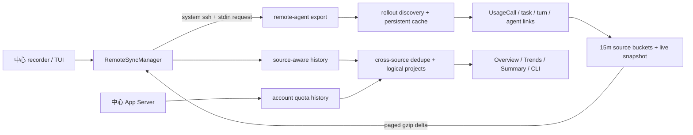

# v0.4 远程用量同步设计

- 状态：Implementation in progress
- 目标版本：0.4.0
- 更新日期：2026-08-31

当前实现基线（未表示 v0.4 已发布）：NodeId/project-key identity、显式且默认关闭的 `remotes.json` allowlist、source-aware history v2、可恢复 v1→v2 cutover、跨进程 rollout tail reuse、session digest/event-fact 原子持久层，以及严格单帧远端协议已经落盘。隐藏 `remote-agent export` 已能按固定 35 天域扫描 rollout、生成 bucket/session-digest 物化集、维护带 TTL/tombstone 的全局 Delta journal，并在最终 framing 超限或页内 project descriptor 修订冲突时缩短连续前缀；坏 DTO 会在 journal 落盘前按完整协议上下文拒绝。session facts 已实现固定 generation 的 snapshot/delta 分页与独立 cursor。probe 只声明 exporter 实际支持的 Delta journal、live snapshot、session-fact snapshot/delta、redacted/preview content 和 gzip framing；中心把 `LiveSnapshot` 作为同步必需 capability，不会悄悄降级成只有历史数据的连接。

中心侧已经完成显式单主机的 bounded Delta orchestration：固定 31 天窗口、60 分钟 overlap、`includeLive=true`，默认每轮最多 4 页和约 16 MiB，单次 SSH 最长 120 秒、整轮最长 5 分钟；每页在 SSH 锁外交换，返回后再以 config revision、完整 host snapshot、writer lease、source ingest lock 和 exact cursor/range 逐层 fencing。请求携带中心已经持久化的 `knownLiveRevision`；只有 exact match 才允许 revision-only，丢响应、本地 live 文件丢失、source generation 或协议 revision 变化都会强制补发完整 replacement。中心在 exchange 返回后立即捕获自己的 `received_at`，并把它连同 pending page 写入 WAL；崩溃恢复不会用重启时间伪造远端新鲜度。pending-page WAL 先提交 live 文件再推进 aggregate cursor，因此 live publication 与 bootstrap activation、CursorExpired 重建和延迟响应一样可崩溃恢复；cursorless bootstrap 不接受 CursorExpired 旋转。中心会在 mapping/WAL 发布前独立复验 live replacement 的 128 tasks、512 turns 和 64 KiB serialized-content 上限。远端 history 使用 immutable generation COW；首次 bootstrap 即使没有用量变化也会发布一个绑定正确的空 generation，使 source metadata 与 cursor 状态可原子完成。正常 COW/重建会持久化 retirement 并定向回收；恢复阶段再做每轮最多 8 项的 tracing sweep。generation 与 deterministic GC trash 合计最多 32 项，未知目录、symlink/reparse 或不完整 binding scan 全部 fail closed。

`remote add/edit/list/config/pair/unpair/test/enable/disable/remove/sync <id>` 已接线。add/edit/list/config/unpair/enable/disable/remove 不连接网络；pair/test/sync 只操作用户明确指定的一个 allowlist ID，不接受隐式全主机连接，也不枚举 SSH config。pair 不隐式 enable；paired-disabled 仍允许用户手工 `sync`。Unix 用独立进程组执行回收，并把 SSH 管道改成可取消的有界轮询，因此即使 ProxyCommand 逃出进程组并继续持有 pipe，也不会留下永久阻塞的 I/O worker；第一次终止信号请求安全清理，第二次恢复强制终止语义。Windows 在任何 SSH spawn 前先把当前 direct CLI/recorder 放入进程级 kill-on-close Job，使新进程从 CreateProcess 起即被包含，再为每次请求使用更窄的 Job。若平台无法证明 SSH process tree 与继承管道已完全回收，结果会结构化分类为 `ProcessContainment`，并用精确 host-row 指纹持久暂停该主机；重启和其他主机的配置变化都不会重新连接，只有编辑该主机或显式成功的 manual test/sync 才解锁。用户自定义 ProxyCommand 主动脱离进程组后，Unix 不能承诺杀死已逃逸进程；此处的安全保证是本进程不留下阻塞 reader，并停止自动重试。配置 pin 完整 `(node_id, generation)`，远端身份轮换后必须显式 unpair 再 pair。

运行时底层现已完成：`HistoryRuntime` 使用固定迁移窗口完成可恢复的 v1→v2 cutover；本地 v2 observation 先持久化预留单调 revision，完整重扫用 tombstone 修订、增量刷新不删除。bucket、weekly point 与 session digest 的查询在稳定 source-level observation lock 下读取一个 revision-consistent snapshot；首次 observation 先取得这把锁再发布 source metadata，因此读者既不会拼接两个 revision，也不会把半发布的首轮数据当成完整来源。统一查询在 `V1Active/Migrating` 只读 v1，在 `V2Active` 只读 v2，账号 quota 只读一次、各 source 独立聚合。相同 thread 的多来源 replica 先比较完整 digest；只有 project/metrics 和目标 bucket 可精确核对，且必要的 event facts 能证明相同、前缀或分叉关系时才重建为一个 logical session。authority 选择在其他证据相同时优先采用对当前 digest/binding 有精确 fact coverage 的 replica，再比较覆盖终点和稳定 source id。重建只移除目标 thread 的明确 project groups，并把无法证明归属的不透明 residual 置零；同 bucket 中明确属于其他 thread/project 的 groups 保持不变。证据不足或冲突时 fail safe，不做猜测，并明确标记 lower-bound/duplicate/project-conflict warning。Summary/Trends 共用持久 source 选择，并可在 All、精确 Local 与每个 SSH NodeId 间切换；一次性 `summary`/`trends` 也接受相同的 `--source all|local|node-…`，远端选择不会回退或叠加本地用量/会话元数据，Quota 始终明确属于 GLOBAL account。recorder、TUI、一次性报表、手工同步与自动 executor 已接入统一 runtime。recorder singleton 只防止两个后台 recorder 并行；另有 profile-scoped process-lifetime lease：相同 profile/redaction 的 recorder、TUI、report 和手工同步可并行，实际写入仍由短 writer lease 串行化；不同 redaction 切换必须等所有 shared lease 退出。稳定锁初始化使用可恢复的双槽 `initializing → marker → initialized` 协议，不依赖 PID 或 TTL 偷锁。近期仍活动的旧 binary 继续由默认 recorder status 与用户自定义 status 双路径诊断阻止单向迁移，因为旧 binary 不认识新锁。service install/uninstall 与所有尚未完成的 history cutover 共用当前用户全局 shared/exclusive gate，并在任何 manager 变更前预发布永久 cutover blocker。成功安装会先禁止旧 registration 的未来触发，再注册带强制 source-aware 协议和确定性 definition identity 的新定义；Linux/Windows 在 inactive 状态校验，launchd 则在目标 history singleton 的写入栅栏内 bootstrap。磁盘精确定义、manager 已加载 identity 和 trust marker 会在清 blocker 前连续复验，之后才释放 singleton 并启动；失败只做三平台可验证的停用/删除，绝不恢复可在未来登录时启动的旧 definition。清理结果不明确时 blocker 保留；首次迁移和 `Migrating` 恢复还会核对 manager 实际 definition 与 trust marker。V2Active 已完成单向切换，不再为每次启动查询 manager。

默认关闭的自动 scheduler 已接入 recorder：只有 global 与逐主机两个 opt-in 同时开启且已配对的 allowlist 项才进入单 worker round-robin；每个 tick 最多连接一台，成功按 active/idle 间隔调度，失败按主机指数退避，配置关闭时不做 DNS、probe 或 SSH。replica fact candidate 的有界全量规划是纯读且在 remotes 配置锁外执行，规划后再复验 exact host/revision；fair-scan cursor 等小型状态修订只在短 fence 内发布。本地 replica fact 的 35 天 rollout 扫描、batch 构造、不可见 staging、generation 预校验、容量核对与旧 generation 清理也全部在配置锁外执行；exact revision/full-host fence 内只做非阻塞 staging/manifest CAS 校验和 active manifest 原子替换，因此 disable/remove/edit 不会被长规划、扫描或阻塞锁拖住，配置变化也会拒绝迟到 activation。aggregate 页的 project descriptor 必须与该页 upsert/live 引用的 opaque project key 精确相等，不能用未引用 descriptor 消耗中心 mapping 容量。descriptor 解析、批量 resolve、JSON 序列化、临时文件写入和 fsync 都在 remotes fence 外完成；第一次短 exact-host fence 只做 nonblocking mapping lock、稳定文件身份 CAS 和 atomic rename，释放后完成目录 durability，再由第二次 exact-host fence 提交 history。配置或 mapping 在任一边界变化时不提交 history，最多留下无引用且可重试清理的 mapping observation。Settings 已提供逐主机 enable/disable/test/sync，以及 project mapping 的建议、显式 merge 和 split；映射从不自动采纳。Other 已显示消毒后的逐主机同步健康；health 持久完整 `(node_id, generation)`，generation 轮换后的旧结果不能覆盖新状态，带宽暂停也不会伪装成 SSH failure 或增加 failure streak。所有连接仍只针对用户当前明确选择的 allowlist ID。

自动与手工同步共同使用持久 rolling-24h bandwidth ledger：自动 bulk 在 150 MiB soft cap 暂停，所有普通传输在 250 MiB hard cap 暂停；admission 在打开 SSH 前同时预留最大 framed response 与预计 exchange 开销，结算则使用实际验证后的 response bytes，并在尚未解析 ProxyJump 时保守加入每次 exchange 三跳、每跳 100 KiB 的连接开销，因此普通成功同步不会因追加 transport estimate 自身越过 hard cap。手工只可通过单次显式 `--ignore-budget` 越过 hard cap。同步会在预算预留前恢复 durable ingest position，并据此区分 aggregate bootstrap/continuation 与普通 incremental；服务重启不会把已经完成 bootstrap 的来源永久误判为 bulk。远端 FactCursor 可能在中心不知情时过期并回退完整 snapshot，因此自动 fact 交换始终按 bulk 门槛准入，不能借前一段 aggregate delta 的 incremental 分类绕过 soft cap。每次成功 aggregate 后至多处理一个需要精确判定的 replica fact candidate；aggregate 与 facts 独立 admission/结算，fact partial 不回滚已提交的 aggregate。aggregate 与 fact 的成功 attempt 都会先按实际估算结算预留，再执行最终 config fence；可证明未进入 transport 的失败会取消预留，因此并发 disable/remove 不会把零传输或已经成功的 bulk 预留虚假保留 24 小时，只有可能已打开网络且失败位置不明的 attempt 才保守等待过期。单次 fact 跟进最多 8 个数据页、32 MiB encoded response、32 MiB decoded payload 和最坏 17 次 exchange；decoded 上限在解压分配前执行。完整 fact inventory 在构造唯一事件集合时就执行 32,767 条、单条 64 KiB、header 加 records 共 8 MiB 的上限，不会先无界填满 map/vector。DeltaStart 在同一 exporter 锁内先对当前 journal 做无写 reconcile 预演，并把旧 cursor 到预演 watermark 之间的 backlog、upsert、tombstone 与 capacity bootstrap 按最终冻结表示计量；任一完整 delta 超限都在写 index 前返回 typed cursor-expired，让中心改走 snapshot。Fact 发布绑定同一次完整扫描得到的 UTC-day 已知事件 digest、project/turn/lineage breakdown fingerprint 与 metric revisions；历史覆盖可保持显式 lower-bound，但稳定事件身份必须 exact。请求级 token breakdown 不确定性继续作为 partial/cost bound 传播，不阻止对已知事件做 replica union。确定性失败 candidate 使用包含完整 digest 身份的、redaction/profile 与 host-generation scoped 持久 cooldown，并继续尝试下一 candidate；digest 任一字段变化会立即形成新候选，不会被旧 cooldown 阻挡。

rollout cache format v3 已允许超过 8 MiB 的完整 parsed state 落盘：fingerprint 完全未变时只做读前/读后 metadata 探测；增长文件的小前缀使用完整 SHA-256，大前缀使用固定 3 个 1 KiB SHA-256 guard window，并继续绑定稳定文件身份和旧 byte-boundary tail guard；短生命周期 exporter 因此可以让大型未变文件走 metadata-only fast path，也可以从大型增长文件的旧 offset 续读。当前剩余工作集中在 Phase 5 的展示收尾、真实 macOS/Linux/Windows SSH smoke test、容量/perf 基准、用户文档与发布加固；这些未完成前不宣称 v0.4 稳定发布。

## 1. 结论

v0.4 的主要功能是把多台机器上的本地 Codex 用量汇总到一台中心机器，同时保留每条数据的机器来源、项目、会话和用户轮次归属。

采用以下架构：

- 中心机器是唯一同步发起方，通过系统 OpenSSH 主动拉取；
- 远端安装同一应用，按需运行短生命周期的 `remote-agent export`，不注册远端常驻服务；
- 远端解析本机 rollout，并只返回归一化、压缩后的增量事实，不传输原始 JSONL；
- 账号额度、Quota Remaining 和 reset credits 只由中心机器的 App Server 采集一次；
- 本地与每台远端的用量历史按 `source_id` 独立落盘，查询时再聚合；
- 项目实例默认保持独立，Git identity 只产生合并建议，用户确认后映射为逻辑项目；
- 不同 thread id 的会话永不自动合并；相同 thread id 只有在事件证据能够去重时才作为一个多来源会话展示；
- 远程同步和每台主机都采用显式 opt-in；应用不扫描、更不会自动连接 SSH config 中的全部主机；
- recorder singleton 只决定后台 worker 所有权；相同 profile 的 TUI/报表/手工同步持 shared profile lease 后仍可安全并存，不同 profile 的切换必须等待现有 shared lease 正常释放，锁没有 TTL，也不能被“过期接管”。

这个架构把网络流量与新增用量绑定，而不是与远端已经积累的 rollout 总量绑定。

## 2. 背景与实测规模

单台机器只能观察自己的 rollout，但同一 Codex 账号可能同时在本地电脑、开发服务器和 Windows 机器上使用。账户 gauge 是全局的，而项目、session、turn 和模型用量来自各机器本地日志；只统计一台机器会导致本周期用量归因和项目排行成为明显下界。

2026-08-30 对当前开发机的只读测量如下。文件时间窗口只用于容量规划，不代表精确 append 字节数。

| 数据 | 当前规模 |
| --- | ---: |
| sessions + archived sessions | 29.373 GB / 2,452 个 rollout |
| 近 30 天新建文件的当前体积 | 约 12.847 GB |
| 近 30 天被修改文件的当前体积 | 约 13.639 GB |
| `rollouts-v1` 解析缓存 | 85.646 MB |
| 完整 `history-v1` | 18.557 MB |
| 完整 history，gzip level 1 | 约 1.96 MB |
| 近 31 天项目聚合桶 | 10.568 MB |
| 近 31 天项目聚合桶，gzip level 1 | 约 1.33 MB |

如果另一台远端规模相同，而中心反复完整下载原始 rollout：

| 拉取间隔 | 未压缩日流量 |
| --- | ---: |
| 60 秒 | 42.3 TB/day |
| 5 分钟 | 8.46 TB/day |
| 15 分钟 | 2.82 TB/day |

本机 JSONL 抽样在快速 gzip 后仍约为原始体积的 50%–58%，所以 SSH 压缩不能挽救全量复制方案。相反，归一化历史的首次回填是 MB 级，后续增量更小。

1.33–1.96 MB 是当前聚合 history 的容量基线，不包含 v0.4 新增的 session digest、协议元数据以及复制会话按需拉取的事件级事实。最终 wire size 必须用新协议 fixture 和真实数据重新 benchmark，不能把这个基线直接当成最终传输承诺。

### 2.1 当前实现差距

最初阻塞实现的 source-aware bucket identity、稳定 project instance、跨机器 event identity、surface/source 分离，以及 exporter delta/digest/fact 数据路径现已落盘。当前剩余差距不再是基础数据模型，而是发布加固：

- 在真实 macOS、Linux 和 Windows 组合上完成中心/远端 OpenSSH smoke test；
- 用当前同等规模 rollout 测量首次回填、空增量、活跃增量和按需 fact 的 CPU、内存、磁盘与 wire bytes；
- 收尾紧凑终端展示、完整用户文档和发布迁移说明；
- 在上述验证完成前维持 `Implementation in progress`，不宣称 v0.4 稳定。

实现仍遵守最初约束：不能把 SSH 输出直接写入旧 history，也不能绕过 source/dedupe 数据模型。

## 3. 目标与非目标

### 3.1 目标

- 聚合本机和多台 SSH 远端的 token、EST、API EQ、项目、session、turn 和模型用量；
- 保留 `project -> session -> user turn`，并把可证明归属的 subagent 用量计入创建它的用户轮；
- 支持当前 reset cycle、近 7 天和近 30 天 Summary 与 Trends；
- TUI 关闭后由现有中心 recorder 继续同步；
- 网络中断、远端休眠、SSH 认证失败和协议不兼容时不阻塞本地采集；
- 防止远端 session 副本产生双计数；
- 支持 macOS、Linux 和 Windows 作为中心或远端；
- 不保存 SSH 密码、私钥或 passphrase，不读取远端 `auth.json`；
- 每台远端可独立添加、配对、测试、启用、停用和单次同步；测试连接不隐式开启后台同步；
- 为每台远端提供可观测的延迟、覆盖率、流量、失败和回填状态。

### 3.2 非目标

- 不复制完整 prompt、assistant、reasoning 或 tool event 内容；远端标题/用户消息预览默认脱敏，只有用户显式启用后才传长度受限且清洗过的 preview；
- 不复制整个 `~/.codex`、rollout cache 或 history 目录；
- 不在远端查询 App Server 的 quota/reset credits；
- 不在远端注册第二个 recorder/service；
- 不提供秒级实时同步；v0.4 的活跃目标延迟是约 60 秒；
- 不自动接受新 host key，不自动配置 SSH 密钥；
- 不枚举 `~/.ssh/config`、Windows SSH config 或系统已知主机并批量导入/连接；
- 不把多个 Codex 账号合并到一个 quota profile；
- 不保证中心可以验证所有远端实际登录的是同一账号；v0.4 由用户配置保证；
- 不根据项目 basename、会话标题、消息文本或时间接近程度猜测身份。

## 4. 决策与备选方案

| 方案 | 决策 | 原因 |
| --- | --- | --- |
| 中心通过 SSH 拉取远端归一化增量 | 采用 | 凭据留在中心；不需要中心监听端口；适合已有 SSH 配置的开发服务器 |
| 中心 scp/rsync 原始 rollout | 拒绝 | GB/TB 级流量、隐私风险、中心重复解析、远端磁盘读取压力 |
| 远端主动推送到中心 | 暂不采用 | 每台远端都要定时服务和出站凭据；中心还要可达并接收写入 |
| 长连接流式 SSH | 暂不采用 | 连接恢复和跨平台复杂；60 秒近实时不需要 |
| 内嵌 Rust SSH 库 | 暂不采用 | 增加 async/runtime、认证、agent、known_hosts 和 ProxyJump 责任 |
| 系统 OpenSSH | 采用 | 复用 `~/.ssh/config`、IdentityFile、ssh-agent、ProxyJump 和 host key 策略 |
| 应用内显式 remote allowlist | 采用 | SSH config 只负责解析用户输入的单个 alias；新安装和新主机默认都不产生后台连接 |
| 按 source 落盘、查询时聚合 | 采用 | 可禁用、删除、重试和审计单台来源，避免不可逆混合 |

## 5. 总体架构



### 5.1 同步 owner

- 稳定文件身份校验后的 OS 独占锁是唯一 writer authority；PID、心跳和时间戳只用于诊断，永远不能据此偷取或删除仍存活的锁；
- ownership manifest 的 epoch 负责后端切换 fencing。每次 v1/v2 publish 前后都复验 exact manifest、root、profile、redaction 和稳定锁句柄；
- recorder、TUI 和手工同步只在本地恢复/提交的短临界区持有 writer lease；SSH 网络交换必须发生在锁外，返回后重新获取 authority 并做 config/source/cursor CAS；
- 进程崩溃由操作系统释放锁，不需要也不允许 TTL 强制过期。迟到响应因 config revision、host snapshot、source generation、cursor/range 或 ownership epoch 不匹配而拒绝提交；
- v0.4 以前的 recorder 不获取这把锁，因此迁移前必须检查 status backend；近期仍活动的 legacy-v1 writer 会阻止迁移。`service install`/`uninstall` 取得当前用户全局 service gate 的 exclusive 侧；尚未完成的 history cutover 在 ownership writer lease 内取得 shared 侧，所以不同自定义 state root 也无法并发修改唯一的用户级 manager 注册。安装器先原子发布无 TTL 的全局 cutover blocker，写失败时不得触碰 manager；随后先禁止旧 registration 的未来触发，再由 launchd/systemd/Task Scheduler 停止并确认旧任务不再活动，同时确认没有独立前台 recorder 持有目标 state root 的 singleton lock。新 argv 同时携带旧 binary 会拒绝的 source-aware service protocol，以及以版本域、平台、可执行文件、完整 recorder 语义参数和安装时环境生成的确定性 definition identity。Linux unit 与 Windows task 按 `register inactive → verify exact disk definition + manager identity/state → persist trust marker → reverify → clear blocker → release singleton → enable/start` 执行。launchd 的 disabled job 不能 bootstrap，因此采用 `disable old → bootout → write new → enable/bootstrap`；bootstrap 期间仍持有目标 history 的 singleton，任何 RunAtLoad/KeepAlive 尝试都会在写入前失败，之后才执行同样的双重 identity/trust 校验、清 blocker、释放 singleton 和 kickstart。注册、trust 校验或 blocker 清理任一步失败都进入可验证的停用/删除流程而不恢复旧 definition；无法证明清理成功时永久保留 blocker。若进程在 launchd bootstrap 后、清理前崩溃，KeepAlive 可能按节流周期重试，但每次都会被 blocker 拒绝，直至用户重新 install/uninstall；这是 fail-closed 的资源噪声，不会写入 history。中央 `HistoryRuntime` 对新迁移与 `Migrating` 恢复同时检查 blocker、actual definition 与 trust marker；exact V2Active 直接返回，不承担重复 manager 查询开销。若平台 manager 不存在受管注册而 status 仍显示近期活动，安装/卸载仍须保留该 status fence 并拒绝继续。v0.4 以前的安装器和管理员不遵守这把 gate，若其恰好在最后一次 actual 复验与 blocker 清除之间并发改写 manager，应用层协议无法提供跨旧进程的原子互斥；该场景明确不受支持，最终紧邻复验、definition identity 与永久 blocker 用来缩小窗口并在可观察到变化时 fail closed；
- 自动调度单台主机禁止重入，按主机 round-robin；每个 tick 至多发起一个连接，避免服务启动、网络恢复或配置变化时形成 SSH 连接风暴。

### 5.2 名词冲突

当前 `TaskRecord.source` 表示 desktop、CLI、subagent 等使用表面。v0.4 新增的机器来源不得复用这个字段，统一使用：

- `source_id` / `node_id`：机器数据来源；
- `task_source` 或现有 `source`：desktop、CLI、subagent；
- `ssh_host`：仅用于连接的用户配置 alias；
- `source_label`：TUI 显示名。

## 6. 身份与数据模型

### 6.1 Source

每台机器首次运行 remote agent 时生成稳定随机 `node_id`。本机也使用相同模型，不使用硬编码的特殊身份。

```text
Source {
  source_id
  display_label
  kind: local | ssh
  protocol_version
  binary_version
  last_success_at
  coverage
  status
}
```

SSH alias 和 hostname 可变且可能重复，只能用于显示和连接。首次成功连接后，中心保存该 alias 预期的 `node_id`；以后 alias 指向另一台机器时必须中止并要求用户确认，不能静默接管历史。

如果两个已配置目标同时报告相同 `node_id`，中心不得把它们当成两个 source 相加。它们可能只是同一机器的两个 SSH alias，也可能是克隆磁盘时连同 remote state 一起复制。中心先阻止第二个目标并显示冲突；同一机器可改绑 alias，真正的克隆必须在其中一台执行显式 node-id rotate 后再配对。

Rotate 必须同时生成新的 exporter generation，并使旧 cursor 失效；中心把它视为新 source 回填。旧 source 历史继续保留，是否归入同一 logical project 仍遵循显式映射，不能因克隆来源相同而自动合并或删除。

### 6.2 Source-aware history

现有 history 以 bucket start 做 upsert，并在候选之间选择更强证据；它不能把同一时刻的两台机器直接相加。v0.4 必须升级为 source-aware 布局。

建议逻辑结构：

```text
history-v2/<profile>/
  account/YYYY-MM-DD.json
  sources/<source-id>/source.json
  sources/<source-id>/<redaction-profile>/buckets/YYYY-MM-DD.json
  sources/<source-id>/<redaction-profile>/weekly/YYYY-MM-DD.json
  sources/<source-id>/<redaction-profile>/digests/YYYY-MM-DD.json
  sources/<source-id>/<redaction-profile>/facts/<thread-shard-key>/YYYY-MM-DD.json.gz
  sources/<source-id>/<redaction-profile>/fact-manifests/<thread-shard-key>.json
  sources/<source-id>/<redaction-profile>/fact-staging/<batch-id>/...
  sources/<source-id>/<redaction-profile>/sync-state.json
```

- `account/` 只保存中心 App Server 的 quota points、reset boundaries 和 reset credits；
- `source.json` 保存稳定 source identity、`includeInAggregates`、detached 状态和最后连接配置引用；它独立于可删除的 SSH allowlist；
- `buckets/` 保存各机器的 15 分钟本地用量事实；
- `weekly/` 保存 source-scoped 周累计证据；键为 `(observedAt, resetsAt)`，用来保留 reset 切换以及 bucket coverage 不完整时的 lower-bound 语义；
- `digests/` 保存 source-scoped session digest、范围、revision 和 replica 检测索引；
- `facts/` 只保存被判定为多 replica 候选的归一化事件事实，不为普通 session 全量复制事件；
- `fact-manifests/` 是查询可见的每-thread active generation 指针；`fact-staging/` 永不参与查询；
- 同一 source 内继续使用替换/更强证据规则；
- 不同 source 只在查询层相加；
- weekly cumulative、Summary 和项目图表优先从 source buckets 派生；历史 bucket coverage 不完整时可使用同 source 的 weekly evidence，并传播 lower-bound/partial 标识；
- `syncEnabled=false` 只停止自动连接，已同步历史仍参与查询并随时间标为 stale；独立存于 `source.json` 的 `includeInAggregates=false` 才从查询排除 source，且同样不删除历史；
- v0.3 本地历史一次性导入本机 source，不与任何远端预先混合。

Fact 主键为 `(thread_id, usage_event_id)`，digest 主键为 `(thread_id, range_start)`；两者都有 revision/tombstone。每个 delta page 的 bucket/digest 写入与 delta cursor 提交必须原子完成。Session-fact snapshot/delta 的所有中间页只写 staging；最后一页到达后，中心完成 copy-on-write shard、原子替换该 thread 的 active manifest，并在同一 manifest 中提交新 FactCursor。中途失败时查询继续使用旧完整 active facts；没有旧 facts 时继续使用 conservative authority。page token 绝不能进入 active manifest，孤立 staging 在 TTL 后 GC。中心重启、远端离线或 logical project mapping 改变后，Logical 查询都必须能只靠这些落盘数据重建相同结果。

中心 facts/digests 默认保留 35 天，与 31 天 Summary 窗口留出修订余量；GC 按 UTC shard 执行，并且不能删除仍被未完成 snapshot 或当前查询窗口引用的 shard。远端也必须维护可生成完整 session-fact snapshot 的持久索引，不能只依赖短期 change journal。

### 6.3 Project instance 与 logical project

项目分成两层：

```text
ObservedProjectKey = HMAC-SHA256(source-local project secret,
                                source_id + canonical_project_path)
ProjectInstanceId  = 中心生成的稳定 opaque id
LogicalProjectId   = 中心配置中的稳定 opaque id
```

每个 source identity 除公开的 NodeId 与 generation 外，还持有只在本机私有状态文件中落盘的 256-bit project-key secret。该 secret 不进入 `probe`、export 协议、日志或中心配置；rotate NodeId 时同时 rotate secret。Observed key 使用带固定 domain/version 的 HMAC，因此只拿到 NodeId 与 observed key 的被动中心不能离线枚举常见绝对路径。这个边界不防御已经拥有远端同一 SSH 用户权限的主动中心：该权限本身即可读取状态文件或执行代码，不能把 HMAC 描述成对 SSH 账户拥有者的隔离。

Observed project key 表示某次可验证的机器与路径观测。Project instance 表示某台机器上的一个持续项目实例，并可持有多个历史 path aliases；Logical project 表示用户认为属于同一项目的一组实例。

默认规则：

1. 所有实例先保持独立；
2. 远端可离线解析 Git root 与规范化 remote identity；
3. 相同 Git fingerprint 只产生“建议合并”；
4. 用户确认后把多个 instance 映射到同一 logical project；
5. 非 Git 项目只能显式合并；
6. basename、绝对路径或 HEAD commit 相同都不能单独触发合并。

Git URL 规范化必须去除 userinfo、密码/token、query 和 `.git` 表达差异。网络协议默认只传 fingerprint，不传原始 remote URL。

实现只用参数数组直接调用系统 `git`，不经过 shell，也不执行网络操作：`rev-parse --show-toplevel` 定位 repository，`config --local --get remote.origin.url` 读取可靠的 local origin。单命令最多等待 750ms、stdout 最多 16KiB，每轮 collection 的 Git 总预算为 2.5s 且最多检查 256 个不同 cwd；总预算耗尽后其余项目只缺少建议证据，usage 仍正常保存。长寿命本地 history runtime 复用按 canonical cwd/repository 去重的 5 分钟缓存；短生命周期 remote agent 使用 source 私有、按协议 revision 隔离的同 TTL 落盘缓存，key 只保存 canonical cwd 的 domain-separated SHA-256，不落绝对路径。缓存最多 32,768 项/16MiB并按最旧项确定性淘汰；时钟回拨、过期项和临时失败都不能把旧证据冒充为新命中，也不会覆盖仍可供中心保留的已验证证据。每轮导出携带 Git command、workspace、cache hit、budget exhausted 和 elapsed 计数用于性能核对。repository 根以明确的 `.` 表示，monorepo 子目录保留 `/` 分隔的安全相对路径。

Monorepo 不能只用 repository fingerprint 合并。合并建议还应包含规范化的 repo-relative workspace root；同一仓库内的两个子项目默认仍是两个 project instance。worktree、镜像和 fork 也只产生建议，不自动认定为同一逻辑项目。

完整 canonical path 默认只留在产生它的 source。远程协议传 opaque observed key、经过清洗的显示名和显式 Git 三态：`unavailable`、`confirmed_non_repository`、或 repository（安全 repo-relative workspace root + 可选 fingerprint）。临时 unavailable 保留中心旧证据；确认非仓库会清除 root/fingerprint；确认 repository 但无 origin 会保留 root 并清除旧 fingerprint。协议不传用户主目录、服务器绝对路径或原始 remote URL。

中心首次看到新的 observed key 时为它建立 project instance。项目目录移动后会产生新 observed key；只有相同 source、旧路径消失、Git fingerprint 和其他证据一致时才建议把新路径作为已有 instance 的 alias，不能仅靠新 basename 自动延续。

项目 instance 和 logical project 映射都保存在中心配置中，并在查询时应用。修改映射不重写 history，因此可以随时拆分、重命名或重新组合历史。

### 6.4 Session replica 与 logical session

物理会话主键必须包含 source：

```text
SessionReplicaKey = (source_id, thread_id)
ThreadShardKey    = SHA256(domain + source_id + thread_id)
```

原始 thread id 只用于协议和逻辑比较，绝不能直接作为目录名。facts、manifest 与 staging 的磁盘路径统一使用带版本前缀的 lowercase `ThreadShardKey`；shard 内容仍保存并校验原始 `SessionReplicaKey`。这样既不收窄未来 Codex thread-id 的 wire grammar，也避免 Windows 保留设备名和大小写折叠碰撞。

不同 thread id 永远是独立 session，即使标题、消息、时间或项目相同。相同 thread id 出现在多台机器时是 replica 候选：

- 完全相同：展示为一个 logical session，usage 只计一次；
- 一个是另一个前缀：取稳定 usage events 的并集；
- 两台机器从同一前缀分别继续：按稳定 event id 合并非重叠后缀；
- 证据冲突或无法精确去重：选择证据更完整的 replica，不相加，并标记 duplicate/partial。

当前 `UsageCall` 没有跨机器稳定 ID。v0.4 必须在解析阶段增加与 source path 无关的 `usage_event_id`，优先使用原始 call/event id；缺失时使用 thread、turn、事件时间、模型、累计 counter 状态和稳定 replay ordinal 构造，并对歧义明确降级。

为控制常规流量，bucket 首先携带 session digest、事件计数和范围。只有中心发现相同 thread id 出现在多个 source 且需要验证，才发起针对该 session 的归一化 `UsageEventFact` 拉取。每条 fact 只包含稳定 event ID、加法指标和必要归因，不包含原始消息或工具正文。

中心一旦为某个 replica candidate 建立 fact cursor，就在任一 source 的 session digest revision 变化时刷新对应 facts；仍在运行的 candidate 最多按活跃同步间隔刷新，关闭且 digest 未变的 candidate 不重复拉取。这样普通 session 永远只走聚合桶，而复制 session 的事实更新不会停在首次 snapshot。

source-only 视图可直接使用 source buckets。Logical 视图遇到多 replica session 时，必须排除这些 session 在普通 source bucket group 中的贡献，再用 event facts 的去重并集替换，不能同时使用两份。无法取得精确 facts 时使用保守权威 replica 策略，绝不直接相加，并标记 `duplicate_session_dedup_unavailable`。

每条 event fact 必须携带产生它的 `observed_project_key`，不能携带只有中心才知道的 `ProjectInstanceId`。中心收到 descriptor 后先把 observed key 解析为 project instance，再做 logical mapping。相同 event id 的两个 replica 如果指向不同且尚未合并的 project instances：

1. 全局 token/EST/API EQ 仍只计一次；
2. 若两个 instances 已映射到同一 logical project，直接归入该 logical project；
3. 若尚未映射，共享 event 归到确定性 authority replica 的 project，并标记 `replica_project_conflict`；
4. 分叉后只存在于单一 replica 的 event 按自身 observed project 归属；因此同一 logical session 可以在两个未合并项目下分别显示各自的非重叠贡献；
5. 项目合并映射变化后重新查询事实即可，不重写原始 source shard。

保守 authority 使用确定性总序：兼容的协议/指标 revision、精确 event identity、coverage 完整度、较少的 truncated/unreadable/reset 等 hard partial、事实范围支配、较新的 `covered_through`，最后以固定 `source_id` 打破完全平局。已有 authority 只有在 challenger 按完整排序严格更优时才切换；切换记录 `authority_changed` 诊断。相同证据以不同到达顺序导入必须得到同一 authority 和同一总量。

逻辑项目总量的顺序必须是：

```text
加载所有保留的 source shards
  -> includeInAggregates filter
  -> 仅在 included sources 中做 replica detection/authority/event union
  -> 逻辑 session / turn totals
  -> logical project totals
```

不能先相加 source 项目小计再尝试去重，也不能让 excluded source 继续参与 authority、事件归属、aggregate coverage 或 partial reasons。被排除 source 仍可在 source-only Inspect/Other 中作为诊断数据查看；重新 include 后从当前完整 included 集合确定性重算。

## 7. 远端计算边界

远端是本地数据编译器，不生成完整 TUI Snapshot。

### 7.1 远端读取

- `CODEX_HOME/sessions/**/*.jsonl`；
- `CODEX_HOME/archived_sessions/**/*.jsonl`；
- `session_index.jsonl`；
- 自己的 parsed rollout cache、export state 和 change journal。

远端不读取 `auth.json`，不启动 App Server，不读取或消耗 reset credits。

### 7.2 文件发现与增量解析

远端必须完成：

- sessions/archived 发现、指纹、移动和重复文件处理；
- 同一 thread 多 rollout 的安全 replay order；
- 累计 token counter 到安全 delta 的还原；
- counter reset 时重新建立 baseline，不计歧义样本；
- task、turn、model、service tier、reasoning effort、title/cwd/source 的恢复；
- `spawn_agent` call id 与 `sub_agent_activity` event id 的精确连接；
- subagent 到根 session 和创建它的根用户 turn 的归属；
- truncated、unreadable、skipped line、ambiguous reset 和 coverage partial reasons。

不能用时间邻近、标题或 subagent 名称猜测父轮次。

### 7.3 持久 tail parse 是前置条件

v0.4 的 rollout persistent cache 已扩展为可跨进程续读增长文件：

- 加载同一 cache namespace 与文件身份的旧 fingerprint；
- 验证新文件仍包含旧长度的安全前缀；
- 校验旧 tail guard；
- 从旧 byte offset 继续解析；
- 文件缩短、替换、identity 或 guard 不匹配时才完整重读。

命中该路径时 perf log schema v6 记录 `discoveryComplete`、`diskExactReusedFiles`、`diskTailReusedFiles`、`diskLargeExactReusedFiles`、`diskLargeTailReusedFiles`、`tailParsedBytes`、`tailGuardValidationBytes`、`fullParsedBytes`、`persistentHashBytes` 与其中专属于大型 guard 的 `persistentLargeGuardBytes`。`discoveryComplete` 直接来自本次刷新实际采用的 discovery inventory；目录 walk 中可观察到变化或读取失败时为 false，不能只用 `discoveryFullScan` 推断完整性。完全相同的 fingerprint 经过第二次稳定探测后直接复用，`persistentHashBytes=0`；只有创建 cache 或验证增长文件的旧前缀时，小于等于 8 MiB 才完整 SHA-256，更大的前缀只读取开头、中点和旧边界各 1 KiB。文件缩短、替换、稳定 identity 缺失、guard/tail guard 不匹配，以及验证过程可观察到 fingerprint 变化时均回退完整解析。cache 文件仍必须位于当前用户私有、逐组件拒绝 symlink/reparse 的目录中；rollout guard 打开也拒绝最终 symlink/reparse。

这个快速路径有明确的信任边界：同一 OS 用户运行的其他进程被视为可信，因为它本来就能同时修改 rollout、cache 和 source identity。如果内容变化却人为恢复或碰撞全部 fingerprint 字段，metadata-only exact hit 不会再读内容；普通跨平台文件 API 也无法在 O(1) I/O 下证明一个增长文件的任意未采样中段从未发生等长改写。因此三个 guard window 能捕获替换、常见头部/中部/边界改写，但不是完整前缀的密码学证明。如果未来要把同用户恶意篡改纳入威胁模型，只能重新启用 O(prefix) 全量校验、依赖平台专用变更日志，或让远端 agent 长驻并保持已验证的打开句柄；当前实现和 UI 不应宣称抵抗该模型。

format v3 不迁移旧 v2 entry；升级后的第一次扫描会把旧 entry 当作 cache miss，按现有 `max_files`/lookback 边界完成一次冷解析并原子写入 v3。后续短生命周期进程才获得 metadata-only exact hit 或大型文件 tail reuse，因此部署验收必须把首次冷启动与稳态轮询分别测量。

### 7.4 每次模型调用计算

以下判断依赖单次请求边界，必须在远端聚合前完成：

- token breakdown 与 `request_usage_exact`；
- Codex credit-rate `estimated_cost_units`；
- 单独保存的 `api_long_context_extra_cost_units`；
- API EQ input/cached/cache-write/output 费用；
- standard/fast tier；
- `codex-auto-review` 使用 Luna 价格代理；
- long-context 严格逐请求阈值；
- priced/unpriced coverage 与 partial reasons。

工具调用不计 API EQ。远端不计算最终 `EST.%`，因为服务器 gauge 和跨机器权重分母只在中心可用。

### 7.5 15 分钟 source bucket

远端输出 UTC 15 分钟 bucket。现有 `LocalHalfHourBucket` 是兼容旧格式的名称，远程协议使用中性的 `UsageBucket`。

每个 bucket 至少包含：

- start/end/sample time 与 revision；
- 完整 `TokenUsage`；
- base EST units 与 Longx extra；
- API EQ minimum/maximum、samples/tokens coverage；
- model/service-tier groups；
- observed project key/descriptor、emitting thread/turn、root session/turn groups；
- call count、session digest 与 partial reasons；
- metric、estimator、project breakdown 和 pricing catalog revisions。

父节点 totals 不在远端重复物化。中心在查询时把一个根用户轮自身用量与可精确归属的所有 descendant 用量相加，保证展开和收起都不重复计数。

开放 bucket 使用 `(source_id, starts_at)` 作为稳定键并不断提升 revision；中心收到新 revision 时替换旧值。已关闭 bucket 出现迟到写入时也允许产生新 revision。

### 7.6 Live snapshot

History buckets 服务 Trends 和 Summary；Overview 另需要轻量 live snapshot：

- 最近 task 和 turn；
- RUN/WAIT/DONE/STOP/FAIL/STALE；
- model、effort、service tier；
- token totals、title/message preview；
- parent/subagent 关系；
- `live_revision`。

实现的正常 live scope 是活动/不确定 task 加最近 24 小时内更新的终态 task，以及这些 task 下仍在进行或最近 24 小时内更新的 turn；正常省略更老的终态行不降低 coverage。完整 replacement 再受 128 task、512 turn 和 64 KiB serialized content 三个硬上限约束，只有无效行或硬上限截断才标记 live partial。每次 full snapshot 的 project descriptor 只覆盖仍被 task 引用的 opaque key。

中心把完整快照保存为 source/profile/generation/revision 绑定的 `remote-live.json`。没有语义变化时只返回 revision，不重复发送完整 live 列表；多页 continuation 保留上一份 live-specific quality，而不是被 aggregate coverage 覆盖。TUI 只加载 include-in-aggregate 的远端来源，给物理 thread ID 加 source namespace，远端 task/turn 不允许 resume，并在 15 分钟没有成功接收后把未终结状态降为 `STALE`。远端刷新时间只写对应 `SourceStatus.as_of`，不能推进 GLOBAL snapshot/quota 的 `as_of`。状态仅是远端本地 rollout 推断，不升级为 App Server live 权威状态；live 中的 token 是累计 task/turn token，不能解释为远端 quota 或 API-EQ 窗口。

Overview 的 5 小时/周 task 与 turn 用量另由中心本地的 `AllIncluded` 统一历史查询投影，不能直接累加各 source bucket，也不能受 Summary/Trends 当前 source selector 影响。统一查询先完成 logical-replica authority/union 去重；投影随后把远端物理 ID 规范化为带 NodeId 的 namespace，补齐选定窗口内的历史行和祖先闭包，再用 live 层覆盖近期状态与元数据。窗口只计入起点不早于服务端窗口且采样内容没有越过窗口结束时间的本地桶；无法安全切分的边缘桶或缺失覆盖保持 lower-bound/partial。analysis miss 必须显示零/未知，绝不回退到累计 live counter。Models 若缺少可证明的逐 thread 模型分解则保持 partial，不能从 aggregate model bucket 猜测。Summary 数值同样只来自 source-aware history bucket，live 行只可作为零用量元数据，不能重复计数。

## 8. 首次回填与常规同步

### 8.1 首次回填

当前机器近 31 天超过 1,200 个 rollout，而默认 `max_files=500`。远端回填不能直接复用默认限制并声称完整。

回填顺序：

1. 先完成当前 reset cycle/近 7 天；
2. TUI 尽快显示可用的 lower-bound 数据；
3. 从新到旧按 UTC 日补齐到 31 天；
4. 每完成一日就持久化 checkpoint；
5. 每页不超过协议输出上限；
6. 中断后从已提交 checkpoint 继续；
7. 全程显示 `BACKFILLING`、coverage 和 partial 状态。

首次过程可能在远端读取十几 GB rollout 并持续较长时间，这是一次性的远端 CPU/磁盘成本，不应变成大网络传输。回填只允许一项运行，不与同 source 的普通同步重入。

### 8.2 常规同步

```text
取得 remote export lock
  -> 加载 source/export state
  -> 检查目录和文件 fingerprint
  -> 无变化：返回 manifest/coverage
  -> 有变化：tail parse 追加字节
  -> 只重算受影响 thread 和 bucket
  -> 持久化 bucket 与 change journal
  -> 返回 gzip delta
  -> 退出
```

即使没有新 token，跨过 bucket 边界时也要推进 coverage；task 因时间从 RUN 变为 STALE 时要更新 live revision。

## 9. SSH 与导出协议

### 9.1 传输

中心调用系统 `ssh`/`ssh.exe`。首版只接受 SSH config 中的 host alias，并执行固定远端命令：

```text
codex-usage-monit remote-agent export
```

动态参数以版本化 JSON 写入 stdin，避免 Unix shell、cmd.exe 和 PowerShell 引号差异。stdout 只承载协议帧，日志和诊断只写有上限的 stderr。

建议参数：

```text
-T
BatchMode=yes
StrictHostKeyChecking=yes
ConnectionAttempts=1
ConnectTimeout=10
ServerAliveInterval=15
ServerAliveCountMax=2
ClearAllForwardings=yes
ForwardAgent=no
```

不自动执行 `ssh-keyscan`，不允许配置任意 shell 片段。特殊 IdentityFile、ProxyJump 和端口由用户 SSH config 管理。

### 9.2 版本握手

双方交换：

- protocol version；
- binary version；
- history format revision；
- metric/estimator/project-breakdown revisions；
- API pricing catalog revision；
- redaction mode；
- stable node id。

版本不兼容时停止密集重试。Token facts 在安全兼容时仍可接受；EST/API EQ revision 不同则对应字段标为 partial/unpriced，不能静默混合。首版推荐中心与远端使用相同 release。

### 9.3 Cursor

Cursor 不能只用时间戳，因为旧 bucket 可能迟到修正，远端时钟也可能回拨。普通聚合增量与按需 session facts 使用两个独立 cursor 域：

```text
DeltaCursor {
  generation
  sequence
}

FactCursor {              # per source + thread + redaction profile
  fact_generation
  through_sequence
}
```

- `generation` 在 bucket/digest exporter state 重建或不兼容升级时变化；
- `fact_generation` 在持久 event-fact index 重建或不兼容升级时变化；
- 各自域内每个 upsert/tombstone 提升对应 `sequence`；
- 中心只在一页数据原子落盘后提交新 cursor；
- 响应丢失时，同一旧 cursor 会返回相同的幂等变化；
- cursor 早于 journal 保留范围时，仅该 source 触发分页回填；
- 最近一小时重叠是额外修复窗口，不是旧 bucket 更新的唯一机制。

普通 aggregate journal 只有一个固定的 35 天物化域和一个全局 `DeltaCursor`。Cycle、近 7 天、近 30 天等选项只是中心落盘后的查询条件，绝不能反向改变远端 rollout lookback、desired materialized set 或 journal namespace。远端每轮成功采集都扫描相对于本次 `observed_at` 的完整 35 天保留域；协议里的 `range` 只表达本页 coverage 目标，不能用于丢弃 journal transition。所有已扫描 sequence 的 bucket/digest upsert 或 tombstone 都必须随页返回，即使其时间不在请求 range 内；中心先幂等落盘并推进 cursor，再在查询层按时间过滤。否则一次 7 天请求，甚至仅仅中心与远端存在数秒时钟差，都会让“被过滤但 cursor 已越过”的记录永久丢失。

采集不完整时采用更严格的 fail-closed 规则：truncated、unreadable、skipped line、ambiguous counter reset 或 discovery incomplete 任一出现，本轮 aggregate observation 都不得进入 planner/reconcile。仅使用 `UpsertOnly` 仍不安全，因为 partial scan 中已经出现的同 key 小计仍可能用较小值覆盖已有完整值；该轮只可返回诊断和不落 aggregate journal 的瞬时 live 信息。完整的一次性 inventory 当前也只允许 `UpsertOnly`：缺少持久、按域证明的 deletion/retention coverage 之前，desired 中缺失的旧 key 不能解释为删除，更不能生成 authoritative tombstone。明确的 35 天 retention GC/tombstone 需由独立、可证明的规则产生。

`DeltaCursor` 绝不能代替 `FactCursor`。中心可能在 delta 已推进很久后才发现重复 thread；此时该 thread 首次 `sessionFacts` 请求不带 fact cursor，远端必须返回保留窗口内的完整事实 snapshot。Snapshot 在第一页固定 `snapshot_watermark` 和 `snapshot_id`，后续页通过绑定 source/thread/redaction profile/snapshot/watermark 的 opaque page token 读取 `sequence <= snapshot_watermark` 的同一视图；最后一页才返回可激活的 `FactCursor(through_sequence=snapshot_watermark)`。新事实进入下一轮 delta batch，不能插入正在分页的 snapshot。page token 失效则丢弃 staging 并从旧 active FactCursor 重启；FactCursor 失效则重复完整 snapshot，而不是从 DeltaCursor 猜起点。

`FactCursor` 只表示已经完整激活的事实集合；`snapshot_id`、`batch_id` 和 page token 只表示未完成的分页 continuation，三者在类型和持久层中都不可互换。首次 snapshot 与后续 fact delta 都先完整 staging，再一次性发布，Logical 查询永远不会看到半个 batch。

Delta change journal 默认保留 35 天，并设置每 source 128 MiB 硬上限；达到任一边界后从最旧记录开始裁剪。Session-fact index/change history 同样以 35 天为目标，并设置每 source/redaction profile 512 MiB 可配置硬上限；若必须提前裁剪，报告 `fact_retention_truncated`，受影响窗口降级为 partial/authority，而不是静默双算。索引因损坏或升级重建时提升 `fact_generation`。离线时间过长或高频修订导致旧 cursor 被裁剪时，远端返回明确的 `cursor_expired` 和当前 generation，中心改走可恢复的 31 天分页回填或单 thread 完整 fact snapshot，不能把缺口当成“无变化”。

### 9.4 逻辑请求与响应

请求字段：

```text
protocolVersion
clientVersion
requestKind: probe | delta | sessionFacts
probe? { checkStateWritable, checkRolloutReadable }
delta? { deltaCursor?, range { from, to }, overlapMinutes, includeLive, knownLiveRevision? }
sessionFacts? { threadId, factCursor?, pageToken?, retentionDays: 35 }
redactContent
maxPageBytes
acceptedRevisions
```

响应字段：

```text
protocolVersion
nodeId
probeResult? { capabilities, stateWritable, rolloutReadable }
deltaPage? { generation, sequence, nextDeltaCursor? }
factSnapshotPage? {
  snapshotId, factGeneration, snapshotWatermark,
  nextPageToken?, activateFactCursor?
}
factDeltaPage? {
  batchId, factGeneration, deltaWatermark,
  nextPageToken?, activateFactCursor?
}
observedAt
timing { remoteReceivedAt, remoteSentAt }
coverage
projectDescriptors
bucketChanges[]       # delta only
sessionDigests[]      # delta only
eventFactChanges[]    # sessionFacts only
live?                 # delta only
stats / warnings
hasMore
```

`probe` 只完成版本、能力、node identity、目录可读/状态目录可写检查；除首次生成本机稳定 node id 外，不扫描或解析 rollout 内容、不创建 export cursor/change journal、不返回用量。`projectDescriptors` 只包含 `ObservedProjectKey` 及其脱敏描述；远端不生成中心的 `ProjectInstanceId`。首次无 FactCursor 返回 `factSnapshotPage`，已有 active FactCursor 返回 `factDeltaPage`；两者都使用独立 fact generation/sequence、upsert/tombstone、固定 watermark 和 staging/activate 语义。`eventFactChanges` 不包含 prompt、assistant、reasoning 或 tool 正文，只包含去重和归因所需的稳定 event ID、observed project key、thread/turn linkage、时间、模型与加法指标。远端必须把这些变化写入持久 fact index；否则复制会话在历史 bucket 被修订后无法可靠撤销旧贡献。

stdout 使用长度可校验的单帧响应；小于 32 KiB 可使用 identity，大响应使用应用层快速 gzip。gzip 自带完整性校验，长度帧用于发现截断。普通页上限建议为压缩后 4 MiB、解压后 32 MiB；stderr 上限 32 KiB。超限、解压失败、尾部多余数据或 JSON schema 不合法时整页丢弃。

## 10. 项目与会话的中心合并

### 10.1 项目匹配模式

Settings 提供：

| 模式 | 行为 |
| --- | --- |
| Separate | 所有 project instances 分开 |
| Suggest | Git fingerprint 只提示，确认后合并；默认 |
| Auto Git | 高置信 Git identity 相同则自动映射，可手动拆分 |

未合并的同名项目显示为不同项目，例如：

```text
PROJ codex-usage-monit · local
PROJ codex-usage-monit · dev-server
```

合并后：

```text
PROJ codex-usage-monit · 2 sources
  SESS @local       主要功能实现
  SESS @dev-server  Windows 适配
  SESS @2 sources   SSH 同步规划
```

最后一行表示同一 logical session 存在多个 replica，但 usage 已去重。

### 10.2 Summary 与图表

- logical project 在堆叠图中保持一种颜色；
- Inspect/tooltip 可展开 local/remote source 贡献；
- session 行始终保留来源标记；
- 项目树默认保持 `project -> session -> user turn`，不强制插入 host 层；
- 可切换 Sources 观察模式排查单台机器贡献与同步问题；
- logical project totals 在 session dedupe 后计算；
- project mapping 变化后重新查询即可，历史无需迁移。

### 10.3 Coverage

每个 source 单独报告：

- covered from/through；
- discovered/scanned/truncated/unreadable files；
- skipped lines、ambiguous token resets；
- backfill progress；
- last success、stale age；
- revisions 与 partial reasons。

一个 logical project 可以同时包含 `local complete` 与 `remote stale`。UI 保留最后成功的远端历史，但当前窗口显示 lower bound/partial，并指出具体 source。远端失联绝不能解释为零用量。

## 11. 调度、超时与网络预算

调度器只为 `autoSyncEnabled && host.syncEnabled && paired` 的应用 allowlist 条目创建定时任务；disabled/unpaired host 连 DNS、`ssh -G` 和健康探测都不执行。配置变更使用单调 `config_revision`：关闭全局或单台主机时立即取消排队任务；已经进入系统 OpenSSH 的当前有界 exchange 最多运行到 transport timeout，但 aggregate、fact、cursor、bandwidth health 和最终调度状态在每个提交边界都会重新核对完整 revision/host row，迟到响应全部丢弃且不推进任何本地状态。显式 `remote test <id>` 与 `remote sync <id>` 是独立的一次性操作，不修改这一调度集合。

默认调度：

- 有增量或 live 活动：60 秒；
- 连续 10 分钟无增量：300 秒；
- 手动刷新：立即请求，但仍服从单 source lock；
- 失败退避：1m、2m、5m、10m、30m，加入约 ±20% jitter；
- 休眠恢复后只立即同步一次，不补跑错过的所有轮询；
- 普通同步总超时 45–60 秒；
- 分页回填单次运行可放宽到 120 秒，完成的日 checkpoint 不回滚；
- 普通增量每次最多 4 页/16 MiB 压缩 payload；回填或 session-fact snapshot 每次最多 8 页/32 MiB；
- 一次 bulk 运行结束后至少让出 60 秒，不能在同一 owner 循环中无限追页。

新建 SSH 连接按 20–100 KiB/次做容量规划：

| 间隔 | 估算握手流量/host |
| --- | ---: |
| 60 秒 | 约 28–141 MiB/day |
| 5 分钟 | 约 5.6–28 MiB/day |

这不是本机实测协议流量，而是保守规划范围；ProxyJump 会随跳数增加。空闲期 SSH 握手可能比用量增量更大，因此自适应间隔是必需的。

v0.4 目标预算：

- 同等规模远端的 31 天 bucket/digest 回填目标是 MB 级、压缩后不超过 32 MiB；这是待含 facts 的真实协议 benchmark 验证的目标，不是发布前已成立的承诺；
- 协议级 no-change 响应不超过 8 KiB，不含 SSH 握手与 ProxyJump 开销；
- live 完整 replacement 的 serialized content 不超过 64 KiB；即使活跃期每分钟都发生语义变化，单看这部分的最坏原始上界也低于 96 MiB/day，revision-only 轮询则远低于该值；
- 常驻活跃、无连接复用的一台远端应控制在约 150 MiB/day 量级；
- 空闲远端通常控制在几十 MiB/day；
- 系统 OpenSSH 不提供可移植的 encrypted transport byte counter，因此预算量定义为 `actual compressed payload + connection_count × 100 KiB × effective_hops`；
- 当前不额外执行 `ssh -G`，也不解析用户的 ProxyJump/ProxyCommand；每次 exchange 固定按 3 hops 的保守值估算，避免预算依赖另一条可能执行用户 SSH 配置的探测路径；
- 单 source 的上述 budgeted bytes 达到 150 MiB/rolling 24h soft cap 时暂停自动 bulk 回填并降到空闲间隔；达到 250 MiB hard cap 时暂停所有自动数据页，只每 30 分钟做一次健康探测，待窗口回落后恢复；
- 用户可用显式 `remote sync <id> --ignore-budget` 为单台主机临时越过 hard cap，TUI 普通刷新不能隐式越过；
- perf log 分开记录精确的 `payload_bytes_actual` 与推算的 `transport_bytes_estimated`，不能把后者展示成实测流量；
- TUI 2 秒刷新绝不触发 SSH。

## 12. 配置、CLI 与 TUI

### 12.1 中心配置

建议新增版本化、原子写、私有权限的 `remotes.json`，仿照现有 open/ui state 配置实现：

```json
{
  "version": 1,
  "autoSyncEnabled": false,
  "activeIntervalSeconds": 60,
  "idleIntervalSeconds": 300,
  "hosts": [
    {
      "id": "dev-server",
      "sshHost": "dev-server",
      "syncEnabled": false,
      "redactContent": true,
      "expectedNodeId": null
    }
  ]
}
```

新安装必须写入或等价解释为 `autoSyncEnabled=false, hosts=[]`；缺失/旧 schema 字段使用 `serde(default=false)`，解析不确定时 fail closed，绝不能迁移成 true。应用只读取 `remotes.json.hosts` 作为 allowlist，不枚举用户 SSH config；`ssh -G` 也只能针对用户已经选中的单个 alias 调用。

主机状态分成 `configured-unpaired`、`paired-disabled` 和 `paired-enabled`。`remote add` 后保持 unpaired/disabled，`remote pair` 只 pin node identity，仍不启用自动同步。后台连接的必要条件必须同时满足：

```text
global autoSyncEnabled
  && host.syncEnabled
  && expectedNodeId 已配对
  && host 未处于删除/身份冲突状态
```

升级、配置迁移、成功测试或成功单次同步都不得把任一开关从 false 改成 true。全局开关关闭时保留逐主机选择；重新打开后只恢复之前明确启用的主机。

`includeInAggregates` 不属于连接 allowlist，而属于配对后生成的持久 `source.json`。因此删除 SSH 连接条目不会让历史失去身份或管理入口，也不会把“是否连接”与“是否计入历史”混成一个开关。

Logical project mappings 应独立于短期 UI state，保存在版本化中心配置中。配置记录 project instance opaque id，不以 label/path 作为长期主键。

### 12.2 CLI

计划新增：

```text
remote config --auto-sync <true|false>
remote add <id> --ssh-host <alias>
remote edit <id> [--ssh-host <alias>] [--redact-content <true|false>]
remote pair <id>
remote unpair <id>
remote list
remote test <id>
remote enable <id>
remote disable <id>
remote sync <id>
remote sync --enabled
remote remove <id> [--keep-included]
remote source list
remote source include <source-id>
remote source exclude <source-id>
remote source purge <source-id> # 单独确认的不可逆历史清理
remote-agent export        # hidden/internal
remote-agent node-id
remote-agent rotate-node-id # 克隆恢复；必须在目标机器本地显式执行
```

以上会访问中心侧远程历史状态的命令统一接受 `remote --history-dir <history-v1>`。自定义 recorder 必须显式传入同一个目录；默认服务注册会把安装时解析到的 `remotes.json` 绝对路径写进 argv，因此 `CODEX_USAGE_MONIT_CONFIG_DIR` 不需要依赖后台管理器继承 shell 环境。

`remote add` 只建立 pending 配置，不发起 SSH；`remote pair <id>` 只连接指定主机、完成首次握手并 pin 完整 source generation，配对成功后仍为 disabled。普通 pair 不允许替换已有 pin。远端显式 rotate identity 后，用户必须执行不联网的 `remote unpair <id>`；该操作在同一 config 锁内先把原 source 持久化为 `detached=true`（保留既有 include 策略），再以配置 CAS 清空活动 pin、强制 `syncEnabled=false`，并把完整 generation 暂存为不具备连接权限的 `previousSource`。因此 detach 失败时配置不变，解绑后旧 source 也不会成为幽灵 attached source。后续 remove 仍能通过该精确引用应用默认 exclude 策略；成功 pair 会消费该引用，若改配另一 node，旧 source 保持 detached 并作为独立保留历史管理。新远端默认 `redactContent=true`，用户可显式打开长度受限的标题/消息 preview。改 SSH alias 时保留 expected source；替换为另一台机器必须走同样的 unpair→pair 显式恢复路径，不能用普通编辑绕过身份检查。

`remote test <id>` 无论主机是否启用都只对该 ID 运行短生命周期 `probe`：未配对时显示 observed node id，已配对时校验 pinned identity；不启用主机、不推进 cursor、不写 usage history，也不启动 31 天回填。网络返回后必须重新加载配置；只要 config revision 或目标 host 配置已经变化，就把响应作为 stale 丢弃且不报告成功。

`remote enable/disable` 只控制自动连接；`remote source include/exclude` 只控制已落盘数据是否进入聚合，两组状态互不改写。`remote sync <id>` 是用户对单台已配对主机的显式一次性同步，可以在 global/host auto-sync 关闭时运行，但绝不改变开关。批量命令只有 `remote sync --enabled`，并且同时尊重全局开关与逐主机 `syncEnabled`；不提供无参数“同步全部”和默认 `--all-configured`。`remote list` 只读取应用连接配置与落盘状态，不为刷新状态而逐台连接；`remote source list` 同时列出仍连接和 detached 的历史来源。

`remote remove <id>` 原子停止/拒绝该连接的迟到同步、从 allowlist 删除连接，并把当前 pin 或先前 unpair 留下的精确 `previousSource` 对应 `source.json` 标为 `detached=true, includeInAggregates=false`；历史不会删除。只有显式 `--keep-included` 才允许 detached 历史继续进入聚合。重新添加并配对到相同 node id 时复用原 source，不制造第二份历史，保持原 include 状态且 auto-sync 仍默认关闭。真正删除历史只能走单独确认的 `remote source purge <source-id>`；仍 attached/同步中的 source 必须先 remove，避免与写入竞争。

`remote test` 验证：

- batch-mode 认证；
- host key；
- 远端命令 PATH；
- node identity；
- protocol/revisions；
- state/cache 目录可写；
- 可读取 rollout；
- service 环境下可能缺失的 ssh-agent/IdentityFile 问题。

### 12.3 TUI

- Other：逐 source 显示状态、last success、lag、backoff、coverage、bytes、版本和错误；
- Settings：远程总开关、host enable、同步间隔、redaction、项目合并建议与显式映射；未映射 instance 始终单独列出，可多选后用明确的 Merge 操作合并非 Git 项目，Suggestion 一键接受与 Split 保持独立；
- Overview：task/session 显示机器来源，机器来源过滤与现有 desktop/CLI/subagent surface 过滤分开；
- Trends：可聚合所有 `includeInAggregates` sources，也可 Inspect 单一 source；
- Summary：logical project 默认聚合，session 保留来源，支持 Sources 观察模式；
- TUI 不启动第二套自动 SSH worker；自动调度只由 recorder singleton 承担。TUI 的显式单主机 Test/Sync 是用户动作，不会因 recorder 健康状态自动接管或枚举连接。

Settings 增加 `[R]Remote sources` 独立面板。Connections 区只列出 `remotes.json` 中由用户添加的条目；Detached histories 区只列出已有 `source.json` 但已删除连接的历史来源；两者都不读取 SSH config 生成列表。面板顶部显示 `[G]Auto sync` 全局开关及“已启用/已配置”计数；默认是 `Off · 0/0`。连接行显示 ID、SSH alias、pair 状态、auto-sync 状态、last test、last sync 和错误，选中行提供：

```text
[N]New  [↵]Edit  [P]Pair  [E]Enable/Disable
[I]Include/Exclude  [T]Test  [S]Sync once  [D]Remove  [←]Back
```

Detached history 行改为 `[I]Include/Exclude  [P]Purge  [←]Back`，不渲染无效连接操作的高亮快捷键。

- New/Edit 只编辑单个 ID、SSH config alias、redaction 和调度覆盖项；保存不连接；
- Pair/Test/Sync once 始终只作用于选中行，并使用异步状态 `PAIRING/TESTING/SYNCING`，不能阻塞 TUI；
- Enable 只有配对成功后可用，且只切换该行的自动同步；Test 成功不能代替 Enable；
- Include/Exclude 只影响历史聚合，不发起连接，也不改变 Enable；
- Remove 默认把历史移动到 Detached histories 并 exclude；只有确认对话中的显式 Keep included 才继续计入聚合；
- detached 行只提供 Include/Exclude、Purge 和查看诊断，不存在 Pair/Enable/Test/Sync；Purge 必须二次确认；
- 全局 Auto sync 从 Off 切到 On 时明确显示将自动连接的已启用主机数量；没有逐项启用的主机时不会产生连接；
- disabled/unpaired 行没有定时器，也不因打开 Other、Overview 或刷新 TUI 而连接；其状态显示为配置/上次结果，而不是主动探测；
- Remote sources 面板持有焦点时，主 Settings 的 `T/V/M/L/K/P/E/A` 行快捷键不激活；只高亮本面板当前真实可用的绑定；
- New/Edit 文本输入必须先消费 printable keys，避免 `E/T/S/D` 等操作键在编辑 alias 时误触发。

远端 task/session 在 v0.4 是只读数据。选中远端行时，现有本地 Open/Focus/`codex resume` 操作必须隐藏或显示为无 active binding 的 disabled 状态，键盘 Enter/快捷键和鼠标都不得在中心 cwd 启动本地 resume。Copy 只可复制已展示的脱敏 metadata/thread id；生成并执行 SSH resume 命令不属于 v0.4。

任何新增可见控件必须遵守仓库 btop 风格快捷键规则，并补键盘、鼠标、Unicode hitbox、compact terminal 和明暗主题测试。

## 13. 安全与跨平台

### 13.1 安全

- SSH 参数以独立 argv 传递，host alias 拒绝前导 `-` 和控制字符；
- 不拼接用户提供的任意 shell command；
- stdin 承载动态请求，stdout 承载受限协议；
- 不保存私钥、密码、passphrase 或 agent 内容；
- 不启用 agent forwarding、端口 forwarding 或 TTY；
- host key 变化立即失败并要求人工处理；
- 远端 state/cache 使用用户私有权限和原子替换；
- 标题/消息继续经过长度限制与终端控制字符清洗；
- `redactContent` 在远端聚合前应用；
- 限制 stdout、stderr、解压后大小、页数和处理时间，防止异常远端占满内存或磁盘；
- 日志只记录中心配置 ID 或 source id，不记录用户名、hostname、私钥路径和消息正文。

`redaction_profile` 是协议 generation、中心存储 namespace、delta cursor 和 fact cursor 身份的一部分，至少区分 `redacted` 与 `preview-enabled`。两种 profile 的 bucket、digest、fact 和 live cache 绝不能共用 cursor 或查询路径；TUI/CLI 处于 redacted 模式时不得回退读取 preview-enabled namespace。

从 preview-enabled 切回 redacted 时，中心立即停止读取旧 namespace，启动新的 redacted bootstrap；成功原子切换后删除旧 remote preview namespace。发布顺序固定为：在 exact config 与 redacted writer fence 下，先分别为 source history 及 center ingest cursor/WAL 持久化 retirement marker，再于 source lock 下原子发布 `source.json` 的 redacted 可见性；随后把旧 preview history 原子移动到确定性 private trash 并按固定 entry/depth 工作量删除，同时在 preview ingest source lock 下按固定 entry 工作量删除旧 binding namespaces。两个 marker 都位于被清理 namespace 之外；history marker 在 live/trash 都不存在后清除，ingest marker 则保留为小型 tombstone，直到用户显式 purge 该 source。后者使 Windows 上已返回成功但在崩溃后重新出现的目录项仍可在下次 retry 被再次清理，而不依赖未受 Win32 文档保证的目录 `FlushFileBuffers`。崩溃、Windows sharing violation 或有界清理未完成时，下次同一 exact config/source/writer fence 下的准备或完成阶段继续。若崩溃发生在 marker 与 metadata publish 之间，恢复会看到 PreviewEnabled 仍可见并拒绝清理。读路径在同一 source shared lock 内完成 metadata-dependent namespace 读取，因此 history 清理也不能抽走已选择旧 profile 的在途查询。已有版本遗留的“metadata 已 redacted、preview history/ingest 目录仍存在”状态会先补 marker 再收敛。切换期间只显示已完成的 redacted lower-bound 数据，不用旧明文填空。从 redacted 打开 preview 也创建新 generation/namespace，必须由用户显式确认。删除普通文件不承诺底层介质安全擦除；高威胁场景仍应使用磁盘加密或清理整个应用数据目录。

### 13.2 macOS/Linux

- 使用系统 `ssh`；
- 可尊重用户 SSH config 中的 ControlMaster/ControlPersist，但协议正确性不能依赖复用；
- launchd/systemd 环境可能没有交互 shell 的 `SSH_AUTH_SOCK`，推荐使用 SSH config 中的 IdentityFile 或固定 IdentityAgent；
- 不假设远端交互 shell PATH，安装和 `remote test` 必须验证固定命令可执行。

### 13.3 Windows

- 使用 `ssh.exe`，Task Scheduler 继续在当前用户、最低权限上下文运行；
- Windows 远端默认 shell 可能是 cmd.exe 或 PowerShell，固定命令和 stdin JSON 避免动态 quoting；
- Win32 OpenSSH 官方 scope 仍列出 Client ControlMaster 和 Compression 不支持，不能依赖 `-C` 或 ControlPersist；
- 所有平台统一使用应用层 gzip；
- Windows OpenSSH 可能是可选功能，`remote test` 需明确报告未安装或 PATH 不可用；
- 非交互 sshd 环境可能没有用户交互 shell 的 PATH；`remote test` 必须验证 `codex-usage-monit.exe remote-agent export` 的实际可执行路径；
- 原子文件替换与隔离重命名使用 `MOVEFILE_WRITE_THROUGH`；普通目录只以只读 `BACKUP_SEMANTICS | OPEN_REPARSE_POINT` 句柄验证稳定身份，不申请目录写权限，也不调用文档未保证支持的目录 `FlushFileBuffers`；
- 删除类转换必须保留确定性 trash 或外部恢复 tombstone；Windows CI 至少在非管理员 NTFS 临时目录验证“删除后目录项重现”的重放路径，可选增加 ReFS/SMB smoke test；
- CI 覆盖 Windows 作为中心的 fake-ssh 参数、stdin、超时和进程回收，也覆盖 Windows 作为远端时 cmd/PowerShell 的固定命令和二进制帧；
- v0.4.0 只有在 Windows 中心与 Windows 远端的真实连接 smoke test 都通过后才宣称稳定支持；否则对应方向必须明确标为 experimental，不能用 fake-ssh 测试代替发布声明。

## 14. 失败与一致性语义

| 场景 | 行为 |
| --- | --- |
| SSH 无法连接 | 保留最后历史，source 标记 stale，按退避重试 |
| 认证需要交互 | BatchMode 快速失败，不挂起后台服务 |
| host key 变化 | 停止同步，要求人工确认 |
| stdout 截断/非法 | 整页丢弃，不推进 cursor |
| 中心落盘后响应丢失 | 下次重复 upsert，按 source key/revision 幂等替换 |
| 旧 owner 的迟到响应 | owner epoch 不匹配，整页丢弃且不推进任何 cursor |
| remote export 正在运行 | 返回 busy/retry-after，不重入 |
| cursor expired | 仅该 source 分页回填 |
| fact cursor expired | 仅该 source/thread 重新拉固定-watermark 完整事实 snapshot |
| exporter generation 改变 | 保留旧 source 可见状态，完成新 bootstrap 后原子切换 |
| pricing revision 不同 | token 可用；EST/API EQ partial/unpriced，不混合金额 |
| 相同 thread 多 source 冲突 | 不相加；选择强证据 replica 并标 duplicate/partial |
| remote auto-sync 被禁用 | 停止自动连接；保留并继续展示最后历史，source 随时间标 stale |
| source 被 exclude | 查询排除该 source；不连接、不删除历史，也不改变 auto-sync 开关 |
| connection 被 unpair | 先原子 detach 并保留 include，再清活动 pin；精确 previous source 引用保留到 remove 或下一次 pair |
| connection 被 remove | 拒绝迟到提交、删除 allowlist 条目；source 默认转 detached+excluded，历史保留且仍可独立管理 |
| rolling bandwidth hard cap | 暂停自动数据页并标 `budget_paused`；保留低频健康探测和显式手动 override |
| redaction profile 改变 | 切新 generation/namespace；不从旧 preview namespace 回填 |
| 系统休眠恢复 | 立即同步一次，不产生补跑风暴 |

中心记录请求发送与响应接收时间，远端记录请求接收与响应发送时间，以四时间戳方法估计 offset，避免把远端解析耗时误算成时钟偏差。绝对偏差超过 2 分钟时记录 `clock_skew` warning，并把依赖时间窗的 source coverage 标为 partial。Bucket 仍使用 rollout UTC 时间，不自动平移历史事件；同步调度、stale age 与接收时间使用中心时钟。Cursor 只依赖 generation/sequence，不依赖远端 wall clock。

## 15. 性能与可观测性

`--perf-log` 为每个 source 增加：

- sync scheduled/started/completed；
- connect、remote compute、first byte、total duration；
- request/response/compressed/uncompressed bytes；
- connection count、解析/保守的 effective hops、handshake allowance 与 estimated transport bytes；
- bucket upserts、live rows、session dedupe candidates；
- cursor/generation、coverage lag、backfill progress；
- files discovered/reused/tail parsed/full parsed，并单独记录 `fullParsedBytes`；
- tail bytes、cache hit/miss、large exact/tail reuse、bounded guard bytes、affected threads；
- timeout、exit status、protocol error、output limit；
- retry count、backoff duration、stale age；
- lock busy、owner type、concurrency；
- rolling 24h bytes 与预算 warning。

隐私要求：perf log 只记录配置 ID/source ID；路径只记录计数或脱敏哈希；不记录项目标题、消息、hostname、用户名和 SSH 凭据位置。

性能验收目标：

- 无变化轮询只探测 fingerprint，不读取或重新解析 rollout JSON 内容；
- 大型活跃 append 除 3 KiB prefix guard 与最多三次 256 B tail guard I/O（两次校验、一次生成新边界）外只解析新尾部，不完整重读旧前缀；
- 一个远端失联不影响本地 60 秒 recorder 采集；
- TUI 刷新不等待 SSH；
- 回填与普通同步内存/输出受硬上限保护；
- 本机同等规模下，重复空轮询的远端 CPU、磁盘和网络均可从 perf log 对账。

## 16. 实施顺序

2026-08-31 实现检查点：Phase 1–4 的核心数据路径已经接通；Phase 5 已完成 source selector、统一 Summary/Trends、Settings 逐主机管理、显式 project mapping、Other health，以及 Overview 的统一历史补齐、树形 lineage、有界 live status replacement/stale/read-only 展示；其他展示细节仍在收尾。Phase 6 的本机与 Windows MSVC/GNU 交叉检查正在最终复验；真实 macOS/Linux/Windows service install、Windows 中心和远端 SSH 连接仍需手工 smoke test。

### Phase 1：身份与 source-aware history

- SourceId/NodeId、ProjectInstanceId、SessionReplicaKey；
- account history 与 source usage history 分离；
- buckets/digests/facts 持久 shard 与 redaction profile namespace；
- source bucket 的查询时聚合；
- local source 迁移；
- auto-sync disable、aggregate exclude、删除连接与 coverage 的独立语义。

### Phase 2：远端离线 exporter

- 隐藏 `remote-agent export`；
- 固定 stdin/stdout 协议；
- 持久 tail parse；
- 独立 delta/fact generation、固定-watermark snapshot 和 change journal；
- 远端持久 session-fact index；
- 固定 35 天 aggregate 域分页回填；7d/30d 只在中心查询层裁剪；
- gzip、页大小、锁和错误语义。

### Phase 3：SSH manager

- opt-in `remotes.json` allowlist，以及 CLI add/edit/pair/unpair/test/enable/disable/include/exclude/sync；
- 非同步 `probe`、global/per-host config revision 与 disabled-host 零连接保证；
- system OpenSSH argv；
- 独立 worker、超时、并发、退避和 lease；
- page/run/rolling-24h bandwidth budget 与 yield；
- recorder/TUI lease、owner epoch、stale takeover 与迟到提交防护；
- service/perf status。

### Phase 4：项目和会话解析

- Git identity suggestion；
- logical project mapping；
- source-scoped thread metadata；
- stable usage event identity；
- replica digest、针对性 event 拉取与去重；
- 未合并项目中的 replica 归属与稳定 authority；
- duplicate/partial 诊断。

### Phase 5：TUI 与输出

- Other source health；
- Settings Remote sources 独立面板、逐主机配置/配对/测试/启停/单次同步；
- Overview node origin；
- remote task 只读 affordance，禁止本地 resume；
- Summary logical/source 模式；
- Trends 多 source aggregation/Inspect；
- text/JSON 输出 schema。

### Phase 6：跨平台与发布加固

- macOS/Linux/Windows fake-ssh 与真实手工验证；
- malformed/hostile remote output；
- 断线、休眠、重试、cursor expiry、version mismatch；
- 文档、安装说明、CHANGELOG 与 v0.4.0 release。

关键路径是 Phase 1、2、4。不能先把远端 bucket 直接写进现有 history，也不能先做 TUI 再补 source/dedupe 数据模型。

## 17. 测试与验收

### 17.1 单元测试

- remotes 默认 `global=false, hosts=[]`，add/pair/test/sync 不隐式改开关；
- scheduler 只选择 global 与 per-host 都启用且已配对的 ID；
- node/project/session/event identity 稳定性；
- 同路径不同 source 不冲突；
- 同 Git 项目不同路径只产生建议；
- logical project 映射可拆分重算；
- 同 thread identical/prefix/diverged/conflict；
- source bucket upsert、revision、generation 和 delta cursor；
- 7d/30d 请求不能缩窄远端 35 天 scan/materialized set，range 外 transition 仍随全局 cursor 交付；
- partial scan 不发布任何 aggregate upsert、不会降低已有同 key 值，也不会生成 tombstone；完整 one-shot scan 仍为 UpsertOnly；
- 首次 fact snapshot、固定 watermark、fact cursor 增量和 cursor expiry；
- fact snapshot/delta 的 record、单条和完整冻结字节上限必须在 index mutation 前生效；超限 delta 返回 cursor-expired、原 index 不变且随后 snapshot 可完成；
- authority 在不同到达顺序下保持确定；
- include filter 先于 replica/authority，exclude/re-include 后确定性重算；
- redaction profile namespace 与切换 generation；
- open/closed/迟到 bucket；
- base EST、Longx extra、API EQ revision；
- source coverage、stale 与 partial 传播；
- gzip/length/output-limit 校验。

### 17.2 集成测试

使用 fake `ssh` 可执行文件覆盖：

- 新安装及仅存在 SSH config hosts 时启动 recorder/TUI，SSH 子进程数为零；
- add/unpair 不连接；pair/test 只连接目标 ID；test 不写 cursor/history，且丢弃配置变化后的迟到响应；
- 只启用一台时 scheduler 永不连接其他 configured hosts；关闭 global 后全部自动连接为零；
- disabled host 的显式单次 sync 可运行但不改变 enable 状态；`sync --enabled` 只选择显式启用集合；
- auto-sync disable 后旧历史仍参与聚合；include/exclude 不发 SSH 且不改变 auto-sync；
- exclude 当前 authority 或未合并项目 replica 后，只在剩余 included sources 中重选 authority/归属；
- remove → restart 后 source 保持 detached+excluded；`--keep-included`、re-add same node 和独立 source purge 语义稳定；
- disable 或 global-off 发生在请求途中时，旧 config revision 的迟到页不提交；
- argv 与 stdin 请求；
- no-change、单页、多页、cursor expired；
- delta cursor 已推进后首次请求旧 thread facts，仍返回完整 snapshot；
- snapshot 分页期间追加事实不会漏页或重页；
- snapshot/delta 在第 N 页中断时，staging 不可见，旧 totals 保持不变，恢复后只原子切换一次；
- fact cursor 仍有效但 backlog 加本次 authoritative 替换超过完整 batch 上限时，不写入半个新 index，中心在同一轮按 snapshot 恢复；
- 相同 node id 的重复 alias 与克隆冲突；
- 连接超时、进程不退出、非零退出；
- stdout 截断、stderr 洪泛、gzip bomb、未来协议；
- 中心落盘前后故障与 cursor 不前移；
- 中心重启后从落盘 digest/facts 重建相同 logical totals；
- 已知/未知 ProxyJump 的 transport 估算、soft/hard cap、30 分钟健康探测、页数上限、yield 与手动 override；
- preview-enabled → redacted 不读取旧 namespace，完成后清理旧 preview cache；
- 两台远端并发、一台失联、本地仍正常刷新；
- recorder stale 后 TUI takeover、recorder 恢复时不抢占、lease epoch 过期后的旧 worker 迟到提交被拒绝；
- Windows cmd/PowerShell 风格远端固定命令。

### 17.3 场景测试

- 同一项目在本地和远端路径不同；
- 同 basename、不同 Git repo 保持分离；
- 非 Git 项目手动合并；
- 独立 sessions 正常相加；
- rollout 完全复制不双算；
- session 从本地迁移到远端继续运行；
- 相同 session 在两台机器分叉并产生冲突；
- 相同 event 的 replicas 位于未合并项目时只计一次，并按 authority 归属；
- 当前 authority 被 exclude/re-include 时总量不丢失，excluded source 不影响项目归属或 aggregate coverage；
- 非共享分叉后缀保留各自 project 归属，mapping 后可重算；
- subagent 跨复制后仍归入正确根 turn；
- source stale/disabled/re-enabled；
- 30d backfill 中断后恢复；
- 两台机器时区不同，中心日/小时图仍一致。

### 17.4 TUI 测试

- 宽/窄终端、dark/light；
- Settings Remote sources 的 New/Edit/Pair/Enable/Include/Test/Sync/Remove/Back，以及 detached Include/Purge 的真实键盘与整标签鼠标路径；
- disabled/tested 状态不混淆，alias 文本输入优先消费所有 printable shortcut keys；
- Remote sources 获得焦点时主 Settings 快捷键不触发，返回后恢复；
- 0、1、多台 host 下全局与逐项状态计数及 compact terminal 稳定 hitbox；
- logical/source 模式；
- 项目合并建议、确认和拆分；
- source filter、滚动、选择与稳定 hitbox；
- 所有新控件的真实键盘 binding、整标签鼠标命中和输入焦点优先；
- 远端 task 选中时，Open/Focus/resume 的键盘与鼠标路径都不能启动本地 Codex；
- remote stale/backfill/partial/duplicate 状态不依赖颜色才能识别。

### 17.5 v0.4.0 验收标准

- 新安装、从 v0.3 升级和只打开 TUI 都不会扫描或连接任一 SSH host；只有显式加入、配对、逐项启用且打开全局 Auto sync 的机器进入自动调度；
- Settings 与 CLI 都能独立配置、测试、启停和单次同步一台机器，且测试成功不会开启后台同步；
- 一台同规模远端完成 31 天回填，网络只传归一化分页数据，不传原始 rollout；
- no-change 协议帧不超过 8 KiB，且空闲轮询能分开报告实际 payload 与保守估算的 SSH/ProxyJump transport 成本；
- 无变化和单 active file append 均不会完整重读全部 rollout；
- 中心、本地、远端项目和 session totals 可逐 source 对账；
- 复制 session 不双算，无法精确去重时明确 partial；
- 远端离线不清零历史且不阻塞本地 recorder/TUI；
- recorder 关闭 TUI 后继续同步，未安装 recorder 时 TUI 可独立工作；
- macOS、Linux、Windows CI 与手工连接路径通过；
- perf log 可以解释每台远端的 CPU、I/O、连接和日流量。

## 18. 已知风险与后续项

- Codex rollout 是内部格式，稳定 event identity 可能缺少原始唯一 ID；无法证明时必须保守而不是猜测；
- 同一账号假设目前不能由远端离线 exporter 可靠验证；
- Git fingerprint 不能完美表达 monorepo、worktree、fork 和镜像关系；即使加入 repo-relative workspace root 也只用于建议；
- 价格目录升级后，旧聚合未必含有无损重估所需的逐请求证据；远端 revision 不同必须显式 partial；
- 首次 31 天扫描的远端 CPU/磁盘成本可能显著，应 newest-first、可恢复且可观测；
- 如果未来要求低于 10 秒的实时延迟，应单独评估中心发起的长连接 stream，而不是继续缩短短连接轮询；
- 多账号、多中心共享同一远端和自动部署/更新远端二进制不属于 v0.4，可在协议稳定后扩展。

## 19. 参考

- [OpenSSH `ssh_config(5)`](https://man.openbsd.org/ssh_config)
- [Microsoft OpenSSH for Windows overview](https://learn.microsoft.com/en-us/windows-server/administration/openssh/openssh-overview)
- [Microsoft OpenSSH Server configuration for Windows](https://learn.microsoft.com/en-us/windows-server/administration/openssh/openssh-server-configuration)
- [Microsoft Directory Handles](https://learn.microsoft.com/en-us/windows/win32/fileio/obtaining-a-handle-to-a-directory)
- [Microsoft `FlushFileBuffers`](https://learn.microsoft.com/en-us/windows/win32/api/fileapi/nf-fileapi-flushfilebuffers)
- [Win32 OpenSSH Project Scope](https://github.com/PowerShell/Win32-OpenSSH/wiki/Project-Scope)
- 当前实现：`src/rollout.rs`、`src/history.rs`、`src/summary.rs`、`src/service.rs`、`src/tui.rs`
